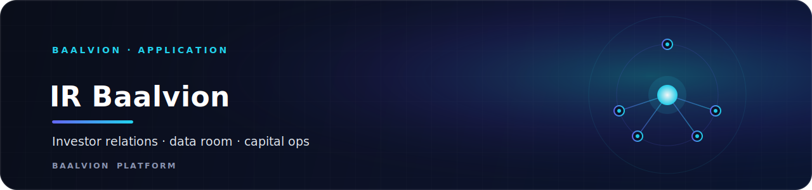
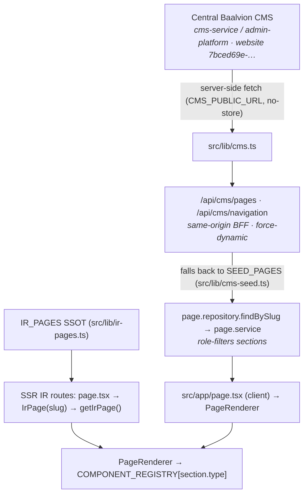

<div align="center">



<br/>
<br/>

**Institutional Investor Relations portal for Baalvion — the investment story, governance, and a session-gated investor portal (dashboard, data room, capital ops) on the central Baalvion identity platform.**

<p>
  
  
  
  
  
</p>

<sub><a href="#overview">Overview</a> · <a href="#architecture">Architecture</a> · <a href="#tech-stack">Tech Stack</a> · <a href="#project-structure">Structure</a> · <a href="#pages--routes">Routes</a> · <a href="#getting-started">Getting started</a> · <a href="#environment-variables">Env</a> · <a href="#deployment">Deployment</a> · <a href="#notes--gotchas">Notes</a></sub>

</div>

---

## Overview

`ir-baalvion-web` is the public-facing **Investor Relations (IR) website** for Baalvion
(brand: *Baalvion Industries Pvt Ltd*), deployed at **`ir.baalvion.com`**. It presents the
institutional investment story — *Why Invest*, the *Investment Thesis*, the *Market
Opportunity* (TAM/SAM/SOM), *Use of Proceeds*, *Financials*, *Governance & Leadership*, an
investor *FAQ* and *Resources* — alongside an authenticated investor portal (dashboard,
data room, capital operations, voting). It is one app inside the larger **Baalvion
pnpm + Turborepo monorepo** (`Frontend/IR-Baalvion-main`), and it consumes shared platform
backends: the **central Baalvion CMS** (`cms-service` / admin-platform console) for editorial
content, the **central auth gateway** (`@baalvion/auth-sdk` over RS256) for sessions, and
domain backends for structured investor data. Public marketing/IR pages are rendered
server-side for SEO with rich JSON-LD structured data and env-gated analytics; the gated
investor portal is rendered client-side behind a session gate.

- **Production domain:** https://ir.baalvion.com (`NEXT_PUBLIC_BASE_URL`)
- **Local dev port:** `:3027` (Turbopack)
- **Auth:** centralized via `@baalvion/auth-sdk` + same-origin `/auth-bff` proxy → auth-gateway
- **Content:** central `cms-service` page-builder via `src/lib/cms.ts`, with seed fallback

## Tech Stack

| Layer | Choice | Version |
|-------|--------|---------|
| Framework | Next.js (App Router, Turbopack dev) | `15.5.18` |
| Language | TypeScript | `^5` |
| UI runtime | React / React DOM | `^19.2.1` |
| Styling | Tailwind CSS + `tailwindcss-animate` | `^3.4.1` / `^1.0.7` |
| Component primitives | Radix UI (accordion, dialog, dropdown, tabs, toast, tooltip, …) | `^1.x–^2.x` |
| Design system | shadcn/ui convention (`components.json`, base color `neutral`) | — |
| Icons | `lucide-react` | `^0.475.0` |
| Charts | `recharts` | `^2.15.1` |
| Forms | `react-hook-form` + `@hookform/resolvers` | `^7.54.2` / `^4.1.3` |
| Validation | `zod` | `^3.24.2` |
| HTML sanitization | `sanitize-html` (+ `@types/sanitize-html`) | `^2.13.0` |
| Dates | `date-fns`, `react-day-picker` | `^3.6.0` / `^9.14.0` |
| Carousel | `embla-carousel-react` | `^8.6.0` |
| AI (server-only) | Genkit + `@genkit-ai/google-genai` | `^1.28.0` |
| Auth client | `@baalvion/auth-sdk` (workspace package) | `workspace:*` |
| Class utilities | `clsx`, `tailwind-merge`, `class-variance-authority` | `^2.1.1` / `^3.0.1` / `^0.7.1` |
| Font | Inter via `next/font/google` (variable `--font-inter`) | — |
| Package manager | pnpm (monorepo workspace) | — |

Scripts (`package.json`):

```bash
pnpm dev          # next dev --turbopack on port 3027
pnpm build        # next build
pnpm start        # next start (production server)
pnpm lint         # next lint
pnpm typecheck    # tsc --noEmit
pnpm genkit:dev   # genkit start -- tsx src/ai/dev.ts (AI flows)
pnpm genkit:watch # genkit watch mode
```

## Architecture

### Rendering model

The **root layout** (`src/app/layout.tsx`) sets `export const dynamic = 'force-dynamic'` and
`revalidate = 0`, so **every route renders dynamically** (no static caching). This guarantees
content edited in the central CMS console is reflected on the next request. The app mixes two
rendering strategies:

- **Public IR/marketing pages** (`/why-invest`, `/investment-thesis`, `/market-opportunity`,
  `/use-of-proceeds`, `/financials`, `/company/story`, `/faq`, `/governance/framework`,
  `/resources`) are **server components**. Each thin route (`page.tsx`) calls
  `generateMetadata()` via `irMetadata(slug)` and renders `<IrPage slug=… />`, which resolves
  a `PageDefinition` from the code SSOT and emits JSON-LD. This makes them crawler-friendly.
- The **home page** (`src/app/page.tsx`) and the **gated investor portal** (`/dashboard`,
  `/data-room`, `/capital-ops`, `/strategic-operator`, `/phase2`, `/phase3`,
  `/governance/my-voting`) are **client components** that fetch through service/repository
  layers and render only behind a session gate.

### CMS data flow (page-builder)

Editorial content is **managed centrally** in the Baalvion CMS (admin-platform console),
never in a local `/admin` panel (the legacy local admin is retired — middleware redirects
`/admin*` to the central console). Pages are assembled from an ordered list of named
**section components** registered in `ComponentRegistry.tsx`. A `PageDefinition` (slug, SEO
envelope, ordered `sections[]`) drives `PageRenderer`, which looks each `section.type` up in
the registry and renders it.



Three consumers share the same `IR_PAGES` source of truth (`src/lib/ir-pages.ts`):
1. **SSR route segments** render them for SEO + per-page metadata,
2. the **CMS BFF** serves them as a fallback (`SEED_PAGES`) when the central CMS is down,
3. **seed scripts** (`scripts/seed-ir-investor-pages.ts`) push them into the CMS so the
   composition + SEO stays editable in the console.

Structured investor data (capital calls, NAV history, votes, distributions) is intentionally
**not** in the CMS — it flows through `/api/v1/investor/*` route handlers to its own backend.

### SEO & structured data (JSON-LD)

- Root layout emits **Organization/FinancialService** and **WebSite** JSON-LD, plus full
  Open Graph / Twitter metadata, robots directives and GSC/Bing verification tags.
- `IrPage` emits **BreadcrumbList** on every IR route, **FAQPage** on `/faq`, and **Article**
  JSON-LD on `/company/story`.
- `src/app/sitemap.ts` (→ `/sitemap.xml`) builds a combined sitemap from static routes,
  the `IR_PAGES` SSOT, governance/news/resources sections, and dynamic CMS content.
- `src/app/robots.ts` allows public marketing/IR surfaces and disallows auth-gated portal,
  admin, and API paths.
- Metadata-file conventions generate the favicon (`icon.svg`), OG image
  (`opengraph-image.tsx`) and Twitter image (`twitter-image.tsx`).

### Analytics (env-gated)

`src/components/seo/Analytics.tsx` loads **Google Analytics 4** and **Microsoft Clarity**
only when their `NEXT_PUBLIC_*` IDs are set — nothing third-party ships without a key.

### Security model

- **Auth**: access token is in-memory only; the refresh token is an httpOnly
  `baalvion_refresh` cookie set by the central auth-service. `next.config.ts` rewrites
  `/auth-bff/*` to the gateway so the cookie flows in dev and prod.
- **Middleware** (`src/middleware.ts`) is a coarse edge gate: protected routes require a
  valid session cookie (per-permission RBAC is enforced client-side and at the API boundary).
- **Headers** in `next.config.ts` set HSTS, `X-Frame-Options`, `X-Content-Type-Options`,
  `Referrer-Policy`, `Permissions-Policy`, and a **CSP** (`unsafe-eval` is dev-only for HMR).
- CMS HTML is sanitized (`src/lib/sanitize.ts`, `sanitize-html`) before rendering.

## Project Structure

```
IR-Baalvion-main/
├── src/
│   ├── app/                 # Next.js App Router: routes, layouts, API handlers, SEO files
│   ├── components/          # React UI — sections, ui primitives, portal widgets, CMS renderer
│   ├── core/                # Domain layer: content schemas, repositories, services (page/auth/…)
│   ├── lib/                 # Data clients & utilities — cms.ts, ir-pages.ts, rbac/, auth/, data
│   ├── config.ts            # AppConfig (appName, companyName, baseUrl) — @/config resolves here
│   ├── config/              # environment.ts (mock/production runtime flags)
│   ├── hooks/               # React hooks (useAuth, useNotifications, use-toast, …)
│   ├── i18n/                # Locale JSON (en, es, fr) for the language selector
│   ├── types/               # Shared TypeScript types (api, alerts, performance, intelligence)
│   ├── utils/               # i18n, sitemap, slug-generator helpers
│   ├── ai/                  # Genkit server-only AI flows (genkit.ts, dev.ts)
│   └── middleware.ts        # Edge gate: session check + /admin → central console redirect
├── scripts/                 # CMS seeding scripts (IR pages + navigation)
├── public/                  # Static assets — leadership photos, placeholder image
├── docs/                    # blueprint.md (style guide) + SEO/SEO-STRATEGY.md
├── .idx/                    # Firebase/IDX (Project IDX) dev environment (dev.nix, icon.png)
├── next.config.ts           # Headers/CSP, image domains, auth rewrite, serverExternalPackages
├── tailwind.config.ts       # Tailwind theme (navy/gold institutional palette)
├── components.json          # shadcn/ui config
├── apphosting.yaml          # Firebase App Hosting run config
└── tsconfig.json            # @/* → ./src/* path alias
```

## Pages & Routes

### Public IR / marketing (server-rendered for SEO)

| Route | Purpose |
|-------|---------|
| `/` | Institutional landing page (CMS page-builder home composition) |
| `/why-invest` | Investment highlights, key metrics, growth strategy, CTA |
| `/investment-thesis` | Full thesis narrative (problem → solution → market → moat) |
| `/market-opportunity` | TAM/SAM/SOM of the ~$13T global B2B trade market |
| `/use-of-proceeds` | Allocation of raised capital |
| `/financials` | Financial framework / model |
| `/company/story` | Long-form company narrative (Article JSON-LD) |
| `/faq` | Investor FAQ (FAQPage JSON-LD, driven by `lib/ir-faq.ts`) |
| `/resources` (+ `/contact-ir`, `/email-alerts`) | Investor resources, IR contact, alert sign-up |

### Governance

| Route | Purpose |
|-------|---------|
| `/governance` · `/governance/overview` | Governance landing / overview |
| `/governance/framework` | Governance framework page |
| `/governance/board-of-directors` | Board members (CMS leadership content) |
| `/governance/leadership` · `/leadership/[slug]` | Leadership team + individual profiles |
| `/governance/committee-composition` | Board committee composition |
| `/governance/my-voting` | Investor voting (gated) |

### News & events

| Route | Purpose |
|-------|---------|
| `/news-and-events` (+ `news`, `press-releases`, `events`, `filings`, `financial-reports`, `investor-day`, `webcast`, `documents`, `stock`) | IR newsroom surfaces sourced from CMS |

### Investor portal (session-gated, client-rendered)

| Route | Purpose |
|-------|---------|
| `/dashboard` | Investor dashboard: NAV chart, capital calls, distributions, voting |
| `/data-room` · `/phase2/data-room` | Secure document data room |
| `/capital-ops` | Capital operations (calls, allocation, flow visualization) |
| `/strategic-operator` | Operator cockpit (ownership, equity, org chart, performance) |
| `/phase2`, `/phase3` | Phased investor experiences (dashboards/data room) |
| `/onboarding` | Multi-step investor registration / accreditation / KYC flow |
| `/invest` · `/invest/deals` · `/invest/[id]` | Deals listing / detail |
| `/admin/*` | **Redirected** to the central CMS console (legacy local admin retired) |

### API route handlers (`src/app/api/`)

`/api/cms/{pages,navigation}` (CMS BFF), `/api/auth-local/*` (dev-only seed auth, fail-closed
in prod), `/api/ir/{apply,reports}`, `/api/v1/investor/*` (capital-calls, nav-history, votes,
distributions, documents…), `/api/v1/{alerts,notifications,subscriptions,events,settings,
board-materials,performance,generated-reports,votes}`, `/api/mp/[...path]` (marketplace proxy),
`/api/health`.

## Assets & Media

`public/` holds local static assets (referenced via `/photos/...` and `/images/...`):

- **`public/photos/`** — leadership/executive portrait photos resolved by
  `src/lib/placeholder-images.ts` (mapped to `imageId`s used by the leadership/board pages):
  `aadarshPatra.jpeg`, `Prathamesh Pawer.jpeg`, `Laxman Singh Champia.jpeg`,
  `Rashmika Singh.jpeg`, `DilipKuldeepYadav.jpeg`, `tamannaShaaikh.png`,
  `bishalkumarpingua.jpeg`, `Biswajeet patra.jpeg`, `Jaid Alam.jpeg`,
  `Preeti snigdha Mallick.jpeg`, `sasmitagamel.jpeg`.
- **`public/images/placeholder.png`** — generic placeholder image.
- **`src/app/icon.svg`** — favicon (Next metadata-file convention).
- **`.idx/icon.png`** — Project IDX workspace icon (dev tooling, not shipped).

Remote images are allow-listed in `next.config.ts` (`placehold.co`, `images.unsplash.com`,
`picsum.photos`, `s24.q4cdn.com`, `www.cdprojektred.com`) and in the CSP `img-src`.

## Getting Started

Prerequisites: Node 20+, **pnpm** (run from the monorepo so `@baalvion/auth-sdk` resolves).

```bash
# from the monorepo root
pnpm install

# environment
cp Frontend/IR-Baalvion-main/.env.example Frontend/IR-Baalvion-main/.env.local
# (optionally also pull SEO/analytics vars from .env.seo.example)

# develop (port 3027)
pnpm --filter ir-baalvion-web dev
# or, inside Frontend/IR-Baalvion-main:
pnpm dev

# quality gates
pnpm typecheck
pnpm lint

# production
pnpm build
pnpm start
```

The dev server runs on **`http://localhost:3027`**.

## Environment Variables

All are optional/env-gated; nothing loads unless set. **Never commit real values.**

| Variable | Purpose |
|----------|---------|
| `NEXT_PUBLIC_BASE_URL` | Public origin for canonical URLs, OG, sitemap, robots, JSON-LD (default `https://ir.baalvion.com`) |
| `NEXT_PUBLIC_AUTH_BFF_PATH` | Path the auth client talks to (`/auth-bff` → gateway rewrite) |
| `AUTH_PROXY_TARGET` | Upstream the `/auth-bff/*` rewrite proxies to (central gateway) |
| `NEXT_PUBLIC_IR_API_URL` | IR domain API base for the investor portal |
| `NEXT_PUBLIC_REFRESH_COOKIE_NAME` | httpOnly refresh cookie name (must match gateway; default `baalvion_refresh`) |
| `IR_LOCAL_AUTH_ENABLED` | Opt-in to the dev-only `/api/auth-local` backend (fail-closed in production) |
| `IR_LOCAL_SEED_USERS` | Server-only JSON array of dev seed accounts (dev only) |
| `NEXT_PUBLIC_IR_DEV_QUICK_ACCOUNTS` | Dev quick-login buttons (throwaway creds only; client-bundled) |
| `NEXT_PUBLIC_CMS_URL` | Base URL of the central CMS console (drives `/admin` redirect + seeding) |
| `NEXT_PUBLIC_CMS_WEBSITE_ID` | This site's CMS website UUID (`7bced69e-…`) |
| `NEXT_PUBLIC_CMS_CONSOLE_URL` | Full console URL override (back-compat) |
| `CMS_PUBLIC_URL` | Server-side CMS public delivery API base (used by `lib/cms.ts`) |
| `CMS_WEBSITE_SLUG` | CMS website slug (default `ir.baalvion.com`) |
| `NEXT_PUBLIC_GA4_ID` | Google Analytics 4 measurement ID |
| `NEXT_PUBLIC_CLARITY_ID` | Microsoft Clarity project ID |
| `NEXT_PUBLIC_GSC_VERIFICATION` | Google Search Console verification token |
| `NEXT_PUBLIC_BING_VERIFICATION` | Bing Webmaster Tools (`msvalidate.01`) token |

See `.env.example` and `.env.seo.example` for the authoritative templates.

## Deployment

- **Firebase App Hosting** — `apphosting.yaml` defines the run config (`maxInstances: 1`).
  A standard `next build` / `next start` is produced; the `.idx/` directory provides a
  Project IDX (Nix) dev environment.
- Within the Baalvion platform the app is also deployable as part of the monorepo's
  Turborepo/Docker pipeline. Production injects real secrets at deploy time; `.env*` files
  are gitignored.
- Production must point `NEXT_PUBLIC_CMS_URL` / `NEXT_PUBLIC_CMS_WEBSITE_ID` and
  `AUTH_PROXY_TARGET` at the real central services — if the CMS env is unset in production,
  the `/admin` redirect is skipped (rather than sending users to localhost) and the BFF
  falls back to bundled `SEED_PAGES`.

## Notes / Gotchas

- **`@/config` is a file, not the folder.** It resolves to `src/config.ts` (`AppConfig`),
  while `src/config/environment.ts` is a separate runtime-flags module.
- **Dual content paths:** the home page goes through the *service/repository/CMS-BFF* chain
  (client), whereas the institutional IR pages render server-side from the `IR_PAGES` code
  SSOT via `IrPage`. Both share `PageRenderer` + `COMPONENT_REGISTRY`.
- **Keep the three IR-page consumers in sync** — `src/lib/ir-pages.ts` feeds SSR routes, the
  CMS seed fallback, and the CMS seeding script. Adding a page means updating the SSOT,
  the route segment, the `ComponentRegistry`, the sitemap, robots, and the seed navigation.
- **No local admin.** All `/admin/*` requests redirect to the central console when configured.
- **`ir-metadata.ts` references `/og-image.jpg`** for OG/Twitter images on IR routes, while
  the root layout relies on the generated `opengraph-image.tsx`/`twitter-image.tsx`. The
  former expects a static `og-image.jpg` to exist at the origin root.
- **CSP `unsafe-eval`** is enabled only in dev (`NODE_ENV !== 'production'`) for webpack HMR;
  production CSP omits it.
- **`src/ai/*` is server-only Genkit** — kept external via `serverExternalPackages` in
  `next.config.ts` to avoid bundling OpenTelemetry's dynamic requires.
- Generated/vendor dirs (`.next/`, `.turbo/`, `node_modules/`) are excluded from this doc.

---

<div align="center">
<sub>Part of the <a href="https://github.com/baalvionservice/Baalvion-Project-Infra">Baalvion Platform</a> · centralized identity · domain-driven monorepo</sub>
</div>
