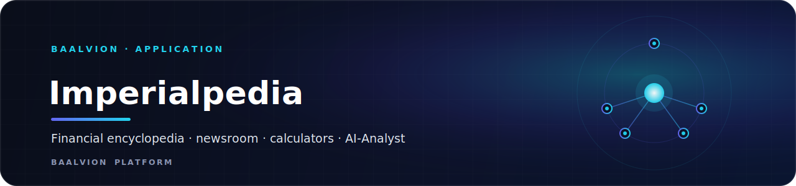
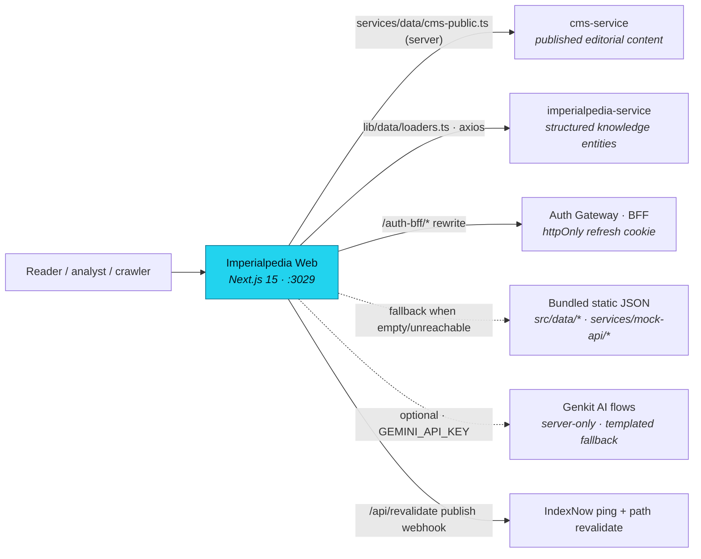

<div align="center">



<br/>
<br/>

**The financial-intelligence and knowledge property of the Baalvion platform — an Investopedia-style encyclopedia, newsroom, knowledge graph, financial calculators, review boards, and AI-Analyst suite, server-rendered for large-scale search and AI crawlability.**

<p>
  
  
  
  
  
  
  
</p>

<sub><a href="#overview">Overview</a> · <a href="#architecture">Architecture</a> · <a href="#tech-stack">Tech Stack</a> · <a href="#project-structure">Structure</a> · <a href="#pages--routes">Routes</a> · <a href="#getting-started">Getting started</a> · <a href="#environment-variables">Env</a> · <a href="#deployment">Deployment</a> · <a href="#notes--gotchas">Notes</a></sub>

</div>

---

## Overview

**Imperialpedia** (`imperialpedia-web`) is the financial-intelligence and knowledge website
in the Baalvion platform — an Investopedia-style reference, news, and education property that
combines a structured **encyclopedia** (companies, countries, industries, technologies, a
financial glossary), an **editorial newsroom**, a **knowledge graph**, **financial calculators**,
**review boards**, and an **AI-Analyst** suite. It is a Next.js (App Router) application that
renders mostly server-side for SEO, pulls **published editorial content from the central
Baalvion CMS** and **structured entities from the `imperialpedia-service` backend**, and falls
back to bundled static data so pages never break during cutover. Audience: retail investors,
analysts, finance learners, and search/AI crawlers.

Within the Baalvion monorepo it lives at `Frontend/Imperialpedia-main/`, is the CMS "website"
with slug `imperialpedia`, authenticates against the central `auth-service` (RS256), and is
administered from the central **admin-platform** console (the in-app admin/editor/writer panels
are retired and redirect there).

- **Local dev port:** `:3029` (`next dev -p 3029`)
- **CMS website slug:** `imperialpedia` (canonical editorial store is `cms-service`)
- **Auth:** centralized via `@baalvion/auth-sdk` + same-origin `/auth-bff` proxy → auth gateway; access token in-memory only, refresh in the httpOnly `baalvion_refresh` cookie
- **Data:** `imperialpedia-service` (structured entities) + central `cms-service` (editorial), with bundled static JSON as graceful fallback

## Architecture

### Rendering model

App Router with **React Server Components by default**. Most listing/detail pages are server
components that `await` data at request time; interactivity (navbar, search, calculators,
carousels, market widgets) is isolated into `"use client"` islands. `next.config.ts` sets
`reactStrictMode`, fails the build on type errors (`ignoreBuildErrors: false`), but leaves lint
as a separate CI gate.

### High-level flow



### Data flow

Imperialpedia is a presentation tier over two live Baalvion backends, with static JSON fallback:

- **Editorial content** (articles, news) is authored in admin-platform, published through the
  CMS, and read server-side via `services/data/cms-public.ts`. CMS content blocks are normalized
  into Imperialpedia's `Article` / `NewsArticle` shapes; when the CMS is empty or unreachable the
  layer falls back to a legacy mock set (`services/mock-api/*`) so pages are never blank.
- **Structured entities** (company / country / industry / technology + glossary terms) load from
  `imperialpedia-service` via `lib/data/loaders.ts`, `lib/data/term-live.ts`, and
  `lib/data/review-live.ts`, with `src/data/*.json` as fallback.
- **Server state** in client components is cached/deduped by TanStack Query
  (`services/query-client.ts`, `providers/QueryProvider.tsx`); the typed service objects live in
  `services/data/*`.

### Auth

Centralized identity via the Baalvion `auth-service` (RS256). The browser never stores tokens
in `localStorage`:

- Access token is **in-memory only** (`lib/auth-client.ts`, single-flight refresh).
- Refresh token is an httpOnly `baalvion_refresh` cookie set by auth-service.
- Auth calls go to the **same-origin `/auth-bff`** path, which `next.config.ts` rewrites to the
  auth gateway so the cookie flows in dev and prod.
- `providers/AuthProvider.tsx` bootstraps the session on mount; `middleware.ts` coarse-gates
  protected prefixes (`/admin`, `/creator/dashboard`, `/editor`, `/writer`, `/premium`) on the
  presence of the refresh cookie; fine-grained authorization is enforced server-side.

### Content & search model

- **Encyclopedia entities** stored in one generic table in `imperialpedia-service`, cross-linked
  by slug arrays and resolved into a "related" knowledge graph (`getRelatedEntities`).
- **Glossary** ("terms") uses Investopedia-style A–Z URLs: `/terms-beginning-with-a` rewrites to
  `/terms/a`, and legacy `/terms/{slug}` 301-redirects to `/terms/{letter}/{slug}` (middleware).
- **Search** via `/api/search` route handler + `services/data/search-service.ts` and
  `lib/utils/search.ts`.

### SEO

SEO is a first-class subsystem built for large-scale indexing:

- Per-route metadata via `lib/seo/metadata-builder.ts` and `generateMetadata`; rich Open Graph /
  Twitter cards and Organization/WebSite JSON-LD in the root layout.
- Structured data (`lib/seo/structured-data.ts`, `modules/seo-engine/components/JsonLd.tsx`,
  breadcrumbs).
- Dynamic `app/sitemap.ts` + sharded sitemaps (`app/sitemaps/`), `app/robots.ts`, and a
  **publish webhook** (`/api/revalidate`) that invalidates the sitemap cache, revalidates Next.js
  paths, and pings **IndexNow** (Bing/Yandex) on content publish for near-real-time recrawl.
- AdSense (`ads.txt`) and analytics (GA/GTM) are env-gated and allow-listed in the CSP.

## Tech Stack

| Concern | Choice | Version |
|---|---|---|
| Framework | [Next.js](https://nextjs.org) (App Router, RSC) | `15.5.18` |
| Language | TypeScript | `^5` |
| Runtime | React / React DOM | `^19.2.1` |
| Styling | Tailwind CSS + `tailwindcss-animate` | `^3.4.1` / `^1.0.7` |
| UI primitives | Radix UI (accordion, dialog, dropdown, tabs, toast, tooltip, …) | `^1.x–2.x` |
| Icons | `lucide-react`, `@heroicons/react` | `^0.475.0` / `^2.2.0` |
| Server state | `@tanstack/react-query` | `^5.95.2` |
| Client state | React Context stores (app / UI / calculator) | — |
| Forms / validation | `react-hook-form` + `@hookform/resolvers` + `zod` | `^7.54.2` / `^4.1.3` / `^3.24.2` |
| HTTP | `axios` | `^1.13.6` |
| Rich text | TipTap (`@tiptap/react`, starter-kit, image/link/underline/text-align) | `^3.20.4` |
| Charts | `recharts` | `^2.15.1` |
| Animation | `framer-motion` | `^11.0.8` |
| Carousel | `embla-carousel-react` | `^8.6.0` |
| i18n | `i18next` + `react-i18next` + browser language detector | `^23.10.0` / `^14.0.5` |
| Toasts | `sonner` + Radix toast | `^2.0.7` |
| Dates | `date-fns` | `^3.6.0` |
| HTML sanitization | `sanitize-html` | `^2.13.0` |
| Generative AI | Genkit + Google GenAI (Gemini) | `^1.28.0` |
| Auth | `@baalvion/auth-sdk` (workspace), in-house auth-client | `workspace:*` |
| Testing | Vitest | `^4.1.0` |
| Lint | ESLint 9 + `eslint-config-next` + `@typescript-eslint` | `^9.39.4` |

## Project Structure

```
Imperialpedia-main/
├─ src/
│  ├─ app/             → Next.js App Router routes, API handlers, layout, sitemap/robots
│  ├─ components/      → Shared UI: landing, layout, home, world, search, review, ui (Radix)
│  ├─ modules/         → Domain modules: content-engine, calculators, community, creators, seo[-engine]
│  ├─ services/        → Data layer: api-client, live data services, query-client, mock-api fallbacks
│  ├─ lib/             → Utilities: data loaders, seo, auth-client, errors, sanitize, state stores
│  ├─ hooks/           → Reusable hooks (useAppQuery/Mutation, use-toast, use-mobile)
│  ├─ providers/       → React context providers (Auth, Query)
│  ├─ config/          → env, routes, platform, seo configuration
│  ├─ data/            → Bundled static JSON/TS fallback datasets + review tables
│  ├─ types/           → Global TypeScript domain types (~35 files)
│  ├─ design-system/   → Tokens, themes, typography, layout primitives
│  ├─ i18n/            → i18next config + locale bundles (en, es, fr, de, zh)
│  ├─ ai/              → Genkit server-only AI flows (AI-Analyst suite)
│  └─ middleware.ts    → Edge middleware: term redirects + coarse auth gate
├─ public/             → Static assets (logos, OG images, robots/ads, verification files)
├─ docs/               → Author/CMS/entity/component documentation (see docs/admin-cms)
├─ scripts/            → One-off extract/diagnostic scripts (terms, reviews)
├─ next.config.ts      → Rewrites, redirects, CSP/security headers, image config, webpack tuning
├─ tailwind.config.ts  → Theme tokens, Investopedia-style serif/sans font stacks
├─ vercel.json         → turbo-ignore guard for the imperialpedia-web build
└─ apphosting.yaml     → Firebase App Hosting run config
```

> The admin panel & CMS architecture specification lives in
> [`docs/admin-cms/`](docs/admin-cms/README.md).

## Pages & Routes

Routes are App Router segments under `src/app/`. Notable ones:

| Route | Purpose |
|---|---|
| `/` | Editorial home: trending bar, lead story, topic rows, term-of-day, newsletter band |
| `/[slug]` | Catch-all article/news/review/stocks resolver (CMS-first, static fallback) |
| `/news`, `/market-news`, `/live-market-news`, `/company-news` | Newsroom / market & company news |
| `/articles`, `/latest`, `/explore` | Article library and discovery |
| `/glossary`, `/terms/[letter]`, `/terms/[letter]/[slug]` | Financial glossary (A–Z terms) |
| `/companies`, `/countries`, `/industries`, `/technologies` | Structured encyclopedia entity hubs + detail |
| `/knowledge-map` | Knowledge-graph visualization of entity relationships |
| `/financial-tools`, `/calculators`, `/calculators/[slug]`, `/financial-calculators` | Interactive financial calculators |
| `/stocks`, `/etfs`, `/bonds`, `/crypto`, `/commodities`, `/options`, `/mutual-funds` | Asset-class reference hubs |
| `/banking`, `/savings`, `/checking`, `/credit-cards`, `/loans`, `/mortgages`, `/insurance`, `/retirement`, `/taxes`, `/budgeting`, `/personal-finance` | Personal-finance topic hubs |
| `/economy`, `/fed`, `/inflation`, `/gdp`, `/interest-rates`, `/monetary-policy`, `/fiscal-policy`, `/indicators` | Macro/economy reference |
| `/world`, `/world/[region]` | Regional market coverage (us / europe / asia / china / emerging) |
| `*-reviews`, `/imperialpedia-review-board`, `/brokers`, `/robo-advisors` | Product review boards (brokers, banks, cards, loans, advisors, apps…) |
| `/ai-analyst`, `/ai-analyst/content-outline`, `/research-ai` | AI-Analyst suite (bull/bear case, catalysts, recaps, etc.) |
| `/community`, `/creators`, `/creator`, `/learning-paths` | Community, creator profiles, guided learning |
| `/dashboard`, `/portfolio` | Authenticated user dashboard / portfolio |
| `/premium`, `/pricing` | Premium research tier |
| `/auth/...` | Sign-in / auth flows |
| `/about`, `/contact`, `/transparency`, `/privacy-policy`, `/terms-of-service` | Trust / legal / E-E-A-T pages |
| `/admin/*`, `/editor/*`, `/writer/*` | **Retired** — redirect to the central admin-platform console |
| `/api/*` | Route handlers: `revalidate`, `search`, `contact`, `newsletter`, `waitlist`, `ai`, `ai-insights`, `auth/register`, `companies`, `countries`, `industries`, `technologies` |
| `/sitemap.xml`, `/sitemaps/*`, `/robots.txt` | SEO infrastructure |

## Assets & Media

Everything served from `public/`:

| File | Use |
|---|---|
| `logo.png` | Site logo (referenced in Organization JSON-LD) |
| `og-image.png`, `og-image.jpg` | Open Graph / Twitter social share image (1200×630) |
| `images/defi-future.jpg` | Editorial article/topic image |
| `logos/fidelity.png`, `logos/ibkr.png`, `logos/robinhood.png` | Broker/provider logos for review boards |
| `robots.txt` | Crawl rules (disallows `/admin`, `/api`, `/auth`, dashboards; points to sitemap) |
| `ads.txt` | Google AdSense authorized-sellers declaration |
| `13c7ede615e8cf445c4e183a9894e9c4.txt` | IndexNow key file (matches `INDEXNOW_KEY`) |
| `yandex_72dc394851184864.html` | Yandex Webmaster site-verification file |

Most editorial imagery is **remote** (allow-listed in `next.config.ts` image config and CSP):
`images.unsplash.com`, `picsum.photos`, `placehold.co`, `www.investopedia.com`, `imperialpedia.com`.
Image formats are optimized to WebP/AVIF with a responsive device-size ladder.

Fonts: editorial headlines use **Source Serif 4** (loaded via `next/font/google`); body/UI use a
native Helvetica/Arial system stack (no webfont) — an Investopedia-style pairing defined in
`tailwind.config.ts`.

## Getting Started

### Prerequisites

- Node.js 20+ and **pnpm** (this is a workspace package in the Baalvion Turborepo monorepo;
  prefer running from the repo root so `@baalvion/auth-sdk` resolves)
- Running Baalvion backends for full data: `auth-service` (:3001), `imperialpedia-service` (:3004),
  `cms-service` (:3011/:3018). Without them, pages render from bundled static fallbacks.

```bash
# from the monorepo root
pnpm install

# develop / build / run
pnpm dev          # next dev on port 3029  (script: "next dev -p 3029")
pnpm build        # next build
pnpm start        # next start (serve the production build)
pnpm lint         # eslint .
pnpm type-check   # tsc --noEmit
pnpm test         # vitest run
pnpm genkit:dev   # run the Genkit AI flows dev server (tsx src/ai/dev.ts)
```

> From the monorepo root you can also use the workspace filters, e.g.
> `pnpm --filter imperialpedia-web dev`.

Copy/create `.env.local` (see the table below). Defaults in code point at localhost services, so
the app boots without configuration; production requires the `NEXT_PUBLIC_*` and secret values set.

## Environment Variables

`NEXT_PUBLIC_*` values are inlined at build time (a rebuild is required after changing them).
**Never commit real secrets.**

| Variable | Purpose |
|---|---|
| `AUTH_PROXY_TARGET` | Upstream target the `/auth-bff` rewrite proxies to (auth-service / gateway) |
| `NEXT_PUBLIC_AUTH_URL` | Public base URL of the auth endpoints |
| `NEXT_PUBLIC_API_URL` | imperialpedia-service API base used by the axios client / loaders |
| `NEXT_PUBLIC_API_BASE_URL` | Alternate API base (config/env) |
| `NEXT_PUBLIC_IMPERIALPEDIA_API_URL` | imperialpedia-service `/api/v1` base for structured entities |
| `NEXT_PUBLIC_SITE_URL` | Canonical site origin used for metadata / OG / sitemap |
| `NEXT_PUBLIC_APP_NAME` | Display name (default `Imperialpedia`) |
| `NEXT_PUBLIC_ENVIRONMENT` | `development` / `production` / `test` override |
| `NEXT_PUBLIC_CMS_PUBLIC_URL` | CMS public delivery API base for published editorial content |
| `NEXT_PUBLIC_CMS_SITE_SLUG` | CMS website slug for this site (`imperialpedia`) |
| `GEMINI_API_KEY` | Google Gemini key for the AI-Analyst flows (empty → templated fallbacks) |
| `REVALIDATE_SECRET` | Shared secret authorizing the `/api/revalidate` publish webhook |
| `INDEXNOW_KEY` | IndexNow key (also hosted at `public/<key>.txt`) for instant recrawl pings |
| `NEXT_PUBLIC_ADMIN_PLATFORM_URL` | Central admin-platform base (cross-app navigation) |
| `NEXT_PUBLIC_ADMIN_CONSOLE_URL` | This site's CMS console URL (admin redirect target) |
| `NEXT_PUBLIC_REFRESH_COOKIE_NAME` | Refresh cookie name middleware gates on (default `baalvion_refresh`) |
| `NEXT_PUBLIC_GA_ID` | Google Analytics / GTM ID (analytics only render when set) |
| `NEXT_PUBLIC_ADSENSE_CLIENT` | Google AdSense client ID |
| `NEXT_PUBLIC_CONTACT_EMAIL` / `NEXT_PUBLIC_SUPPORT_EMAIL` / `NEXT_PUBLIC_EXPERTS_EMAIL` | Public contact addresses shown on Contact/legal pages |

## Deployment

- **Build guard:** `vercel.json` runs `npx turbo-ignore imperialpedia-web` so Vercel/CI skips
  rebuilds when nothing in this package changed.
- **Firebase App Hosting:** `apphosting.yaml` provides a `runConfig` (App Router SSR runtime).
- The app is a standard Next.js `build` → `start` deployment; set production `NEXT_PUBLIC_*`,
  `AUTH_PROXY_TARGET`, `REVALIDATE_SECRET`, and `GEMINI_API_KEY` in the host's secret manager.
- Security headers (HSTS, X-Frame-Options, X-Content-Type-Options, Referrer-Policy,
  Permissions-Policy) and a production CSP are emitted from `next.config.ts` (dev adds
  `'unsafe-eval'` only for HMR).

## Testing

```bash
pnpm test         # vitest run
```

## Notes / Gotchas

- **State is React Context, not Zustand.** There is no Zustand dependency; client state uses
  `lib/state/*` context stores (app / UI / calculator) plus TanStack Query for server state.
- **CMS-first with static fallback.** Live editorial/entity data takes precedence; `services/mock-api/*`
  and `src/data/*.json` only fill in when the CMS/service is empty or unreachable. Don't treat the
  mock layer as the source of truth.
- **AI is server-only.** `src/ai/genkit.ts` imports `server-only`; Genkit/OpenTelemetry packages
  are in `serverExternalPackages` to avoid bundling. With no `GEMINI_API_KEY`, AI flows return
  templated fallbacks and pages still render.
- **`NEXT_PUBLIC_*` is build-time inlined** — changing CMS/API URLs requires a rebuild, not just a
  restart.
- **Admin/editor/writer are retired** in-app and redirect to the central admin-platform console;
  do not re-add per-app admin panels.
- **Dev port is 3029** (not 3000); `next.config.ts` CSP also allow-lists local service ports for
  client fetches in dev.
- `scripts/_diag_*` and `_kill_report.txt` are local diagnostic artifacts, not part of the app.

---

<div align="center">
<sub>Part of the <a href="https://github.com/baalvionservice/Baalvion-Project-Infra">Baalvion Platform</a> · centralized identity · domain-driven monorepo</sub>
</div>
