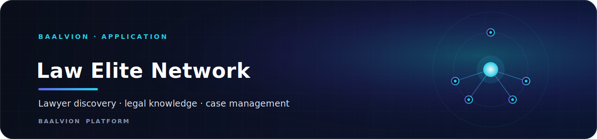
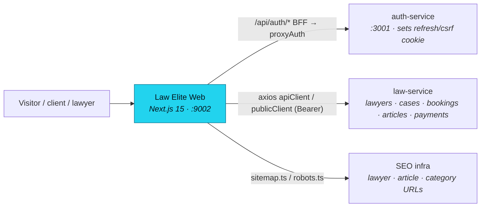

<div align="center">



<br/>
<br/>

**The Baalvion platform's legal knowledge and practitioner-discovery surface — a Next.js App Router application for finding lawyers, booking consultations, managing cases, and reading legal education content, backed by the central law-service and Baalvion identity.**

<p>
  
  
  
  
  
  
</p>

<sub><a href="#overview">Overview</a> · <a href="#architecture">Architecture</a> · <a href="#tech-stack">Tech Stack</a> · <a href="#project-structure">Structure</a> · <a href="#pages--routes">Routes</a> · <a href="#getting-started">Getting started</a> · <a href="#configuration">Configuration</a> · <a href="#notes--gotchas">Notes</a></sub>

</div>

---

## Overview

**Law Elite Network** (`law-elite-network-web`) is the legal knowledge and practitioner-discovery
website of the Baalvion platform. It combines a public legal **knowledge base** (categories,
subcategories, articles, A–Z legal glossary), a verified **lawyer directory** with search and
typeahead, **consultation booking** and video rooms, **case management**, chat, documents,
payments/subscriptions/payouts, referrals, an AI concierge assistant, and an **admin** console for
moderation and analytics. It serves three roles — `client`, `lawyer`, and `admin`.

Within the Baalvion monorepo it lives at `Frontend/Law-Elite-Network-main/`. It is a presentation
tier over the central **law-service** (the knowledge-domain backend) and authenticates through the
central Baalvion **auth-service** via a same-origin Next.js BFF. The product publisher is
**Baalvion**.

- **Local dev port:** `:9002` (`next dev -p 9002`)
- **Default API base:** `https://api.baalvion.com/api/v1/knowledge/law/v1` (local default `http://localhost:3015/v1`)
- **Auth:** central `auth-service` (default `:3001`) via the same-origin `/api/auth/*` BFF proxy; access token in memory only
- **Roles:** `client`, `lawyer`, `admin` (`src/config/roles.ts`)
- **Currencies:** INR (default), USD (`src/config/constants.ts`)

## Architecture

### Rendering model

Next.js **App Router**. Public knowledge and directory routes are server-rendered for SEO with
per-route layouts that own metadata; interactive surfaces (navbar, search, chat, dashboards, the AI
assistant) are `"use client"` islands. The root layout (`src/app/layout.tsx`) emits global metadata,
LegalService + WebSite JSON-LD, an accessible skip-link, the Inter webfont, and mounts the
`AuthProvider`, i18n provider, navbar, AI chat assistant, notification listener, and impersonation
banner.

### High-level flow



### Data flow

- **Backend data** flows through `src/lib/api/client.ts`, which exports a `publicClient` (no auth,
  for articles/categories/reviews/typeahead) and an authenticated `apiClient` (Bearer token,
  for bookings, cases, messages, documents, payments, subscriptions, payouts, notifications,
  referrals, admin). Both target `NEXT_PUBLIC_API_BASE_URL`. Typed API objects
  (`lawyerApi`, `bookingApi`, `caseApi`, `articlesPublicApi`, `adminApi`, …) wrap the endpoints.
- **Domain services** in `src/services/*` (lawyers, cases, bookings, appointments, chat, reviews,
  subscriptions, invoices, referrals, notifications, recommendations, matching, predictions) and
  data hooks in `src/hooks/*` build on the API clients. Some areas ship `*.mock.ts` fixtures used
  for local development alongside the live services.
- **AI features** (`src/lib/ai/*`) — chat assistant, lawyer ranking, recommendation, pricing, and
  fraud engines — are **rule-based** TypeScript engines (e.g. `chatAssistant.ts` matches intent and
  returns curated guidance). The Genkit/Google-GenAI dependencies are present but the flow harness
  `src/ai/dev.ts` is currently an empty stub.

### Auth

Centralized identity through the Baalvion `auth-service`:

- Browser auth requests go to the **same-origin `/api/auth/*`** route handlers
  (`login`, `register`, `refresh`, `logout`). `src/app/api/auth/_proxy.ts` (`proxyAuth`) forwards
  them server-to-server to the Node auth-service (`AUTH_SERVICE_URL`, default `http://localhost:3001`)
  and relays the JSON body plus any `Set-Cookie` (refresh/csrf) back on this origin (stripping
  `Secure` in dev so cookies still set over `http://localhost`).
- The **access token is held in memory only** — never `localStorage`/`sessionStorage`
  (`src/lib/api/client.ts`). law-service is described in-source as an **HS256 island** that does not
  yet issue an httpOnly refresh cookie, so a full page reload requires re-authentication; httpOnly
  refresh is a tracked Phase 1b backend dependency.
- A deduped, single-flight `silentRefresh()` shares one `/api/auth/refresh` call across concurrent
  callers, and a one-time `401 → refresh → retry` interceptor makes hard navigations to authed
  pages robust.
- The Zustand auth store (`src/store/authStore.ts`) persists only **profile metadata** (`user` /
  `profile`) under `law-elite-auth-storage`, not the access token.
- **Admin "View as" impersonation:** when set, `apiClient` sends `X-Impersonate-User-Id` so
  law-service scopes the request to the target user (persisted in `sessionStorage`).

### SEO

- `src/app/layout.tsx` sets templated titles, OG/Twitter cards, canonical, robots directives, and
  LegalService + WebSite JSON-LD (with a `SearchAction`).
- `src/app/sitemap.ts` builds static routes plus dynamic lawyer / article / category URLs by
  fetching the live law-service lists (revalidated hourly, fail-safe to `[]`).
- `src/app/robots.ts` allows public knowledge/directory routes and disallows authenticated areas
  (dashboard, admin, cases, chat, billing, vault, transactions, auth, lawyer back-office, `/api/`).
- OG/Twitter images are generated by Next metadata-file conventions
  (`opengraph-image.tsx` / `twitter-image.tsx`) — no static `og-image.png` asset is required.

## Tech Stack

| Concern | Choice | Version |
|---|---|---|
| Framework | [Next.js](https://nextjs.org) (App Router) | `15.5.18` |
| Language | TypeScript (strict, `noEmit`) | `^5` |
| Runtime | React / React DOM | `^19.0.0` |
| Styling | Tailwind CSS + `tailwindcss-animate` | `^3.4.1` / `^1.0.7` |
| UI primitives | Radix UI (`@radix-ui/react-*`: accordion, dialog, dropdown, tabs, toast, tooltip, …) | `^1.x–2.x` |
| Icons | `lucide-react` | `^0.475.0` |
| Client state | `zustand` | `^5.0.3` |
| Forms / validation | `react-hook-form` + `@hookform/resolvers` + `zod` | `^7.54.2` / `^4.1.3` / `^3.24.2` |
| HTTP | `axios` | `^1.7.9` |
| Search | `algoliasearch` | `^4.22.1` |
| Charts | `recharts` | `^2.15.1` |
| Carousel | `embla-carousel-react` | `^8.6.0` |
| Dates | `date-fns`, `react-day-picker` | `^3.6.0` / `^9.11.3` |
| AI (deps) | Genkit + Google GenAI (`@genkit-ai/google-genai`, `genkit`) | `^1.28.0` |
| Class utils | `clsx`, `tailwind-merge`, `class-variance-authority` | `^2.1.1` / `^3.0.1` / `^0.7.1` |
| Package manager | pnpm (monorepo workspace) | — |

Build tooling: `next lint`, `tsc --noEmit` (`typecheck`), PostCSS (`postcss.config.mjs`),
`patch-package`. `src/config/constants.ts` declares `PLATFORM_VERSION = "2.1.0"`.

## Project Structure

```
Law-Elite-Network-main/
├─ src/
│  ├─ app/             → App Router routes, per-route layouts, /api/auth BFF, sitemap/robots
│  │  └─ api/auth/     → login · register · refresh · logout route handlers + _proxy (proxyAuth)
│  ├─ components/      → UI: navbar, ai assistant, notifications, admin, ui/ (Radix primitives)
│  ├─ services/        → Domain services (lawyers, cases, bookings, chat, reviews, subscriptions,
│  │                     invoices, referrals, notifications, recommendations, matching, predictions)
│  ├─ lib/             → api/ (axios clients + typed endpoint objects), ai/ (rule engines),
│  │                     seo, automation, communication, i18n, mock, utils
│  ├─ hooks/           → Data + UI hooks (dashboard cases, live notifications, user profile, toast)
│  ├─ store/           → Zustand stores (auth, language)
│  ├─ config/          → constants, roles, routes
│  └─ types/           → Domain TypeScript types (lawyer, case, booking, payment, review, …)
├─ docs/               → backend.json (entity schemas), seed-data.json, firestore-mock-data.json
├─ components.json     → shadcn/ui generator config
├─ tsconfig.json       → strict TS, path alias @/* → ./src
├─ postcss.config.mjs  → PostCSS / Tailwind pipeline
└─ apphosting.yaml     → Firebase App Hosting run config (maxInstances: 1)
```

## Pages & Routes

App Router segments under `src/app/`. Centralized route constants live in `src/config/routes.ts`.

### Public — knowledge & discovery
| Route | Purpose |
|---|---|
| `/` | Home |
| `/lawyers` · `/lawyers/[slug]` · `/lawyer/[id]` | Lawyer directory + profile |
| `/search` | Lawyer/content search |
| `/law/[categorySlug]` | Legal knowledge category hub |
| `/article/[slug]` | Legal education article |
| `/legal` · `/legal/[letter]` | A–Z legal glossary |
| `/plans` | Subscription / pricing plans |
| `/about-us` · `/contact-us` · `/careers` · `/advertise` · `/editorial-process` | Company / trust |
| `/privacy-policy` · `/terms-of-service` | Legal pages |

### Authenticated — client area
| Route | Purpose |
|---|---|
| `/dashboard` | Client dashboard |
| `/cases` · `/cases/[id]` | Case management |
| `/booking/[lawyerId]` · `/booking-details/[id]` · `/appointments` | Consultation booking & appointments |
| `/checkout/[bookingId]` · `/billing` · `/billing/[invoiceId]` · `/transactions` | Payments & billing |
| `/chat` · `/chat/[chatId]` · `/notifications` · `/my-counsel` | Messaging & notifications |
| `/vault` · `/profile` · `/onboarding` · `/referral` | Documents, profile, onboarding, referrals |

### Lawyer back-office (`/lawyer/*`)
`dashboard`, `profile`, `availability`, `requests`, `earnings`.

### Admin console (`/admin/*`)
`dashboard`, `analytics`, `insights`, `broadcast`, `users`, plus a dynamic `/admin/[resource]`.

### Auth
`/login`, `/register`, `/forgot-password`, `/reset-password`, `/access-denied`, and the
`/api/auth/*` BFF route handlers.

## Getting Started

### Prerequisites

- Node.js 20+ and **pnpm** (workspace package in the Baalvion Turborepo monorepo)
- For live data: the central **law-service** (default `:3015`) and **auth-service** (`:3001`).
  Without them, public pages still render (sitemap/article fetches fail safe to empty).

```bash
# from the monorepo root
pnpm install

# develop / build / run
pnpm dev          # next dev -p 9002  → http://localhost:9002
pnpm build        # next build
pnpm start        # next start
pnpm lint         # next lint
pnpm typecheck    # tsc --noEmit
pnpm genkit:dev   # Genkit AI flows dev server (tsx src/ai/dev.ts — currently an empty stub)
```

> From the monorepo root you can also use the workspace filter, e.g.
> `pnpm --filter law-elite-network-web dev`.

## Configuration

Public `NEXT_PUBLIC_*` values are inlined into the client bundle (rebuild after changing them);
`AUTH_SERVICE_URL` is server-only (the browser never talks to auth-service directly — the BFF does).
**Never commit real secrets.**

| Variable | Default | Purpose |
|----------|---------|---------|
| `NEXT_PUBLIC_API_BASE_URL` | `https://api.baalvion.com/api/v1/knowledge/law/v1` | law-service API base for `apiClient` / `publicClient` (sitemap default `http://localhost:3015/v1`) |
| `NEXT_PUBLIC_APP_URL` | `https://lawelitenetwork.com` | Canonical site origin for metadata, sitemap, robots |
| `AUTH_SERVICE_URL` | `http://localhost:3001` | Server-only upstream the `/api/auth/*` BFF proxies to (Node auth-service) |
| `NODE_ENV` | — | `production` enables `Secure` cookies in the auth proxy (stripped in dev) |

## Notes / Gotchas

- **Dev port is 9002**, not 3000 (`next dev -p 9002`).
- **Auth is centralized.** Do not add a second JWT issuer or store tokens in web storage. Access
  tokens are in-memory; auth goes through the same-origin `/api/auth/*` BFF, which forwards to the
  Node auth-service server-side (no CORS) and manages the refresh/csrf cookies.
- **law-service is an HS256 island** without an httpOnly refresh cookie yet, so there is no silent
  cross-reload refresh — a full page reload requires re-authentication. httpOnly-cookie refresh is a
  tracked Phase 1b backend dependency.
- **AI is rule-based.** `src/lib/ai/*` are deterministic TypeScript engines, and `src/ai/dev.ts` is
  an empty Genkit harness — the Genkit deps are wired but no generative flow is active. Treat the AI
  assistant as curated intent matching, not an LLM, unless flows are added.
- **Two auth stores exist** (`src/store/authStore.ts` and `src/store/auth-store.ts`). `authStore.ts`
  is the Zustand store that persists profile metadata only.
- **No `public/` assets yet.** The Organization JSON-LD references `${SITE_URL}/logo.png`, which does
  not yet exist (noted as a TODO in `layout.tsx`); the favicon is suppressed via a `data:,` icon.
- **Default currency is INR** with USD also supported (`src/config/constants.ts`); concierge contact
  is `concierge@lawelitenetwork.com`.

---

<div align="center">
<sub>Part of the <a href="https://github.com/baalvionservice/Baalvion-Project-Infra">Baalvion Platform</a> · centralized identity · domain-driven monorepo</sub>
</div>
