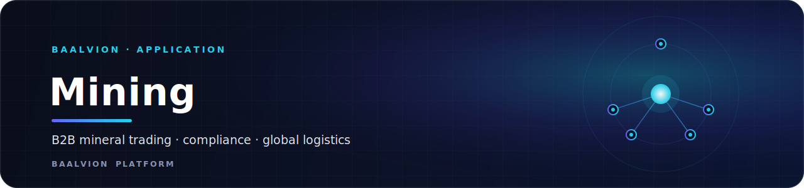
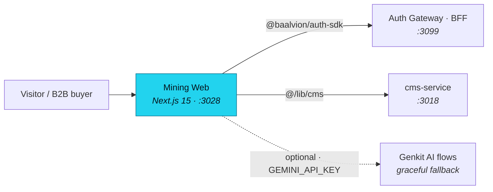

<div align="center">



<br/>
<br/>

**Public website and B2B trade portal for Baalvion Mining Inc. — a global mineral supply network with compliance, market intelligence, and programmatic trade-corridor SEO built in.**

<p>
  
  
  
  
  
</p>

<sub><a href="#overview">Overview</a> · <a href="#architecture">Architecture</a> · <a href="#tech-stack">Tech Stack</a> · <a href="#getting-started">Getting started</a> · <a href="#configuration">Configuration</a> · <a href="#project-structure">Structure</a> · <a href="#notes">Notes</a></sub>

</div>

---

## Overview

Public-facing website and B2B trade portal for **Baalvion Mining Inc.**, a global
mining and commodity supply network operated by Baalvion Industries Private
Limited. The app is part of the Baalvion ecosystem domain and integrates with the
platform's centralized authentication and content services.

- **Production domain:** https://mining.baalvion.com
- **Local port:** `:3028` (Turbopack)
- **Auth:** centralized via `@baalvion/auth-sdk` → the auth-gateway BFF
- **Content:** central `cms-service` (`:3018`) via `@/lib/cms`

## Architecture



## Tech Stack

- **Framework:** Next.js 15 (App Router, TypeScript)
- **Styling:** Tailwind CSS + shadcn/ui (Radix UI)
- **AI:** Google Genkit (Gemini) — optional, degrades gracefully without a key
- **Auth:** `@baalvion/auth-sdk` → central auth-gateway BFF
- **CMS:** central `cms-service` (`:3018`) via `@/lib/cms`
- **Package manager:** pnpm (monorepo workspace)

## Getting Started

```bash
pnpm install          # from monorepo root
pnpm run dev          # starts on :3028 (turbopack)
pnpm run typecheck    # tsc --noEmit
pnpm run lint         # eslint
pnpm run build        # typecheck + next build
```

Optional AI flows (requires `GEMINI_API_KEY`):

```bash
pnpm run genkit:dev
```

## Configuration

Create `.env.local` at the app root:

```env
NEXT_PUBLIC_AUTH_URL=http://localhost:3099
NEXT_PUBLIC_CMS_API_URL=http://localhost:3018
NEXT_PUBLIC_GA_MEASUREMENT_ID=G-XXXXXXXXXX   # optional
GEMINI_API_KEY=                               # optional — AI flows fall back gracefully
```

## Project Structure

| Path | Purpose |
|------|---------|
| `src/app/` | Next.js App Router pages and route layouts |
| `src/components/layout/` | Navbar, Footer, CookieConsent |
| `src/components/pseo/` | Programmatic SEO trade-corridor pages |
| `src/lib/cms.ts` | Central CMS integration (live + fallback) |
| `src/lib/sitemap-data.ts` | Sitemap registry — products, suppliers, blog, guides |
| `src/ai/flows/` | Genkit AI flows (compliance, market insights, product descriptions) |
| `src/services/` | Business logic for inventory, leads, orders |

## Notes

- AI flows degrade to schema-valid fallbacks when `GEMINI_API_KEY` is absent — no
  build or runtime crash.
- The CMS integration (`src/lib/cms.ts`) reads from the central `cms-service`.
  Do not mock or replace it.
- Auth is centralized via `@baalvion/auth-sdk` — do not add a second JWT issuer.

---

<div align="center">
<sub>Part of the <a href="https://github.com/baalvionservice/Baalvion-Project-Infra">Baalvion Platform</a> · centralized identity · domain-driven monorepo</sub>
</div>
