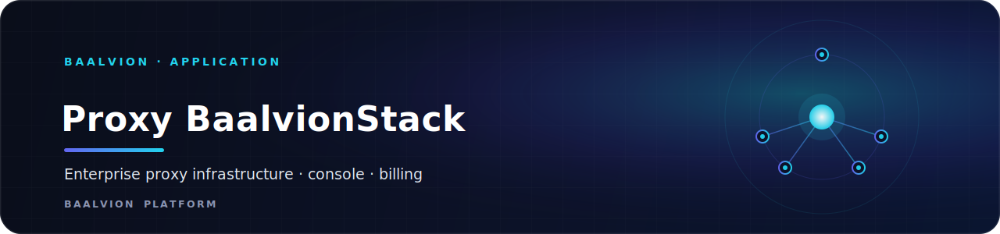
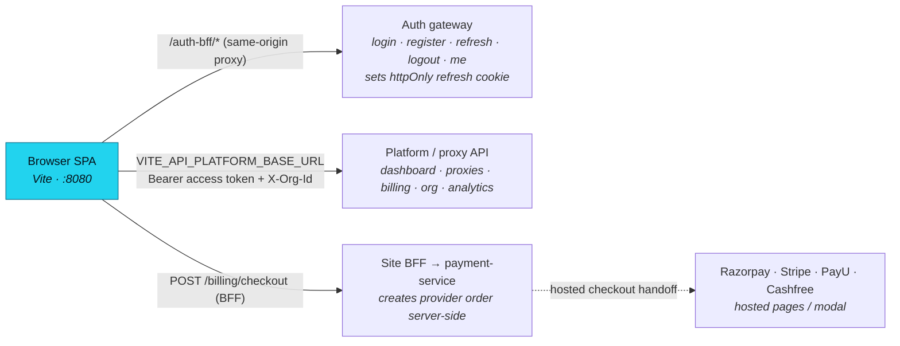

<div align="center">



<br/>
<br/>

**Customer-facing web app for Baalvion's enterprise proxy infrastructure — a public marketing site, an authenticated customer console (proxies, billing, analytics, organization), and an internal operator admin, all backed by the central Baalvion platform.**

<p>
  
  
  
  
  
  
  
</p>

<sub><a href="#overview">Overview</a> · <a href="#architecture">Architecture</a> · <a href="#tech-stack">Tech Stack</a> · <a href="#project-structure">Structure</a> · <a href="#pages--routes">Routes</a> · <a href="#getting-started">Getting started</a> · <a href="#environment-variables">Env</a> · <a href="#security">Security</a> · <a href="#notes--gotchas">Notes</a></sub>

</div>

---

## Overview

**Proxy BaalvionStack** is the React/Vite single-page frontend for **Baalvion NetStack** — Baalvion's
enterprise proxy infrastructure product. It bundles three surfaces in one SPA:

- a **public marketing site** (home, pricing, product/comparison pages, docs, legal, status);
- an **authenticated customer console** (`/app/*`) — proxy management, presets, sub-users, analytics,
  billing/checkout, API keys, organization administration, security center, and support;
- an **internal operator admin** (`/admin/*`) — control room, network map, risk/trust-safety, growth,
  finance/revenue/chargebacks, tenants, feature flags, and white-label.

It is one app inside the larger **Baalvion** pnpm + Turborepo monorepo and consumes the shared
`@baalvion/auth-sdk` workspace package. The browser talks to the central platform through a same-origin
auth BFF (`/auth-bff`, proxied to the auth gateway so the httpOnly refresh cookie flows same-origin)
and a configurable platform API base (`VITE_API_PLATFORM_BASE_URL`). Payments are handled exclusively
through a gateway-checkout client that hands off to provider-hosted checkout — no card data or payment
secrets ever touch this app.

- **Dev / preview port:** `8080` (`strictPort`, host `::`)
- **Public marketing site (per `index.html`):** `https://baalvion.com`
- **Reverse-proxy host (preview `allowedHosts`):** `*.baalvionstack.com` / `*.baalvionstack.local`
- **Auth model:** access token in **memory only** (no `localStorage`); httpOnly refresh cookie via the auth gateway; silent session restore on load

## Architecture

### Request topology

The SPA is built and served by Vite. In both `dev` and `preview`, `vite.config.ts` mounts a same-origin
`/auth-bff` proxy to the auth gateway and applies hardened security headers (CSP, framing, sniffing).
Live data is read from the platform API base; payments are initiated through the site's own BFF, which
brokers the provider order server-to-server.



### Auth & session model

`src/contexts/AuthContext.tsx` holds the access token and user **in React state only** (P0 security
remediation — no `localStorage`/`sessionStorage`). The refresh token is the **httpOnly cookie** set by
the auth service via the `/auth-bff` proxy. On app start the provider silently restores the session by
calling `authClient.refresh()` (cookie-only, no body) and then `me()`; if there is no valid cookie the
user stays unauthenticated. `src/lib/authClient.ts` posts to `/auth-bff/{login,register,refresh,logout,
validate-invite,accept-invite}` with `credentials: 'include'`, and registration returns a
`requiresPayment` flag that routes new paid-plan orgs to checkout.

### Data layer

`src/lib/platformClient.ts` is the typed REST client for the platform/proxy API. It reads
`VITE_API_PLATFORM_BASE_URL`, attaches the in-memory `Bearer` access token plus an `X-Org-Id` header,
and unwraps a `{ data }` envelope into typed results. It exposes domain modules including
`dashboardApi`, `proxyApi`, `presetApi`, `analyticsApi`, `billingApi`, `orgApi`, `apiKeyApi`,
`securityApi`, `usageApi`, `notificationApi`, `auditApi`, `supportApi`, `enterpriseApi`,
`networkAnalyticsApi`, `marketplaceCatalogApi`, `partnerApi`, plus a no-auth `publicApi` (plans,
status, stats, case studies, API reference). Server state is cached with TanStack Query
(`QueryClientProvider` in `App.tsx`).

### Payments

`src/lib/gatewayCheckout.ts` is the **only** payment integration point. It contains no payment logic,
no provider keys, and no card fields. The browser calls the site's own backend
(`POST {VITE_API_PLATFORM_BASE_URL}/billing/checkout`, authorized with the in-memory access token); the
BFF prices the charge server-side, creates the provider order, and returns provider-public params. The
client then hands off to the provider's **hosted** flow:

- **Razorpay** — loads `checkout.razorpay.com/v1/checkout.js` and opens the modal;
- **Stripe** — redirects to the hosted Checkout Session URL;
- **PayU** — builds a signed form and POSTs to the hosted page;
- **Cashfree** — loads the v3 SDK and redirects via `payment_session_id`.

Authoritative settlement always arrives via the provider webhook → payment-service ledger; the client
result is UI feedback only. A `mock` mode simulates the hosted step for local/test tenants.

### SEO & crawlability

`index.html` ships static metadata (title, description, canonical, Open Graph, Twitter card, and a
`SoftwareApplication` JSON-LD block) and `react-helmet-async` (`HelmetProvider` in `App.tsx`) manages
per-route head tags. `public/robots.txt` explicitly allows major search and AI/LLM crawlers (GPTBot,
ClaudeBot, PerplexityBot, CCBot, Google-Extended, etc.) on the public site while disallowing
`/login`, `/admin`, `/app`, `/dashboard`, `/onboarding`, and `/accept-invite`; `public/sitemap.xml` is
served alongside it.

## Tech Stack

| Concern | Choice | Version |
|---|---|---|
| Build tool / dev server | [Vite](https://vitejs.dev) + `@vitejs/plugin-react-swc` | `^7.3.2` / `^3.11.0` |
| UI runtime | React / React DOM | `^18.3.1` |
| Language | TypeScript | `^5.8.3` |
| Routing | `react-router-dom` | `^6.30.1` |
| Server state | `@tanstack/react-query` | `^5.83.0` |
| Styling | Tailwind CSS + `tailwindcss-animate` + `@tailwindcss/typography` | `^3.4.17` / `^1.0.7` / `^0.5.16` |
| UI primitives | Radix UI (`@radix-ui/react-*`) | accordion/dialog/select/tabs/toast etc. |
| Headless widgets | `cmdk`, `vaul`, `input-otp`, `embla-carousel-react`, `react-resizable-panels` | `^1.1.1` / `^0.9.9` / `^1.4.2` / `^8.6.0` / `^2.1.9` |
| Animation | `framer-motion` | `^11.18.2` |
| Icons | `lucide-react` | `^0.462.0` |
| Class utils | `clsx`, `tailwind-merge`, `class-variance-authority` | `^2.1.1` / `^2.6.0` / `^0.7.1` |
| Forms | `react-hook-form` + `@hookform/resolvers` + `zod` | `^7.61.1` / `^3.10.0` / `^3.25.76` |
| Dates | `date-fns`, `react-day-picker` | `^3.6.0` / `^8.10.1` |
| Charts | `recharts` | `^2.15.4` |
| Theming | `next-themes` | `^0.3.0` |
| Toasts | `sonner` (+ Radix toast) | `^2.0.7` |
| Head management | `react-helmet-async` | `^2.0.5` |
| Auth SDK (workspace) | `@baalvion/auth-sdk` | `workspace:*` |
| Lint | ESLint 9 (flat config) + `typescript-eslint` | `^9.32.0` / `^8.38.0` |
| Package manager | pnpm (monorepo workspace) | — |

## Project Structure

```
Proxy-BaalvionStack/
├── src/
│   ├── pages/               # Route components
│   │   ├── public/          # Public marketing/legal/auth-entry pages
│   │   ├── app/             # Authenticated customer console pages (/app/*)
│   │   └── admin/           # Internal operator admin pages (/admin/*)
│   ├── components/          # Shared components incl. layout shells + ui/ (Radix/shadcn)
│   ├── contexts/            # AuthContext, OrgContext, EnterpriseContext (React providers)
│   ├── lib/                 # authClient, platformClient, adminApiClient, gatewayCheckout,
│   │                        #   tokenStore (in-memory), observability, utils
│   ├── api/                 # Intent/data-layer entry (re-exports)
│   ├── contracts/           # API/auth/payment/v1 contract types
│   ├── hooks/               # Reusable hooks (e.g. useReferralCapture)
│   ├── state/ data/ types/ utils/   # Client state, static data, shared types, helpers
│   ├── App.tsx              # Providers + BrowserRouter route table (public/app/admin)
│   ├── main.tsx             # SPA bootstrap (mounts #root)
│   └── index.css | App.css  # Tailwind layers + global styles
├── public/                  # favicon.ico, robots.txt, sitemap.xml
├── scripts/                 # validate-links.ts / .js (Link/navigate vs Route audit)
├── index.html              # SPA shell + static SEO meta + JSON-LD
├── vite.config.ts          # :8080 server/preview, /auth-bff proxy, CSP/security headers, build target
├── tailwind.config.ts      # Theme tokens, typography plugin, animations
├── components.json         # shadcn/ui config (aliases, base color)
├── eslint.config.js        # ESLint 9 flat config
└── tsconfig*.json          # app / node / base TS configs
```

## Pages & Routes

Routing is centralized in `src/App.tsx` (`react-router-dom`). The route table is the source of truth;
`scripts/validate-links.ts` audits every `<Link to>` / `navigate()` against it.

### Public (`PublicLayout`)

`/` (home), `/pricing`, `/status`, `/case-studies`, `/calculator`, `/docs`, `/residential`,
`/mobile`, `/datacenter`, `/enterprise`, `/book-demo`, `/about`, `/privacy`, `/aup`, `/refund`,
`/terms`, `/contact`, `/security`, `/sla`, `/compliance-info`, `/transparency`, `/integrations`,
`/proxy-comparison`, `/infrastructure`, `/cookies`, `/changelog`, `/faq`, `/blog`,
`/enterprise-vs-smb`, plus auth entry: `/login`, `/signup`, `/accept-invite`, `/forgot-password`,
`/reset-password`.

### Customer console (`/app/*`, `AppLayout`)

`dashboard`, `proxies`, `proxy-access`, `privacy`, `enterprise`, `presets`, `sub-users`, `analytics`,
`network-analytics`, `partner`, `marketplace`, `billing` (+ `billing/checkout`, `billing/methods`,
`billing/history`, `billing/subscription`), `api-keys`, `settings`, `audit-logs`, `compliance`,
`security`, `contract`, `audit`, `account-suspended`, `payment-required`, `organization`
(+ `organization/members`, `organization/roles`, `organization/billing`), `support`, `tester`,
`data`, `notifications`.

### Operator admin (`/admin/*`, `AdminLayout`)

`dashboard`, `control-room`, `network-map`, `risk-center`, `growth`, `customer-health`, `middleware`,
`pricing-sim`, `cohort`, `users`, `plans`, `providers`, `orchestration`, `trust-safety`,
`edge-network`, `intelligence`, `finance`, `marketplace`, `audit-logs`, `routing`, `abuse`, `health`,
`tickets`, `tenants`, `feature-flags`, `whitelabel`, `payments`, `revenue`, `chargebacks`.

### Standalone

`/auth/sso-callback`, `/500` (server error), and a catch-all `*` → NotFound.

## Getting Started

**Prerequisites:** Node.js, **pnpm**, and the monorepo workspace installed (this app depends on the
`@baalvion/auth-sdk` workspace package). For live data you also need the platform reachable: the auth
gateway (behind `VITE_AUTH_PROXY_TARGET` / `VITE_API_AUTH_BASE_URL`) and the platform/proxy API
(`VITE_API_PLATFORM_BASE_URL`).

```bash
# From the monorepo root
pnpm install

# Dev server on http://localhost:8080
pnpm run dev

# Lint
pnpm run lint            # eslint .

# Production build / preview
pnpm run build           # vite build
pnpm run build:dev       # vite build --mode development
pnpm run preview         # serve dist/ with the same port, proxy, and hardened headers
```

Create `.env.local` (copy from `.env.example`) at the app root before running.

## Environment Variables

All client-exposed variables use the Vite `VITE_` prefix and are inlined into the browser bundle —
treat them as public. `.env*` / `*.local` files are gitignored; never commit secrets. See
`.env.example` for the template.

| Variable | Purpose |
|---|---|
| `VITE_API_AUTH_BASE_URL` | Auth-service base URL (dev `http://localhost:3001/v1/auth`); also a fallback for the `/auth-bff` proxy target and a CSP `connect-src` origin |
| `VITE_AUTH_PROXY_TARGET` | Preferred upstream for the same-origin `/auth-bff/*` proxy (dev/preview) |
| `VITE_API_PLATFORM_BASE_URL` | Platform + proxy API base (dev `http://localhost:4000/v1`); used by `platformClient` and `gatewayCheckout`, and as a CSP `connect-src` origin |
| `VITE_APP_URL` | App metadata / canonical app base (`http://localhost:8080`) |
| `VITE_GATEWAY_URL` | Single API gateway ingress (default `https://api.baalvion.com`) |
| `VITE_PROXY_GATEWAY_HOST` | Proxy gateway (Go data plane) host shown on the Proxy Access page (default `gw.baalvion.net`) |
| `VITE_PROXY_GATEWAY_HTTP_PORT` | Proxy gateway HTTP port (default `10000`) |
| `VITE_PROXY_GATEWAY_SOCKS_PORT` | Proxy gateway SOCKS port (default `1080`) |
| `VITE_PAYU_ACTION_URL` | PayU hosted-page action URL (default `https://test.payu.in/_payment`) |

> `vite.config.ts` derives the CSP `connect-src`/`script-src`/`frame-src` origins from the auth and
> platform base URLs (plus fixed payment-provider origins), so local dev and production stay aligned
> without hand-editing the policy.

## Security

- **No token in web storage.** The access token + user live in React state only (`tokenStore` is an
  in-memory holder). Do not persist them to `localStorage`/`sessionStorage`.
- **httpOnly refresh cookie via same-origin proxy.** Auth always flows through `/auth-bff` so the
  refresh cookie is set/sent same-origin (`credentials: 'include'`); never call a cross-origin auth URL.
- **No payment secrets client-side.** `gatewayCheckout.ts` carries no provider keys or card fields; the
  BFF prices and creates provider orders server-side, and settlement is webhook-authoritative.
- **Hardened headers in dev and preview.** `vite.config.ts` emits CSP, `X-Frame-Options: SAMEORIGIN`,
  `X-Content-Type-Options: nosniff`, `Referrer-Policy`, and `Permissions-Policy`; CSP origins are
  derived from the configured API base URLs plus the payment providers' domains.
- **Authenticated/admin routes are non-indexable** (`public/robots.txt` disallows `/login`, `/admin`,
  `/app`, `/dashboard`, `/onboarding`, `/accept-invite`). Client route gating prevents display, not
  access — the API enforces real authorization.

## Notes / Gotchas

- **Build target is `esnext`.** Vite's default target trips an esbuild transpile bug in CI
  (`Transforming destructuring to the configured target environment is not supported yet`) on
  async/await + destructuring; `esnext` disables downleveling and fixes it for this modern SPA.
- **`preview` needs `allowedHosts`.** Behind the local reverse proxy / Caddy the upstream Host is
  `proxy.baalvionstack.com` (or `.local`), so it is allow-listed or `vite preview` returns
  "Blocked request. This host is not allowed."
- **`VITE_API_PLATFORM_BASE_URL` localhost fallback is DEV-ONLY.** `gatewayCheckout` guards the
  `http://localhost:4000/v1` fallback behind `import.meta.env.PROD` so a missing prod env var fails
  loudly rather than routing checkout to a dev machine.
- **`X-Org-Id` fallback.** `platformClient` falls back to a placeholder org id when none is on the
  user; live calls expect a real org from the authenticated session.
- **`.env.example` is the template** — copy to `.env.local`; do not commit real values.

---

<div align="center">
<sub>Part of the <a href="https://github.com/baalvionservice/Baalvion-Project-Infra">Baalvion Platform</a> · centralized identity · domain-driven monorepo</sub>
</div>
