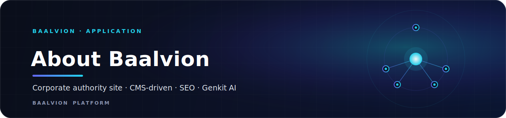
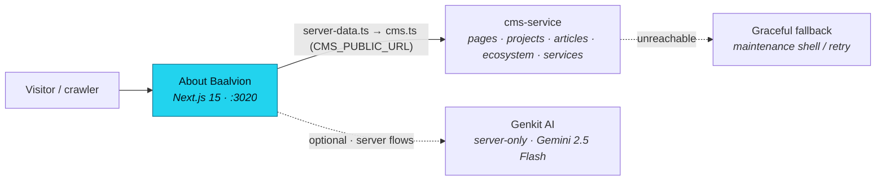

<div align="center">



<br/>
<br/>

**The corporate authority website for `about.baalvion.com` — a CMS-driven, SEO-first Next.js app that publishes Baalvion Industries' company, ecosystem, and project content from the central platform CMS.**

<p>
  
  
  
  
  
</p>

<sub><a href="#overview">Overview</a> · <a href="#architecture">Architecture</a> · <a href="#tech-stack">Tech Stack</a> · <a href="#project-structure">Structure</a> · <a href="#pages--routes">Routes</a> · <a href="#getting-started">Getting started</a> · <a href="#environment-variables">Env</a> · <a href="#deployment">Deployment</a> · <a href="#notes--gotchas">Notes</a></sub>

</div>

---

## Overview

The public corporate website for **Baalvion Industries**, served at
**https://about.baalvion.com**. It presents the company, its operating philosophy and
structure, the wider Baalvion ecosystem, projects, services, industries, case studies,
careers, investor information, and trust/legal pages.

Content is **not** hard-coded in the app: pages are rendered server-side from the central
Baalvion **CMS** (`cms-service`) via its public delivery API, mapped into typed view models
and rendered for SEO. When the CMS is unreachable the app degrades gracefully rather than
crashing. It is the corporate-authority surface within the wider Baalvion platform and lives
inside the **pnpm + Turborepo monorepo** under `Frontend/about-baalvion-main`; its workspace
package name is `about-baalvion-web`.

- **Production domain:** https://about.baalvion.com (set as `metadataBase`)
- **Local dev port:** `:3020` (Turbopack)
- **Content source:** central `cms-service` public API via `src/lib/cms.ts` (graceful fallback)
- **Auth SDK:** `@baalvion/auth-sdk` (workspace) is available; local admin is retired
- **AI:** Google **Genkit** (Gemini 2.5 Flash), server-only

## Architecture

### Rendering model

Next.js **App Router** with React Server Components as the default. The home page and content
pages are server components that fetch from the CMS through `src/lib/server-data.ts`
(`getHomePageData`, `getProjects`, `getEcosystemItems`, `getPageBySlug`, …). AI logic is
hard-gated to the server via an `import 'server-only'` boundary in `src/ai/genkit.ts`, and
the Genkit/OpenTelemetry runtime is kept out of the client bundle through
`serverExternalPackages` in `next.config.ts`.

### Content & data flow



- **CMS read path** (`src/lib/cms.ts`) maps the `cms-service` public API onto frontend types
  (`Project`, `Article`, `EcosystemItem`, `OperationalUpdate`, `Page` sections). It applies a
  retry-with-backoff strategy on transient failures and degrades gracefully. The CMS base URL
  is `CMS_PUBLIC_URL` and the site is identified by `CMS_WEBSITE_SLUG` (`about-baalvion`).
- **Home page** (`src/app/page.tsx`) fetches CMS data server-side; if data is unavailable
  during the build phase it renders a maintenance shell, and at runtime an unavailable CMS
  surfaces through the error boundary rather than fabricating content.
- **Environment validation** (`src/lib/env.ts`) uses Zod schemas for server and client env;
  invalid configuration throws in production (fail-fast).

### SEO

First-class SEO from `src/app/layout.tsx`: `metadataBase` of `https://about.baalvion.com`,
a templated title (`%s | Baalvion Industries`), **Organization** and **WebSite** JSON-LD
(the WebSite schema declares a `SearchAction` to `/news/search`), OpenGraph + Twitter
(`summary_large_image`) cards, and a robots policy that indexes the site while disallowing
`/admin/` and `/api/`. A dynamic `sitemap.ts` is generated from CMS content (pages, projects,
articles, updates, services, industries, case studies) plus the static hub routes, and
`robots.ts` points crawlers to `https://about.baalvion.com/sitemap.xml`.

### Security headers

Set in `next.config.ts → headers()` for all routes:

| Header | Value |
|---|---|
| `Content-Security-Policy` | `default-src 'self'`; scripted/styled with `'unsafe-inline'` (dev adds `'unsafe-eval'` for HMR); `connect-src 'self' https://api.baalvion.com`; `frame-ancestors 'none'`; `object-src 'none'`; `base-uri 'self'`; `form-action 'self'` |
| `Strict-Transport-Security` | `max-age=63072000; includeSubDomains; preload` |
| `X-Frame-Options` | `SAMEORIGIN` |
| `X-Content-Type-Options` | `nosniff` |
| `X-XSS-Protection` | `1; mode=block` |
| `Referrer-Policy` | `strict-origin-when-cross-origin` |
| `Permissions-Policy` | `camera=(), microphone=(), geolocation=()` |
| `X-DNS-Prefetch-Control` | `on` |

`img-src` allow-lists `placehold.co`, `images.unsplash.com`, `picsum.photos` (and
`fastly.picsum.photos`); `next/image` `remotePatterns` mirror these hosts. User-supplied HTML
is run through `src/lib/sanitize.ts` before rendering.

## Tech Stack

| Concern | Choice | Version |
|---|---|---|
| Framework | [Next.js](https://nextjs.org) (App Router, RSC) | `15.5.18` |
| Language | TypeScript | `^5` (strict, `noEmit`) |
| Runtime | React / React DOM | `^19.2.1` |
| Styling | Tailwind CSS + `tailwindcss-animate` | `^3.4.1` / `^1.0.7` |
| UI primitives | shadcn/ui on Radix UI (`@radix-ui/react-*`) | accordion/dialog/select/tabs/toast etc. |
| Icons | `lucide-react` | `^0.475.0` |
| Class utils | `clsx`, `tailwind-merge`, `class-variance-authority` | `^2.1.1` / `^3.0.1` / `^0.7.1` |
| Forms | `react-hook-form` + `@hookform/resolvers` + `zod` | `^7.54.2` / `^4.1.3` / `^3.24.2` |
| Charts | `recharts` | `^2.15.1` |
| Carousel / dates | `embla-carousel-react`, `date-fns`, `react-day-picker` | `^8.6.0` / `^3.6.0` / `^9.14.0` |
| HTML sanitize | `sanitize-html` (+ `@types/sanitize-html`) | `^2.13.0` |
| AI | Google **Genkit** (`genkit`, `@genkit-ai/google-genai`) — Gemini 2.5 Flash | `^1.28.0` |
| Auth | `@baalvion/auth-sdk` (workspace) | `workspace:*` |
| Env | `dotenv` + Zod-validated `src/lib/env.ts` | `^16.5.0` |
| Package manager | pnpm (monorepo workspace) | — |

Build tooling: Turbopack (dev), `next lint`, PostCSS, `patch-package`. shadcn/ui is
configured via `components.json` (RSC + TSX, base color `neutral`, `lucide` icons).

## Getting Started

**Prerequisites:** Node 20+, pnpm, and the monorepo workspace installed. For live content you
also need the central `cms-service` reachable at `CMS_PUBLIC_URL`; otherwise pages render the
graceful maintenance/fallback states.

```bash
# From the monorepo root
pnpm install

# Dev (Turbopack) on http://localhost:3020
pnpm run dev

# Quality gates
pnpm run typecheck    # tsc --noEmit
pnpm run lint         # next lint

# Production build / serve
pnpm run build        # next build
pnpm run start        # next start

# Optional: run Genkit AI flows locally (needs a Gemini key)
pnpm run genkit:dev   # or genkit:watch
```

Create a local env file (`.env.local`) before running — see below.

## Environment Variables

Public (`NEXT_PUBLIC_*`) values are exposed to the browser; everything else is server-only.
`src/lib/env.ts` validates these with Zod and throws in production if they are invalid.

| Variable | Default | Purpose |
|---|---|---|
| `CMS_PUBLIC_URL` | `http://localhost:3011/api/v1/public` | Central CMS public delivery API base (content source) |
| `CMS_WEBSITE_SLUG` | `about-baalvion` | CMS site slug for this app |
| `NEXT_PUBLIC_CMS_CONSOLE_URL` | — | Link to the CMS admin console for editors (optional) |
| `NEXT_PUBLIC_APP_URL` | `http://localhost:3020` | Public base URL of this app |
| `NEXT_PUBLIC_ABOUT_API_URL` | `https://api.baalvion.com/api/v1/ecosystem/about` | Ecosystem API base (client) |
| `ADMIN_SECRET_KEY` | — | Server-only admin secret (min 16 chars, default rejected); local admin is retired |
| `NODE_ENV` | — | `development` \| `test` \| `production` |

> The Gemini API key consumed by the Genkit Google plugin is read server-side when AI flows
> run; AI is not required for the site to build or render content.

## Project Structure

| Path | Purpose |
|---|---|
| `src/app/` | App Router: pages, root `layout.tsx` (metadata + JSON-LD + fonts), `sitemap.ts`, `robots.ts` |
| `src/app/page.tsx` | Home — server-rendered from CMS (`Navbar → HomePageServer → HomeExplore → Footer`) |
| `src/lib/cms.ts` | CMS client: maps `cms-service` public API to frontend types, retry + graceful fallback |
| `src/lib/server-data.ts` | Server data fetchers (`getHomePageData`, `getProjects`, `getEcosystemItems`, …) |
| `src/lib/env.ts` | Zod-validated server + client environment schemas (fail-fast in production) |
| `src/lib/sanitize.ts` · `schema.ts` · `db.ts` · `utils.ts` | HTML sanitization, data shapes, type defs, utilities |
| `src/lib/auth/` | Auth helpers (centralized via `@baalvion/auth-sdk`) |
| `src/ai/` | Genkit config (`genkit.ts`, `import 'server-only'`, Gemini 2.5 Flash), `dev.ts`, `flows/` |
| `components.json` | shadcn/ui config (RSC, TSX, base color `neutral`, `lucide`) |
| `next.config.ts` | Security headers / CSP, image `remotePatterns`, `serverExternalPackages` |
| `tailwind.config.ts` | Theme tokens (HSL CSS vars), Inter font, `tailwindcss-animate` |
| `apphosting.yaml` | Firebase App Hosting run config (`maxInstances: 1`) |
| `vercel.json` | Vercel `turbo-ignore about-baalvion-web` build guard |

## Pages & Routes

The app has **22 top-level routes** (each a `page.tsx`), plus dynamic CMS-fed segments. Hub
routes:

| Route | Purpose |
|---|---|
| `/` | Home — CMS-driven hero/company/ecosystem |
| `/about` · `/company` · `/philosophy` · `/structure` · `/leadership` | Company & corporate |
| `/platform` · `/ecosystem` · `/services` · `/industries` | Platform & offering |
| `/projects` · `/case-studies` · `/reports` · `/updates` | Work & disclosures |
| `/investors` · `/careers` · `/contact` | Stakeholders |
| `/trust` · `/privacy` · `/terms` | Trust & legal |
| `/admin` | Local admin surface (retired) |

`robots.ts` disallows `/admin/` and `/api/`; `sitemap.ts` is generated dynamically from CMS
content plus the static hub paths.

## Notes / Gotchas

- **Content is real, from the CMS.** `src/lib/cms.ts` reads the central `cms-service`; it
  already retries and degrades gracefully. Do not mock or replace it, and do not hard-code
  page content.
- **AI is server-only.** `src/ai/genkit.ts` uses `import 'server-only'` and `next.config.ts`
  marks Genkit/OpenTelemetry as `serverExternalPackages`. Never import AI modules from a
  client component.
- **Env is fail-fast.** `src/lib/env.ts` validates env with Zod and throws in production on
  invalid config; `ADMIN_SECRET_KEY` must be ≥16 chars and the shipped default is rejected.
- **Local admin is retired.** The `/admin` route exists but is not the platform admin
  surface; manage content through the CMS console (`NEXT_PUBLIC_CMS_CONSOLE_URL`).
- **Both type-check and lint are build blockers** (`ignoreBuildErrors: false`,
  `ignoreDuringBuilds: false`) — keep `pnpm run typecheck` and `pnpm run lint` green.
- **Security headers live in `next.config.ts`.** The dev CSP adds `'unsafe-eval'` for HMR; the
  prod CSP omits it. Add any new third-party host to both the CSP and image `remotePatterns`.
- The dev server runs on **port 3020**.

---

<div align="center">
<sub>Part of the <a href="https://github.com/baalvionservice/Baalvion-Project-Infra">Baalvion Platform</a> · centralized identity · domain-driven monorepo</sub>
</div>
