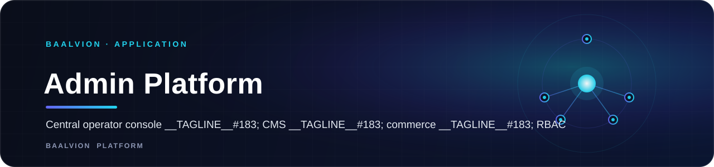

<div align="center">



<br/>
<br/>

**The central operator console for the Baalvion platform — a single Next.js app managing identity, CMS, commerce, RBAC, and every domain product from CTM to Imperialpedia, backed by a hierarchical authorization layer and realtime updates.**

<p>
  
  
  
  
  
  
</p>

<sub><a href="#overview">Overview</a> · <a href="#architecture">Architecture</a> · <a href="#tech-stack">Tech Stack</a> · <a href="#getting-started">Getting started</a> · <a href="#configuration">Configuration</a> · <a href="#project-structure">Structure</a> · <a href="#security">Security</a></sub>

</div>

---

## Overview

**Admin Platform** (`baalvion-admin-platform`) is the operator-facing console for the whole
Baalvion platform — the single place `super_admin`, `admin`, and `writer` roles manage identity,
content, and commerce across every domain product in the monorepo, rather than each app shipping
its own bespoke back office.

- **Dev port:** `3030` (`next dev --port 3030`)
- **Canonical production host:** `https://admin.baalvion.com`
- **Audience:** internal operators only — `super_admin`, `admin`, and `writer` roles, gated behind
  MFA login
- **Auth model:** the central Baalvion identity platform via `@baalvion/auth-sdk`, with an
  additional MFA step (`(auth)/mfa`) before the dashboard is reachable

## Architecture

### Route groups

- **`(auth)`** — login, forgot-password, and MFA, ungated.
- **`(dashboard)`** — everything else: `ai`, `analytics`, `audit-center`, `audit-logs`, `billing`,
  `cms`, `commerce`, `crm`, `ctm`, `developers`, `identity`, `imperialpedia`, `infrastructure`,
  `ir`, `jobs`, `law`, `marketplace`, `media`, `news-intelligence`, `notifications`, `oauth`,
  `operations`, `organizations`, `payments`, `people`, `platform-management`, `rbac`, `revenue`,
  `security`, `sessions`, `settings`, `staff`, `support`, `users` — one console section per domain
  product, gated by the authz layer below.
- `invite/[token]` and `welcome` handle operator invitations and first login outside the gated tree.

### Authorization

A dedicated `src/lib/authz` layer (`access.ts`, `hierarchy.ts`, `policy.ts`, `backendGates.ts`,
`useAccess.ts`) evaluates the Baalvion role hierarchy (`super_admin` → `admin` → `writer`) client-side
for UI gating, with `backendGates.ts` mirroring the same checks the backend actually enforces —
so a console panel is never shown for an action the API will reject. RBAC itself (roles, grants,
per-website scoping) is managed through its own `rbac` dashboard section, backed by
`src/lib/api/rbac.ts` and `src/lib/queries/rbac.queries.ts`.

### Data & realtime

- **API access** goes through `NEXT_PUBLIC_API_URL` / `NEXT_PUBLIC_GATEWAY_URL`, with dedicated
  base URLs for the admin, session, and OAuth services (see Configuration).
- **Realtime** updates are pushed over a WebSocket client (`src/lib/websocket/wsClient.ts`).
- **Rich content editing** (CMS articles, pages) uses Tiptap (`@tiptap/core` + table/image/blockquote
  extensions).
- Server state is cached with TanStack Query; tabular views (users, audit logs, sessions, …) use
  TanStack Table.

### Security headers

`next.config.ts` ships a strict CSP that is deliberately widened only when the configured backend
URLs actually point at `localhost`/`127.0.0.1` (or `ALLOW_LOCAL_BACKENDS=true`) — so a real HTTPS
deployment always gets the strict policy, while a local pm2 fleet pointing at `localhost` services
still works without opening the production CSP.

## Tech Stack

Next.js 15 · TypeScript · `@baalvion/auth-sdk` · Radix UI · TanStack Query / Table · Tiptap ·
Vitest

## Getting Started

```bash
pnpm install
cp .env.example .env.local
pnpm run dev        # http://localhost:3030
```

## Configuration

| Variable | Purpose |
|---|---|
| `NEXT_PUBLIC_API_URL` | Core API base |
| `NEXT_PUBLIC_AUTH_URL` | Auth service base |
| `NEXT_PUBLIC_ADMIN_API_URL` | Admin service base |
| `NEXT_PUBLIC_SESSION_API_URL` | Session service base |
| `NEXT_PUBLIC_OAUTH_URL` | OAuth service base |
| `NEXT_PUBLIC_GATEWAY_URL` | Single API gateway ingress (default `https://api.baalvion.com`) |
| `NEXT_PUBLIC_APP_URL` | This app's own origin |
| `NEXT_PUBLIC_ACCESS_TOKEN_TTL` | Access-token expiry, in ms |
| `ALLOW_LOCAL_BACKENDS` | Opt-in to widen CSP `connect-src` for a local backend fleet |

## Project Structure

```
src/
  app/
    (auth)/            # login · forgot-password · mfa
    (dashboard)/        # one route per domain: cms, commerce, rbac, imperialpedia, ir, jobs, law, …
    invite/[token]/     # operator invitations
    welcome/
  components/
    authz/ rbac/ cms/ commerce/ imperialpedia/ ir/ charts/ data-table/ realtime/ layout/ ui/
  lib/
    authz/             # access.ts · hierarchy.ts · policy.ts · backendGates.ts · useAccess.ts
    api/ auth/ cms/ constants/ hooks/ newsroom/ queries/ store/ types/ websocket/
```

## Security

- MFA-gated login before any dashboard route is reachable.
- Client-side authz checks in `useAccess.ts` are paired with `backendGates.ts` so the UI never
  promises an action the backend will refuse.
- Production CSP stays strict (`connect-src 'self' https:`) unless the configured backends are
  explicitly local.

## Notes

This console is pre-launch: per platform policy, superseded functionality is replaced in place
rather than deleted, since removing a panel before launch can silently drop capability that
another role still depends on.

---

<sub>Part of the <a href="https://github.com/baalvionservice/Baalvion-Project-Infra">Baalvion Platform</a> · centralized identity · domain-driven monorepo</sub>
