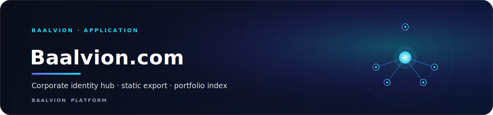
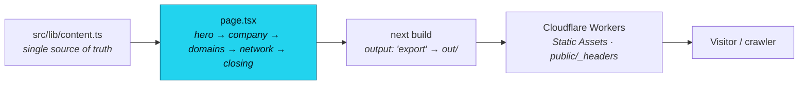

<div align="center">



<br/>
<br/>

**The flagship corporate identity hub for Baalvion — a strictly corporate, statically-exported Next.js site that indexes the platform's domains and brands with zero auth, no dashboards, and no backend logic.**

<p>
  
  
  
  
  
  
</p>

<sub><a href="#overview">Overview</a> · <a href="#architecture">Architecture</a> · <a href="#tech-stack">Tech Stack</a> · <a href="#project-structure">Structure</a> · <a href="#getting-started">Getting started</a> · <a href="#design-system">Design</a> · <a href="#deployment">Deployment</a> · <a href="#notes--gotchas">Notes</a></sub>

</div>

---

## Overview

The flagship corporate site for **Baalvion** — a global infrastructure intelligence company
operating across trade, markets, and ecosystem systems. This is the **corporate layer only**:
an identity hub and portfolio index. It contains **no product UI, no dashboards, no
authentication, and no backend logic**. The product layer (trade / mining / market / jobs /
connect / dashboard subdomains) and independent brands are referenced as links only.

It lives inside the Baalvion **pnpm + Turborepo monorepo** under `Frontend/baalvion-com-main`;
its workspace package name is `baalvion-com-web`. All copy and the portfolio index live in a
single source of truth, `src/lib/content.ts`.

- **Local dev / start port:** `:3043` (Turbopack dev; `next start -p 3043`)
- **Output:** static export (`output: 'export'` → `out/`)
- **Host:** Cloudflare Workers Static Assets (`wrangler.jsonc`, worker name `baalvion`)
- **Data:** zero client-side data fetching; one small client component (scroll reveal)

## Architecture

The site is a **single corporate page** assembled from section components, statically exported
and served from Cloudflare. Because a static host does not run Next.js `headers()`, the
security headers are served by Cloudflare via `public/_headers` (kept in sync with the notes
in `next.config.ts`).



- **Rendering:** App Router; the page renders entirely from `src/lib/content.ts`. Image
  optimization is disabled (`images.unoptimized: true`) because a static export has no Next
  image server.
- **SEO:** `src/app/layout.tsx` sets `metadataBase` from `SITE.url`, a templated title, an
  **Organization** JSON-LD block (logo `icon.svg`, slogan, and `sameAs` derived from the
  external + network links in `content.ts`), and OpenGraph/Twitter (`summary_large_image`)
  metadata. The OG card is generated by `src/app/opengraph-image.tsx` (`next/og`), and
  `robots.ts` / `sitemap.ts` are present. `robots` is set to index + follow.
- **Build guards are blocking:** `typescript.ignoreBuildErrors: false` and
  `eslint.ignoreDuringBuilds: false`.

### Security headers (served by Cloudflare via `public/_headers`)

| Header | Value |
|---|---|
| `Content-Security-Policy` | `default-src 'self'; script-src 'self' 'unsafe-inline'; style-src 'self' 'unsafe-inline'; img-src 'self' data:; font-src 'self'; connect-src 'self'; frame-ancestors 'none'; form-action 'self'; base-uri 'self'; object-src 'none'` |
| `Strict-Transport-Security` | `max-age=63072000; includeSubDomains; preload` |
| `X-Frame-Options` | `DENY` |
| `X-Content-Type-Options` | `nosniff` |
| `Referrer-Policy` | `strict-origin-when-cross-origin` |
| `Permissions-Policy` | `camera=(), microphone=(), geolocation=()` |
| `X-DNS-Prefetch-Control` | `on` |

`public/_headers` also pins `/opengraph-image` to `Content-Type: image/png` so social
scrapers treat the extensionless OG export as a PNG.

## Tech Stack

| Concern | Choice | Version |
|---|---|---|
| Framework | [Next.js](https://nextjs.org) (App Router, static export) | `15.5.18` |
| Language | TypeScript (strict) | `^5.8.2` |
| Runtime | React / React DOM | `^19.2.1` |
| Styling | Tailwind CSS + `autoprefixer` + PostCSS | `^3.4.1` / `^10.4.20` / `^8` |
| Fonts | `next/font` — Fraunces, Inter Tight, IBM Plex Mono (`src/app/fonts.ts`) | — |
| Host / deploy | Cloudflare Workers Static Assets (`wrangler`) | `wrangler.jsonc` |
| Package manager | pnpm (monorepo workspace) | — |

There are no runtime data libraries — `next`, `react`, and `react-dom` are the only
dependencies. Everything else is build/dev tooling.

## Getting Started

```bash
# From the monorepo root
pnpm install

# Dev (Turbopack) on http://localhost:3043
pnpm --filter baalvion-com-web dev

# Quality gates
pnpm --filter baalvion-com-web typecheck   # tsc --noEmit
pnpm --filter baalvion-com-web lint         # next lint

# Production build (static export → out/) and local serve on :3043
pnpm --filter baalvion-com-web build
pnpm --filter baalvion-com-web start
```

The site has no environment variables and fetches no data at runtime; everything is built
from `src/lib/content.ts`.

## Project Structure

| Path | Purpose |
|---|---|
| `src/app/layout.tsx` | Fonts, metadata, Organization JSON-LD |
| `src/app/page.tsx` | The single corporate page (hero → company → domains → network → closing) |
| `src/app/fonts.ts` | `next/font` declarations (Fraunces, Inter Tight, IBM Plex Mono) |
| `src/app/globals.css` | Design tokens + institutional utilities |
| `src/app/opengraph-image.tsx` | Generated OG card (`next/og`) |
| `src/app/icon.svg` | Brand layer mark |
| `src/app/robots.ts` · `sitemap.ts` · `not-found.tsx` | Crawl rules, sitemap, 404 |
| `src/components/sections/` | Page sections (hero, company, domains, network, presence, principles, scale, insight, closing) |
| `src/components/structure/` | Structural shell (e.g. `substrate`) |
| `src/components/` | `site-header`, `site-footer`, `wordmark`, `reveal`, `count-up`, `topology-fabric` |
| `src/lib/content.ts` | **All** copy + portfolio index data (single source of truth) |
| `next.config.ts` | `output: 'export'`, `images.unoptimized`, blocking TS/ESLint |
| `public/_headers` | Cloudflare-served security headers + OG content-type pin |
| `wrangler.jsonc` | Cloudflare Workers Static Assets config (serves `out/`) |

## Design System

- Ground `#090c11`, surface `#10141a`, hairlines at 8% white
- Text `#f6f5f3`, muted `#99a1ad`, accent `#ff9900` (Baalvion orange — labels, index numbers,
  and the primary CTA only)
- Typography: Fraunces, Inter Tight (display), and IBM Plex Mono, self-hosted via `next/font`
- Motion: opacity/transform reveals only; `prefers-reduced-motion` honored
- `themeColor` is `#06080b` (`src/app/layout.tsx` viewport)

## Deployment

The site builds to a static export and is served from **Cloudflare Workers Static Assets**:

```bash
pnpm --filter baalvion-com-web deploy    # next build && npx wrangler deploy
pnpm --filter baalvion-com-web preview   # next build && npx wrangler dev
```

`wrangler.jsonc` serves `./out` with `not_found_handling: "404-page"` under the worker name
`baalvion`. Because `headers()` does not run on a static host, security headers ship from
`public/_headers` — **keep `public/_headers` and the `next.config.ts` notes in sync.**

## Notes / Gotchas

- **Strictly corporate.** No auth, dashboards, product UI, or backend logic belong here.
  Subdomains and brands are links only — do not add a second issuer or data layer.
- **Static export.** `output: 'export'` means no server runtime: `headers()` is inert (use
  `public/_headers`) and `next/image` optimization is disabled (`images.unoptimized`).
- **Single source of truth.** All copy + the portfolio index live in `src/lib/content.ts`;
  edit content there, not in components.
- **Port is 3043.** Both `dev` and `start` bind `:3043` (per `package.json`).
- **Build is blocking.** TypeScript and ESLint errors fail the build
  (`ignoreBuildErrors: false`, `ignoreDuringBuilds: false`).

---

<div align="center">
<sub>Part of the <a href="https://github.com/baalvionservice/Baalvion-Project-Infra">Baalvion Platform</a> · centralized identity · domain-driven monorepo</sub>
</div>
