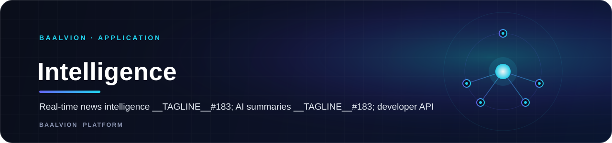
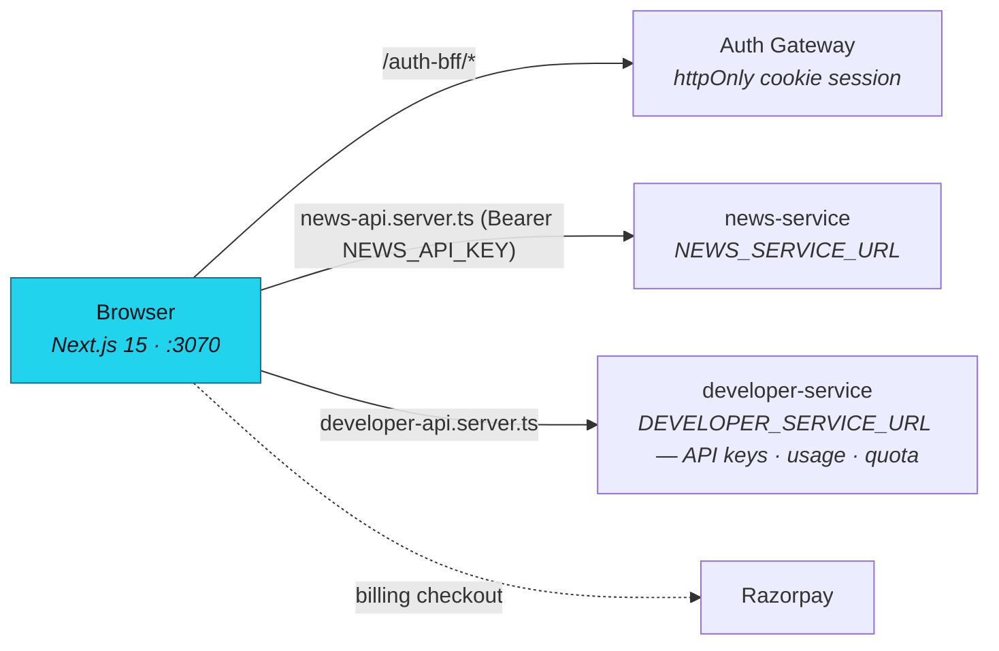

<div align="center">



<br/>
<br/>

**A real-time global news intelligence product — AI-powered summaries, trends, sentiment, and alerts, exposed as a documented API for AI agents and businesses, alongside a self-serve developer dashboard.**

<p>
  
  
  
  
  
  
</p>

<sub><a href="#overview">Overview</a> · <a href="#architecture">Architecture</a> · <a href="#tech-stack">Tech Stack</a> · <a href="#getting-started">Getting started</a> · <a href="#configuration">Configuration</a></sub>

</div>

---

## Overview

**Baalvion Intelligence** monitors companies, competitors, industries, and world events in real
time, with AI-powered summaries, trends, sentiment, and alerts — a news API built for AI agents
and businesses, plus a dashboard for people who want the same intelligence without writing code.

- **Dev port:** `3070` (`next dev --turbopack -p 3070`)
- **Canonical production host:** `https://signal.baalvion.com`
- **Deployment target:** Cloudflare Workers (`@opennextjs/cloudflare`, `wrangler`)
- **Auth model:** central Baalvion identity via `@baalvion/auth-sdk`; the access token is held
  in memory only (never `localStorage`) and re-derived from the httpOnly refresh cookie set by
  auth-service through the same-origin `/auth-bff/[...path]` route

## Architecture

### Route groups

- **`(marketing)`** — public site: blog, company, docs, legal, pricing, login, signup.
- **`dashboard`** — the authenticated product: overview, entity explorer, trends, alerts,
  API keys, billing, usage.
- **`auth-bff`** — same-origin proxy to auth-service for the httpOnly cookie session.

### Data & developer APIs



Both `news-api.server.ts` and `developer-api.server.ts` run server-side only — the news API key
and developer-service calls never reach the client bundle. Plan quotas are enforced against
`src/lib/plan-quota.ts` / `plans.ts` (Free, Starter, and higher self-serve tiers).

### Documentation

A public docs section (`(marketing)/docs`) ships a real developer-facing nav (`docs-nav.ts`):
Getting Started, Authentication, and an MCP Server guide are live; Endpoints, SDKs, Webhooks,
Examples, Rate Limits, and FAQ are flagged `available: false` — present in navigation, not yet
published.

## Tech Stack

Next.js 15 · React 19 · TypeScript · Tailwind CSS · Radix UI · Recharts · Cloudflare Workers
(`@opennextjs/cloudflare`)

## Getting Started

```bash
pnpm install
pnpm run dev        # http://localhost:3070
```

## Configuration

| Variable | Purpose |
|---|---|
| `NEWS_SERVICE_URL` | news-service base (server-only) |
| `NEWS_API_KEY` | Bearer token for news-service (server-only) |
| `DEVELOPER_SERVICE_URL` | developer-service base — API keys, usage, quota (server-only) |

---

<sub>Part of the <a href="https://github.com/baalvionservice/Baalvion-Project-Infra">Baalvion Platform</a> · centralized identity · domain-driven monorepo</sub>
