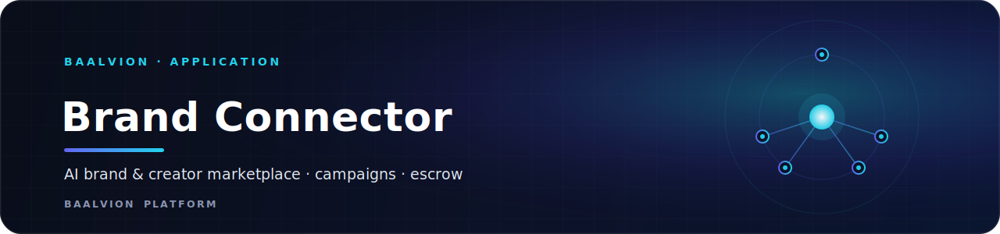
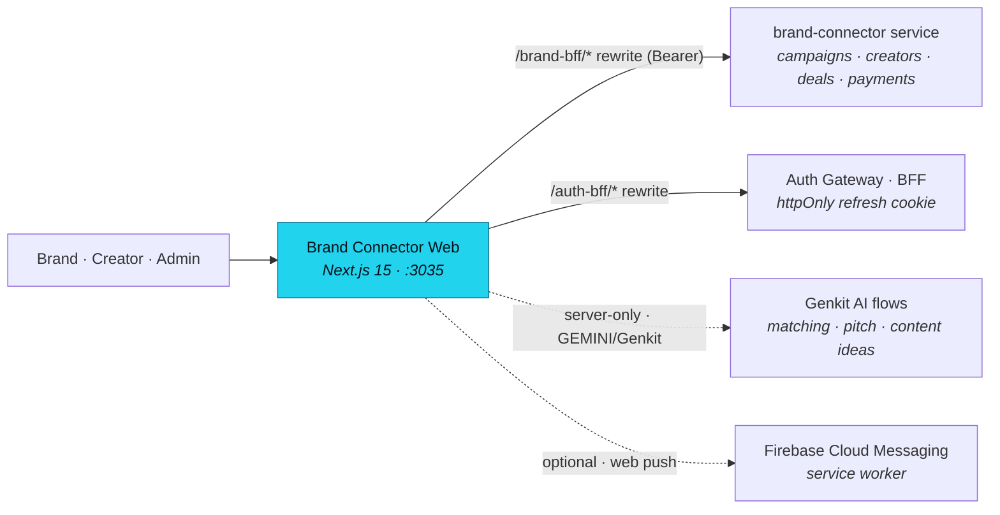

<div align="center">



<br/>
<br/>

**AI-powered brand and creator marketplace — campaign management, escrow-backed payouts, and Genkit matching, built on the central Baalvion identity platform.**

<p>
  
  
  
  
  
  
</p>

<sub><a href="#overview">Overview</a> · <a href="#architecture">Architecture</a> · <a href="#tech-stack">Tech Stack</a> · <a href="#getting-started">Getting started</a> · <a href="#configuration">Configuration</a> · <a href="#project-structure">Structure</a> · <a href="#pages--routes">Routes</a> · <a href="#api-bff">API / BFF</a> · <a href="#security">Security</a> · <a href="#notes--gotchas">Notes</a></sub>

</div>

---

## Overview

**Baalvion Connect** (package `brand-connector-web`) is the brand ↔ creator marketplace
surface of the Baalvion ecosystem. It pairs a public marketing site and creator/leaderboard
discovery with three authenticated workspaces — a **brand dashboard**, a **creator
dashboard**, and an internal **admin console** — plus AI-assisted matching and content
generation via Google Genkit.

It lives inside the Baalvion **pnpm + Turborepo monorepo** under
`Frontend/brand-connector-main` and is the ecosystem-domain frontend for the
**`brand-connector`** backend service. It consumes the shared workspace package
`@baalvion/auth-sdk` and routes all data and auth through the central platform gateway —
it does not stand up its own identity issuer.

- **Local dev port:** `:3035` (Turbopack)
- **Default public origin:** `https://connect.baalvion.com` (`NEXT_PUBLIC_APP_URL`)
- **Backend service:** `brand-connector` — reached via the same-origin `/brand-bff` rewrite
  (default upstream `https://api.baalvion.com/api/v1/ecosystem/brand-connector`)
- **Auth:** centralized via `@baalvion/auth-sdk` + same-origin `/auth-bff` proxy → auth-gateway
- **AI:** Google Genkit (Gemini), server-only, reached only through flows / route handlers

## Architecture

### Rendering model

Next.js **App Router** with React Server Components as the default. The marketing site,
leaderboard, and public creator/campaign-detail pages render server-side for SEO;
interactive surfaces (dashboards, admin, onboarding, forms) opt into `"use client"`. Genkit
AI and OpenTelemetry are kept out of the client bundle via `serverExternalPackages` in
`next.config.ts`. Client state is held in **Zustand** stores (one per domain, see
`src/store/`).

### High-level flow



### Data flow

- **API access** goes through `src/lib/api-client.ts` and the `fb-compat` REST shim, which
  target the `brand-connector` service. `next.config.ts` sets `env.BRAND_API_URL` (default
  `https://api.baalvion.com/api/v1/ecosystem/brand-connector`) and rewrites
  `/brand-bff/:path*` to `${BRAND_API_URL}/api/v1/:path*`, so client calls stay same-origin
  and satisfy the strict production CSP (`connect-src 'self'`) while forwarding the Bearer
  header.
- **Auth is centralized.** `next.config.ts` rewrites `/auth-bff/:path*` to `AUTH_PROXY_TARGET`
  so the httpOnly `baalvion_refresh` cookie flows same-origin in dev and prod. The access
  token is held in memory only; per-role authorization is enforced at the API + client guards.
- **~61 BFF route handlers** under `src/app/api/*` (acquisition, admin, analytics, automation,
  billing, campaigns, creators, deals, leads, matching, notifications, onboarding, outreach,
  payments, proposals, scoring, team) proxy/compose backend calls for the dashboards.
- **AI** flows live in `src/ai/flows/` (brand/creator recommendation, pitch generation,
  content-idea generation), registered through `src/ai/genkit.ts` and reached server-side
  only.
- **Web push** is optional via Firebase Cloud Messaging (`public/firebase-messaging-sw.js`,
  `src/lib/fcm.ts`).

### SEO

Per-route metadata is generated from a shared helper (`src/lib/seo.ts`, default origin
`https://connect.baalvion.com`), with Organization + WebSite JSON-LD (including a
leaderboard-backed `SearchAction`) emitted from the root layout, a dynamic `sitemap.ts` and
`robots.ts`, and OpenGraph/Twitter metadata. The primary fonts are **Inter** and **Plus
Jakarta Sans** (Google Fonts).

## Tech Stack

| Concern | Choice | Version |
|---|---|---|
| Framework | [Next.js](https://nextjs.org) (App Router, RSC) | `15.5.18` |
| Language | TypeScript | `^5` (strict, `noEmit`) |
| Runtime | React / React DOM | `^19.2.1` |
| Styling | Tailwind CSS + `tailwindcss-animate` | `^3.4.1` / `^1.0.7` |
| UI primitives | Radix UI (`@radix-ui/react-*`) | accordion/dialog/select/tabs/toast/tooltip… |
| Client state | `zustand` | `^5.0.3` |
| Motion | `framer-motion` | `^12.4.7` |
| Icons | `lucide-react` | `^0.475.0` |
| Forms | `react-hook-form` + `@hookform/resolvers` + `zod` | `^7.54.2` / `^4.1.3` / `^3.24.2` |
| Charts | `recharts` | `^2.15.1` |
| Rich text | TipTap (`@tiptap/react`, `starter-kit`, `placeholder`) | `^2.11.5` |
| Maps | `react-simple-maps`, `d3-geo` | `^3.0.0` / `^3.1.1` |
| Particles | `@tsparticles/react` + `@tsparticles/slim` | `^3.0.0` / `^3.0.3` |
| PDF | `jspdf` + `jspdf-autotable` | `^4.2.1` / `^5.0.8` |
| Email | `react-email` + `@react-email/components` | `3.0.7` / `0.0.33` |
| Toasts | `react-hot-toast` | `^2.5.2` |
| Onboarding tour | `react-joyride` | `^2.9.3` |
| HTTP | `axios` | `^1.14.0` |
| AI | Google **Genkit** (`genkit`, `@genkit-ai/google-genai`) | `^1.28.0` |
| Auth | `@baalvion/auth-sdk` (workspace) → central auth-gateway BFF | `workspace:*` |
| Class utils | `clsx`, `tailwind-merge`, `class-variance-authority` | `^2.1.1` / `^3.0.1` / `^0.7.1` |
| Package manager | pnpm (monorepo workspace) | — |

Build tooling: Turbopack (dev), PostCSS (`postcss.config.mjs`), `patch-package`. Both
`typescript.ignoreBuildErrors` and `eslint.ignoreDuringBuilds` are **`false`** — type and
lint errors block the build.

## Getting Started

**Prerequisites:** Node 20+, pnpm, and the monorepo workspace installed (this app depends on
the `@baalvion/auth-sdk` workspace package). For live data you also need the platform
services running (the `brand-connector` service + auth-gateway) — otherwise the BFF route
handlers and API client fall back to their configured upstream.

```bash
# From the monorepo root
pnpm install

# Dev (Turbopack) on http://localhost:3035
pnpm run dev          # or: pnpm --filter brand-connector-web dev

# Quality gates
pnpm run typecheck    # tsc --noEmit
pnpm run lint         # next lint

# Production build / serve
pnpm run build        # next build
pnpm run start        # next start -p 3035

# Optional: seed local data / run Genkit AI flows / email preview
pnpm run seed         # tsx src/scripts/seed.ts
pnpm run genkit:dev   # genkit start -- tsx src/ai/dev.ts
pnpm run email        # react-email dev preview
```

## Configuration

Public (`NEXT_PUBLIC_*`) values are baked into the client bundle at build time; everything
else is server-only. Never commit real secrets. Defaults below come from `next.config.ts`,
`src/lib/seo.ts`, and `src/middleware.ts`.

| Variable | Purpose |
|---|---|
| `NEXT_PUBLIC_APP_URL` | Public origin for canonical URLs / OG / sitemap (default `https://connect.baalvion.com`) |
| `BRAND_API_URL` | `brand-connector` service base for the `/brand-bff` rewrite (default `https://api.baalvion.com/api/v1/ecosystem/brand-connector`) |
| `AUTH_PROXY_TARGET` | Server-only upstream for the same-origin `/auth-bff/*` rewrite (central gateway) |
| `NEXT_PUBLIC_REFRESH_COOKIE_NAME` | httpOnly refresh cookie name the edge gate checks (default `baalvion_refresh`) |

> Genkit/Gemini and Firebase Cloud Messaging credentials are read by their respective SDKs
> when present; see `src/ai/genkit.ts` and `src/lib/firebase.ts` / `src/lib/fcm.ts` for the
> exact keys those integrations consume in your environment.

## Project Structure

```
brand-connector-main/
├── src/
│   ├── app/                 # Next.js App Router: pages, layouts, ~61 /api BFF route handlers, SEO files
│   │   ├── auth/            # login, signup (brand|creator), forgot/reset, verify-email
│   │   ├── onboarding/      # brand / creator onboarding wizards
│   │   ├── dashboard/       # brand + creator workspaces (campaigns, wallet, messages, analytics…)
│   │   ├── admin/           # internal admin console (~26 sections)
│   │   ├── campaigns/[id]/  # public campaign detail (crawlable)
│   │   ├── creator/[username]/ # public creator profile
│   │   ├── leaderboard/ · pricing/ · status/
│   │   ├── api/             # BFF route handlers grouped by domain
│   │   ├── layout.tsx       # Root layout: metadata, Org + WebSite JSON-LD, fonts
│   │   ├── sitemap.ts / robots.ts / error.tsx / not-found.tsx
│   │   └── globals.css
│   ├── ai/                  # Genkit (genkit.ts, dev.ts) + flows/ (matching, pitch, content ideas)
│   ├── components/          # React components + ClientLayout
│   ├── store/               # Zustand stores (one per domain — campaign, deal, payment, team…)
│   ├── lib/                 # api-client, fb-compat shim, auth, billing, escrow, seo, validations…
│   ├── firebase/            # FCM / messaging client wiring
│   ├── emails/              # react-email templates
│   ├── contexts/ · hooks/ · constants/ · types/ · scripts/
│   └── middleware.ts        # Edge auth gate (protected-prefix session check)
├── public/                  # logo.png, og-image.jpg, firebase-messaging-sw.js
├── docs/                    # blueprint.md (style guide) + backend.json
├── next.config.ts           # CSP/security headers, /auth-bff + /brand-bff rewrites, BRAND_API_URL, externals
├── tailwind.config.ts · components.json · postcss.config.mjs
├── apphosting.yaml          # Firebase App Hosting run config (maxInstances: 1)
└── vercel.json              # Vercel turbo-ignore guard (brand-connector-web)
```

## Pages & Routes

### Public

| Route | Purpose |
|---|---|
| `/` | Marketing home |
| `/leaderboard` | Creator/brand leaderboard (also the WebSite `SearchAction` target) |
| `/pricing` · `/status` | Plans / system status |
| `/campaigns/[id]` | Public campaign detail (crawlable) |
| `/creator/[username]` | Public creator profile |
| `/auth/*` | login, signup (`/brand`, `/creator`), forgot/reset password, verify-email |

### Authenticated workspaces

- **Brand** (`/dashboard/brand/*`): `campaigns` (+ `[id]/analytics`, `[id]/applications`,
  `[id]/invites`, `new`), `creators`, `deliverables`, `messages`, `analytics`, `billing`,
  `tax`, `team`, `wallet`, `settings`.
- **Creator** (`/dashboard/creator/*`): `campaigns` (+ `[id]/work`, `[id]/dispute`),
  `portfolio`, `rates`, `messages`, `analytics`, `tax`, `wallet`; shared
  `/dashboard/applications`, `/dashboard/notifications`, `/dashboard/settings`.
- **Onboarding** (`/onboarding/*`): `brand`, `creator` wizards.

### Internal — admin console (`/admin/*`)

`acquisition`, `ai`, `analytics`, `audit`, `automation`, `campaigns` (+ `[id]/analytics`),
`content`, `creators/verify`, `deals`, `disputes`, `execution` (+ `[id]`), `finance`,
`fraud`, `leads`, `notifications`, `outreach`, `plans`, `proposals`, `reports`, `revenue`,
`settings`, `support`, `users`.

## API / BFF

Roughly **61 route handlers** under `src/app/api/*`, grouped by domain: `acquisition`,
`admin`, `analytics`, `automation`, `billing`, `campaigns`, `creators`, `deals`, `leads`,
`matching`, `notifications`, `onboarding`, `outreach`, `payments`, `proposals`, `scoring`,
`team`. These act as the app's BFF layer (composing/forwarding to the `brand-connector`
service). The `/brand-bff/*` rewrite additionally exposes the backend's `/api/v1` REST shim
same-origin for the client `fb-compat` adapter.

## Security

- **Auth is centralized** via `@baalvion/auth-sdk` and the same-origin `/auth-bff` proxy. The
  edge middleware (`src/middleware.ts`) gates `/(dashboard|admin|campaigns|onboarding|settings)`
  on the un-forgeable httpOnly `baalvion_refresh` cookie, **failing closed** — only
  `/campaigns/<id>` detail pages are treated as public/crawlable; the `/campaigns` index and
  deeper management routes stay gated. The access token is in memory; per-role authorization
  is enforced at the API + client guards.
- **Security headers** ship from `next.config.ts`: a strict **CSP** (with `'unsafe-eval'`
  and ws/localhost relaxed in dev only for HMR), HSTS preload, `X-Frame-Options: SAMEORIGIN`,
  `X-Content-Type-Options: nosniff`, `Referrer-Policy`, `Permissions-Policy`, and
  `frame-ancestors 'none'`. `connect-src` allow-lists `api.baalvion.com`, Firebase, and
  Google APIs.
- **AI is server-only** — `src/ai/*` is reached only through flows / route handlers and kept
  external from the client bundle (`serverExternalPackages`).
- **Remote images** are allow-listed in `next.config.ts` (`placehold.co`,
  `images.unsplash.com`, `picsum.photos`).

## Notes / Gotchas

- **`BRAND_API_URL` is defaulted in `next.config.ts`**, so `process.env.BRAND_API_URL` is
  always defined and the per-route `|| 'http://localhost:3006'` fallbacks are never reached.
  The backend's additive `/api` compat mount makes `${BRAND_API_URL}/api/v1/<resource>`
  resolve.
- **Do not store tokens in web storage.** Access tokens are in-memory; the refresh token is
  the httpOnly `baalvion_refresh` cookie. Do not add a second JWT issuer.
- **Build gates are strict** — `typescript.ignoreBuildErrors` and
  `eslint.ignoreDuringBuilds` are both `false`. Keep `pnpm run typecheck` and `pnpm run lint`
  green.
- **`_verify.cjs`** is a Playwright browser-verification harness (logs in and walks the
  brand/admin dashboards against a local prod build on `:3035`); it is dev tooling, not
  shipped.
- Firebase here is used for **Cloud Messaging / web push only** (service worker +
  `src/lib/fcm.ts`); auth and data go through the central gateway, not Firebase Auth.

---

<div align="center">
<sub>Part of the <a href="https://github.com/baalvionservice/Baalvion-Project-Infra">Baalvion Platform</a> · centralized identity · domain-driven monorepo</sub>
</div>
