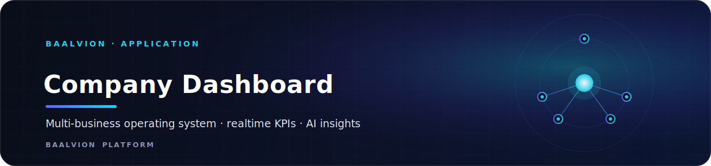
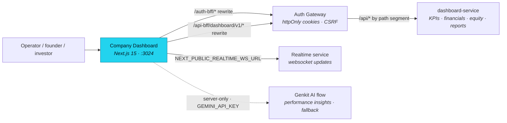

<div align="center">



<br/>
<br/>

**The Baalvion company operating dashboard — a multi-business control surface for KPIs, financials, equity, employees and operations, with realtime updates and AI performance insights, backed by the central platform.**

<p>
  
  
  
  
  
  
</p>

<sub><a href="#overview">Overview</a> · <a href="#architecture">Architecture</a> · <a href="#tech-stack">Tech Stack</a> · <a href="#getting-started">Getting started</a> · <a href="#configuration">Configuration</a> · <a href="#project-structure">Structure</a> · <a href="#routes">Routes</a> · <a href="#deployment">Deployment</a> · <a href="#notes--gotchas">Notes</a></sub>

</div>

---

## Overview

Internal company operating-system dashboard for the Baalvion platform. It is the
authenticated control surface for running one or many businesses from a single Next.js
application — surfacing KPIs, financials, profit/distribution, equity and shareholders,
employees, domains/operations, payments, marketing, compliance and reports, with realtime
updates and an AI performance-insights summary.

It lives inside the Baalvion **pnpm + Turborepo monorepo** under
`Frontend/company-unified-Dashboard-main` and consumes the shared workspace package
`@baalvion/auth-sdk`. It sits in the **platform** domain: authentication is centralized
through the auth-gateway, and business data is read from `dashboard-service` — both reached
**same-origin** through this app's own BFF rewrites, so the only auth credential in the
browser is the gateway's httpOnly cookie.

- **Local dev port:** `:3024` (`next dev -p 3024`)
- **Auth:** centralized — same-origin `/auth-bff/*` rewrite → auth-gateway; httpOnly
  cookie session (no JS-readable token)
- **Data:** same-origin `/api-bff/dashboard/v1/*` rewrite → auth-gateway → `dashboard-service`
- **Realtime:** websocket to `NEXT_PUBLIC_REALTIME_WS_URL` (infrastructure realtime service)
- **AI:** server-only Google Genkit performance-insights flow (degrades gracefully)
- **PWA:** installable (`public/manifest.json`, service worker, install prompt)

## Architecture

### Rendering model

Next.js **App Router** with React Server Components as the default. The root layout is a
server component (`src/app/layout.tsx`) that mounts the role provider, the `AuthGate`, the
PWA loader and the install prompt. Interactive surfaces (the dashboard shells, the API
client, charts, realtime client) opt into `"use client"`. AI logic is hard-gated to the
server: `src/ai/genkit.ts` plus the Genkit/OpenTelemetry runtime are listed in
`serverExternalPackages` in `next.config.ts`, keeping them out of the client bundle.

### High-level flow



### Auth & data flow

- **Pure BFF cookie model.** `src/lib/api-client.ts` talks only to this app's own origin:
  `/auth-bff/*` (login, `me`, refresh, logout) and `/api-bff/dashboard/v1/*` (data).
  `next.config.ts` rewrites `/auth-bff/* → gateway /auth/*` and `/api-bff/* → gateway /api/*`,
  so the httpOnly `access_token` + `refresh_token` cookies the gateway sets are first-party to
  this origin. There is **no JS-readable access token** — `tokenStore.getAccess()` returns
  `null` by design; "authenticated" means an identity exists from `/auth/me`.
- **CSRF.** Unsafe requests send the JS-readable `csrf_token` cookie back as an
  `x-csrf-token` header (double-submit); every request uses `credentials: 'include'`.
- **Route gate.** `src/middleware.ts` is a coarse UX gate that checks for the presence of the
  un-forgeable httpOnly refresh cookie (`NEXT_PUBLIC_REFRESH_COOKIE_NAME`, default
  `refresh_token`) and redirects unauthenticated users to `/auth/login`. Real enforcement is
  at the API boundary. Public prefixes (`/marketing`, `/auth`, `/auth-bff`, `/install`,
  `/portal`, `/api`, `/_next`, `/public`) bypass the gate.
- **Role mapping.** `src/lib/auth.ts` maps backend roles to four UI roles — `ADMIN`
  (`platform_admin`/`owner`/`super_admin`/`admin`), `CO_FOUNDER`, `INVESTOR` (incl.
  read-only `viewer`), `EMPLOYEE` (`member`/`staff`) — defaulting to `EMPLOYEE`.

### Data API routes (BFF)

`src/app/api/*` route handlers proxy the dashboard-service via the gateway and provide
server-side endpoints used by the client: `analytics`, `audit`, `dashboard`
(+ `domains`, `shareholder`, `total`), `distribution`, `domains`, `financials`,
`permissions`, `portal`, `profit`, `reports`, `shareholders`. `next.config.ts` also defaults
`DASHBOARD_API_URL` so server-side route code always has a defined upstream base.

### Security headers

`next.config.ts` emits a CSP plus `X-Frame-Options: SAMEORIGIN`, `nosniff`,
`Referrer-Policy: strict-origin-when-cross-origin`, a `Permissions-Policy`, and HSTS
(`max-age=63072000; includeSubDomains; preload`) on every route. The dev CSP adds
`'unsafe-eval'` and the localhost HMR websocket; the prod CSP omits both and restricts
`connect-src` to `https://api.baalvion.com` + `wss://api.baalvion.com`. The app is also
`robots: { index: false, follow: false }` — it is an internal tool, not a public surface.

## Tech Stack

| Concern | Choice | Version |
|---|---|---|
| Framework | [Next.js](https://nextjs.org) (App Router, RSC) | `15.5.18` |
| Language | TypeScript | `^5` (strict, `noEmit`) |
| Runtime | React / React DOM | `^19.2.1` |
| Styling | Tailwind CSS + `tailwindcss-animate` | `^3.4.1` / `^1.0.7` |
| UI primitives | shadcn/ui on Radix UI (`@radix-ui/react-*`) | accordion/dialog/select/tabs/toast etc. |
| Icons | `lucide-react` | `^0.475.0` |
| Class utils | `clsx`, `tailwind-merge`, `class-variance-authority` | `^2.1.1` / `^3.0.1` / `^0.7.1` |
| Forms / validation | `react-hook-form` + `@hookform/resolvers` + `zod` | `^7.54.2` / `^4.1.3` / `^3.24.2` |
| Charts | `recharts` | `^2.15.1` |
| Command palette | `cmdk` | `^1.0.0` |
| Carousel | `embla-carousel-react` | `^8.6.0` |
| Dates | `date-fns`, `react-day-picker` | `^3.6.0` / `^9.11.3` |
| Realtime | `socket.io-client` | `^4.8.3` |
| AI | Google **Genkit** (`genkit`, `@genkit-ai/google-genai`) — server-only | `^1.28.0` |
| Server bits | `express`, `dotenv`, `require-in-the-middle`, `import-in-the-middle` | `^5.2.1` / `^16.5.0` / `^8.0.1` / `^3.0.0` |
| Auth | `@baalvion/auth-sdk` (workspace) → central auth-gateway BFF | `workspace:*` |
| Package manager | pnpm (monorepo workspace) | — |

Build tooling: PostCSS (`postcss.config.mjs`), `patch-package`, `genkit-cli` (dev),
TypeScript `^5`. Both `typescript.ignoreBuildErrors` and `eslint.ignoreDuringBuilds` are
**`false`** in `next.config.ts` — type and lint errors fail the build.

## Getting Started

**Prerequisites:** Node 20+, pnpm, and the monorepo workspace installed (this app depends on
the `@baalvion/auth-sdk` workspace package). For live data and login you also need the
platform running (auth-gateway, dashboard-service, and the realtime service) — otherwise the
route gate redirects to `/auth/login` and data calls fail.

```bash
# From the monorepo root
pnpm install

# Dev on http://localhost:3024
pnpm run dev          # next dev -p 3024
pnpm run dev:turbo    # next dev --turbopack -p 3024

# Quality gates
pnpm run typecheck    # tsc --noEmit
pnpm run lint         # next lint

# Production build / serve
pnpm run build        # next build
pnpm run start        # next start -p 3024

# Optional: run the Genkit AI flow locally (needs a Gemini key)
pnpm run genkit:dev   # or genkit:watch
```

Create `.env.local` at the app root before running (see [Configuration](#configuration)).

## Configuration

Public (`NEXT_PUBLIC_*`) values are exposed to the browser; everything else is server-only.
Never commit real secrets. `src/lib/env.ts` validates the client vars with Zod and supplies
production `api.baalvion.com` defaults; `next.config.ts` defaults the server upstream.

| Variable | Default | Purpose |
|---|---|---|
| `NEXT_PUBLIC_APP_URL` | `http://localhost:3024` | Public base URL of this app |
| `NEXT_PUBLIC_AUTH_URL` | `https://api.baalvion.com/api/v1/identity/auth/v1/auth` | Central auth API base |
| `NEXT_PUBLIC_DASHBOARD_API_URL` | `https://api.baalvion.com/api/v1/platform/dashboard/api/v1` | dashboard-service API base |
| `NEXT_PUBLIC_REALTIME_WS_URL` | `wss://api.baalvion.com/api/v1/infrastructure/realtime` | Realtime websocket endpoint |
| `NEXT_PUBLIC_GATEWAY_URL` | `http://localhost:3099` | Auth-gateway target for the `/auth-bff` + `/api-bff` rewrites |
| `NEXT_PUBLIC_REFRESH_COOKIE_NAME` | `refresh_token` | Refresh cookie the route gate checks (set to `baalvion_refresh` for the gateway) |
| `DASHBOARD_API_URL` | `https://api.baalvion.com/api/v1/platform/dashboard` | Server-only upstream for the `/api/*` BFF routes |
| `NODE_ENV` | `development` | Gates the dev-only CSP relaxations (`unsafe-eval`, localhost ws) |

> `.env.local` in this repo points the rewrites at a local gateway (`NEXT_PUBLIC_GATEWAY_URL`
> defaults to `:3099`) and sets `NEXT_PUBLIC_REFRESH_COOKIE_NAME=baalvion_refresh` so the
> route gate matches the gateway's cookie name. `GEMINI_API_KEY` is read by the Genkit Google
> plugin for AI insights; when absent, the AI flow returns a graceful fallback.

## Project Structure

```
company-unified-Dashboard-main/
├── src/
│   ├── app/                 # Next.js App Router: dashboard shells, route groups, API BFF routes
│   │   ├── api/             # BFF route handlers (analytics, audit, dashboard, financials, profit…)
│   │   ├── dashboard/       # Main authenticated dashboard surface
│   │   ├── auth/ · marketing/ · install/ · portal/   # Public/entry surfaces (bypass route gate)
│   │   ├── analytics/ automation/ businesses/ compliance/ corporate/ countries/ currencies/
│   │   │   employees/ equity/ finance/ financials/ kpis/ marketing/ marketplace/ notifications/
│   │   │   onboarding/ operations/ payments/ reports/ security/ settings/ sync/   # feature sections
│   │   ├── layout.tsx       # Root layout: RoleProvider, AuthGate, PWA loader, fonts, metadata
│   │   ├── page.tsx         # Entry redirect → /dashboard (auth'd) or /marketing
│   │   ├── robots.ts        # robots controls
│   │   └── globals.css      # Tailwind layers + design tokens
│   ├── ai/                  # Google Genkit (server-only): genkit.ts, dev.ts, flows/
│   ├── components/          # React components: app-sidebar, auth-gate, charts/, kpis/, ui/ (shadcn)…
│   ├── hooks/               # Reusable hooks (incl. use-view-role)
│   └── lib/                 # Core libs: api-client, auth, env (Zod), realtime-client, nav-config, types
├── public/                  # PWA manifest, service worker (sw.js), icons
├── docs/                    # Project docs
├── next.config.ts           # BFF rewrites, CSP/security headers, serverExternalPackages, image hosts
├── tailwind.config.ts       # Theme tokens, fonts (Inter), animations
├── components.json          # shadcn/ui config
├── Dockerfile               # Container build (Linux standalone output)
├── apphosting.yaml          # Firebase App Hosting run config
└── vercel.json              # Vercel turbo-ignore guard (company-unified-dashboard-web)
```

## Routes

The app is organized around an authenticated dashboard plus public entry surfaces. Major
sections under `src/app/`:

| Group | Sections |
|---|---|
| **Entry / public** | `/` (redirect), `/marketing`, `/auth`, `/install`, `/portal` |
| **Core dashboard** | `/dashboard`, `/analytics`, `/kpis`, `/reports` |
| **Finance** | `/finance`, `/financials`, `/profit` *(API)*, `/distribution` *(API)*, `/payments` |
| **Ownership** | `/equity`, shareholders *(via `/api/shareholders`)* |
| **Business / ops** | `/businesses`, `/operations`, `/countries`, `/currencies`, `/marketplace`, `/sync`, `/automation` |
| **People** | `/employees`, `/onboarding` |
| **Governance** | `/compliance`, `/security`, `/corporate`, `/notifications`, `/settings` |

> Section availability is gated per role by `src/lib/auth.ts` / the role context and route
> guards; the sidebar is driven by `src/lib/nav-config.ts`.

## Testing

There is one unit test in the tree (`src/lib/auth-paths.test.ts`); no test runner script is
declared in `package.json`. The enforced quality gates are type-check and lint:

```bash
pnpm run typecheck    # tsc --noEmit (build-blocking)
pnpm run lint         # next lint (build-blocking)
```

## Deployment

- **Standalone server bundle.** `next.config.ts` sets `output: 'standalone'` on non-Windows
  platforms (skipped on `win32` because pnpm symlink file-tracing throws `EPERM` there). The
  deploy artifact is built in the Linux `Dockerfile`; local Windows `next build` still works.
- **Vercel** — `vercel.json` uses `npx turbo-ignore company-unified-dashboard-web` so the
  app only rebuilds when its inputs change in the monorepo.
- **Firebase App Hosting** — `apphosting.yaml` configures the run backend (`maxInstances: 1`).
- Security headers (CSP, HSTS preload, `X-Frame-Options: SAMEORIGIN`, `nosniff`,
  Referrer-Policy, Permissions-Policy) ship from `next.config.ts` on every route.

## Notes / Gotchas

- **Auth is centralized and cookie-only.** There is no JS-readable access token
  (`tokenStore.getAccess()` returns `null`); identity comes from `/auth/me`. Do not add a
  second JWT issuer or store tokens in web storage.
- **Everything is same-origin.** Both auth and data flow through `/auth-bff/*` and
  `/api-bff/*` rewrites to the gateway. The gateway routes `/api/*` to backend services by
  the first path segment — `dashboard` selects `dashboard-service`, `/v1` is its route base.
- **Refresh-cookie name must match the gateway.** The route gate defaults to `refresh_token`;
  set `NEXT_PUBLIC_REFRESH_COOKIE_NAME=baalvion_refresh` (as in `.env.local`) when the gateway
  sets `baalvion_refresh`, or every post-login navigation 307-redirects back to `/auth/login`.
- **AI is server-only.** `src/ai/*` is reached only through flows/route handlers; Genkit +
  OpenTelemetry are `serverExternalPackages`. The performance-insights flow returns a graceful
  fallback when no Gemini key is set — never import AI modules from a client component.
- **Build is strict.** Both `typescript.ignoreBuildErrors` and `eslint.ignoreDuringBuilds`
  are `false` — keep `pnpm run typecheck` and `pnpm run lint` green.
- **`output: 'standalone'` is Linux-only here.** Windows local builds skip it on purpose; the
  real deploy artifact is only ever built in the Linux Docker image.
- The dev server runs on **port 3024**.

---

<div align="center">
<sub>Part of the <a href="https://github.com/baalvionservice/Baalvion-Project-Infra">Baalvion Platform</a> · centralized identity · domain-driven monorepo</sub>
</div>
