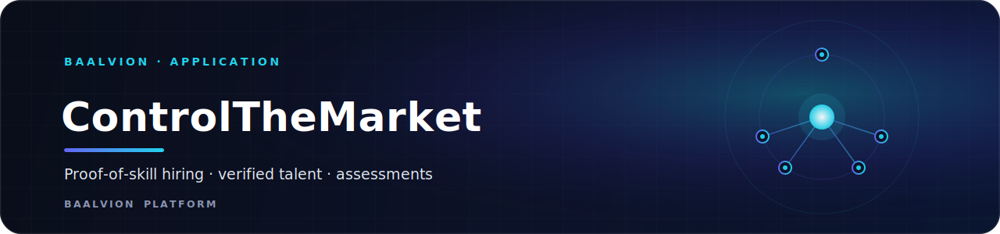
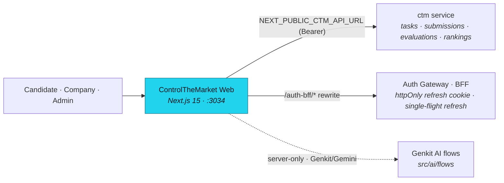

<div align="center">



<br/>
<br/>

**Proof-of-skill hiring platform — companies discover verified talent through real-world performance, not resumes — built on the central Baalvion identity platform.**

<p>
  
  
  
  
  
  
</p>

<sub><a href="#overview">Overview</a> · <a href="#architecture">Architecture</a> · <a href="#tech-stack">Tech Stack</a> · <a href="#getting-started">Getting started</a> · <a href="#configuration">Configuration</a> · <a href="#project-structure">Structure</a> · <a href="#pages--routes">Routes</a> · <a href="#security">Security</a> · <a href="#deployment">Deployment</a> · <a href="#notes--gotchas">Notes</a></sub>

</div>

---

## Overview

**ControlTheMarket** (package `controlthemarket-web`) is a **proof-of-skill hiring platform**:
companies post real-world tasks, candidates submit work, and a ranking engine surfaces
verified talent based on performance rather than paper credentials. Production domain:
**[controlthemarket.com](https://controlthemarket.com)**.

It lives inside the Baalvion **pnpm + Turborepo monorepo** under
`Frontend/controlthemarket-main` and is the ecosystem-domain frontend for the **`ctm`**
backend service (gateway path `/api/v1/ecosystem/ctm`). It consumes the shared workspace
package `@baalvion/auth-sdk` and routes auth through the central platform gateway — it does
not stand up its own identity issuer.

- **Local dev port:** `:3034`
- **Production domain:** `https://controlthemarket.com` (`NEXT_PUBLIC_APP_URL`)
- **Backend service:** `ctm` — API base `https://api.baalvion.com/api/v1/ecosystem/ctm/api/v1`
  (`NEXT_PUBLIC_CTM_API_URL`)
- **Auth:** centralized via `@baalvion/auth-sdk` + same-origin `/auth-bff` proxy → auth-gateway
- **AI:** Google Genkit (Gemini), server-only, reached only through flows / route handlers

## Architecture

### Rendering model

Next.js **App Router** organized into two route groups: **`(public)`** (marketing, login,
crawlable candidate/company profiles, blog, demos) and **`(app)`** (the gated candidate,
company, and admin workspaces). Public surfaces render server-side for SEO; the authenticated
workspaces are client-rendered behind the auth context + edge gate. Genkit AI and
OpenTelemetry are kept out of the client bundle via `serverExternalPackages` in
`next.config.ts`.

### High-level flow



### Data flow

- **API access** goes through `src/lib/ctm-api-client.ts` (and `src/lib/api.ts`), targeting
  the `ctm` service at `NEXT_PUBLIC_CTM_API_URL` (default
  `https://api.baalvion.com/api/v1/ecosystem/ctm/api/v1`). The access token is held **in
  memory only** (no `localStorage`/`sessionStorage`); on `401` the client performs a
  **single-flight** refresh against `/auth-bff/refresh` using the httpOnly cookie. It handles
  both the legacy token-in-body and the gateway BFF (`{ ok: true, csrfToken }`) refresh shapes.
- **Auth is centralized.** `next.config.ts` rewrites `/auth-bff/:path*` to `AUTH_PROXY_TARGET`
  (default the central gateway) so the httpOnly `baalvion_refresh` cookie flows same-origin in
  dev and prod. `AuthProvider` (`src/contexts/auth-context.tsx`) is bootstrap-aware; the edge
  middleware adds a coarse presence gate.
- **Hybrid data layer** (`src/lib/data-layer.ts`) merges live API results with bundled mock
  data as a fallback, so the UI renders during local development without a full backend.
  Production sets `NEXT_PUBLIC_USE_MOCK=false`.
- **Ranking engine** (`src/lib/ranking-engine.ts`) computes candidate rankings; **badges**
  (`src/lib/badges.ts`) and **roles** (`src/lib/roles.ts`) drive verification and RBAC display.
- **AI** flows live in `src/ai/flows/`, registered through `src/ai/genkit.ts`, reached
  server-side only.

### SEO

The root layout (`src/app/layout.tsx`) sets templated titles, keywords, robots directives,
OpenGraph/Twitter cards, and Organization + WebSite JSON-LD (`@graph`). The OG image is
provided by the file-convention `src/app/opengraph-image.tsx`. `sitemap.ts` and `robots.ts`
are emitted at the app root, and the edge middleware explicitly excludes
`robots.txt`/`sitemap.xml`/`opengraph-image`/static assets so the auth gate never
307-redirects crawlers to `/login`. Fonts are **Inter** (body) and **Space Grotesk**
(headline) via `next/font/google`.

## Tech Stack

| Concern | Choice | Version |
|---|---|---|
| Framework | [Next.js](https://nextjs.org) (App Router, RSC) | `15.5.18` |
| Language | TypeScript | `^5` (strict, `noEmit`) |
| Runtime | React / React DOM | `^19.2.1` |
| Styling | Tailwind CSS + `tailwindcss-animate` + `@tailwindcss/typography` | `^3.4.1` / `^1.0.7` / `^0.5.13` |
| UI primitives | Radix UI (`@radix-ui/react-*`) | accordion/dialog/select/tabs/toast/tooltip… |
| Motion | `framer-motion` | `^12.38.0` |
| Icons | `lucide-react` | `^0.475.0` |
| Forms | `react-hook-form` + `@hookform/resolvers` + `zod` | `^7.54.2` / `^4.1.3` / `^3.24.2` |
| Charts | `recharts` | `^2.15.1` |
| Dates | `date-fns`, `react-day-picker` | `^3.6.0` / `^9.11.3` |
| Carousel | `embla-carousel-react` | `^8.6.0` |
| HTML sanitize | `sanitize-html` (+ `@types/sanitize-html`) | `^2.13.0` |
| AI | Google **Genkit** (`genkit`, `@genkit-ai/google-genai`) | `^1.28.0` |
| Auth | `@baalvion/auth-sdk` (workspace) → central auth-gateway BFF | `workspace:*` |
| Class utils | `clsx`, `tailwind-merge`, `class-variance-authority` | `^2.1.1` / `^3.0.1` / `^0.7.1` |
| Package manager | pnpm (monorepo workspace) | — |

Build tooling: PostCSS (`postcss.config.mjs`), `patch-package`. `typescript.ignoreBuildErrors`
is **`false`** (type errors block the build); `eslint.ignoreDuringBuilds` is **`true`** (no
ESLint config is wired in this app yet — see `next.config.ts`).

## Getting Started

**Prerequisites:** Node 20+, pnpm, and the monorepo workspace installed (this app depends on
the `@baalvion/auth-sdk` workspace package). For live data you also need the platform services
running (the `ctm` service + auth-gateway) — otherwise the hybrid data layer falls back to
bundled mock data.

```bash
# From the monorepo root
pnpm install

# Dev on http://localhost:3034
pnpm run dev          # or: pnpm --filter controlthemarket-web dev

# Quality gates
pnpm run typecheck    # tsc --noEmit

# Production build / serve
pnpm run build        # next build
pnpm run start        # next start

# Optional: run Genkit AI flows locally
pnpm run genkit:dev   # genkit start -- tsx src/ai/dev.ts
```

## Configuration

Public (`NEXT_PUBLIC_*`) values are baked into the client bundle at build time; everything
else is server-only. Never commit real secrets. Defaults below come from `next.config.ts`,
`src/lib/ctm-api-client.ts`, `src/middleware.ts`, and `apphosting.yaml`.

| Variable | Purpose |
|---|---|
| `NEXT_PUBLIC_APP_URL` | Canonical public origin — SEO canonicals, robots host, sitemap URLs (prod `https://controlthemarket.com`) |
| `NEXT_PUBLIC_CTM_API_URL` | `ctm` service API base (default `https://api.baalvion.com/api/v1/ecosystem/ctm/api/v1`) |
| `AUTH_PROXY_TARGET` | Server-only upstream for the same-origin `/auth-bff/*` rewrite (central gateway) |
| `NEXT_PUBLIC_REFRESH_COOKIE_NAME` | httpOnly refresh cookie name the edge gate checks (default `baalvion_refresh`) |
| `NEXT_PUBLIC_USE_MOCK` | Dev-only mock mode toggle; must be `"false"` in production |

## Project Structure

```
controlthemarket-main/
├── src/
│   ├── app/
│   │   ├── (public)/        # Marketing + auth + crawlable profiles (home, login, signup, blog, demos…)
│   │   ├── (app)/           # Gated workspaces: candidate/, company/, admin/, dashboard/
│   │   ├── layout.tsx       # Root layout: metadata, Org + WebSite JSON-LD, fonts, providers
│   │   ├── opengraph-image.tsx  # File-convention OG image
│   │   ├── sitemap.ts / robots.ts / error.tsx / not-found.tsx
│   │   └── globals.css
│   ├── ai/                  # Genkit (genkit.ts, dev.ts) + flows/
│   ├── components/          # React UI (incl. ui/ primitives, Toaster)
│   ├── contexts/            # auth-context, submissions-context
│   ├── hooks/
│   ├── lib/                 # ctm-api-client, api, data-layer, ranking-engine, badges, roles, sanitize, types…
│   └── middleware.ts        # Edge auth gate (public-prefix allow-list, fail-closed profile rule)
├── public/                  # og-image.png, mock-uploads/, mock-downloads/
├── docs/                    # PRODUCT_SPEC.md, SYSTEM_ARCHITECTURE.md, COMPLETION_TRACKER.md, blueprint.md, backend.json
├── Dockerfile               # Next 15 standalone image (turbo prune; build context = repo root)
├── next.config.ts           # CSP/security headers, /auth-bff rewrite, standalone output, externals
├── tailwind.config.ts · components.json · postcss.config.mjs
├── apphosting.yaml          # Firebase App Hosting run config (maxInstances: 3) + env
└── vercel.json              # Vercel turbo-ignore guard (controlthemarket-web)
```

## Pages & Routes

### Public (`(public)/*`, server-rendered for SEO)

| Route | Purpose |
|---|---|
| `/` | Marketing home |
| `/about` · `/pricing` · `/contact` · `/privacy` · `/terms` | Company & legal |
| `/blog` · `/blog/[slug]` | Editorial |
| `/badges` · `/companies` · `/leaderboard` | Discovery / rankings |
| `/candidate/[id]` · `/company/[id]` | Crawlable public profiles (a single non-reserved segment) |
| `/demos/*` | Sector demos (baalvion hiring-portal, corporates, education, government) |
| `/login` · `/signup` (+ `/candidate`, `/company`, candidate `onboarding`) · `/forgot-password` | Auth |

### Authenticated workspaces (`(app)/*`, session-gated)

- **Candidate** (`/candidate/*`): `dashboard`, `tasks` (+ `[id]`), `submissions` (+ `[id]`),
  `rankings`, `live-session`, `profile`.
- **Company** (`/company/*`): `dashboard`, `tasks` (+ `create`, `[taskId]/assign`),
  `submissions` (+ `[id]`), `feedback` (+ `[id]`), `compare`, `analytics`, `usage`,
  `recordings`, `live-session`, `billing`, `invoices`, `subscription`, `onboarding`
  (+ `steps`), `settings`.
- **Admin** (`/admin/*`): `dashboard`, `analytics` (+ `roles`, `roles/[role]`), `users`,
  `companies`, `teams`, `roles`, `tasks`, `submissions` (+ `[id]`), `rankings`, `revenue`,
  `intelligence`, `automation`, `execution`, `integrations`, `integration-logs`, `webhooks`,
  `api-settings`, `monitoring`, `health`, `load-handling`, `errors`, `logs`, `activity`,
  `alerts`, `security`, `recordings`, `live-session`, `testing`, `settings`.

The shared `/dashboard` route resolves to the appropriate workspace by role.

## Security

- **Auth is centralized** via `@baalvion/auth-sdk` and the same-origin `/auth-bff` proxy. The
  edge middleware (`src/middleware.ts`) gates everything outside an explicit public allow-list
  on the un-forgeable httpOnly `baalvion_refresh` cookie, **failing closed**: only a single
  non-reserved segment under `/candidate/<id>` or `/company/<id>` is public; every named
  private subpath (dashboard, submissions, billing, settings…) stays gated. The access token
  is in memory; per-role authorization is enforced at the API + client. Dev-only mock mode is
  never active in production.
- **Security headers** ship from `next.config.ts`: a strict **CSP** (with `'unsafe-eval'` and
  ws/localhost relaxed in dev only for HMR; `frame-src` allow-lists Razorpay + Stripe for
  hosted checkout), HSTS, `X-Frame-Options: DENY`, `X-Content-Type-Options: nosniff`,
  `Referrer-Policy`, `Permissions-Policy`, and `frame-ancestors 'none'`.
- **HTML sanitization** uses `sanitize-html` (`src/lib/sanitize.ts`) before rendering
  untrusted content.
- **AI is server-only** — `src/ai/*` is reached only through flows / route handlers and kept
  external from the client bundle (`serverExternalPackages`).
- **Remote images** are allow-listed in `next.config.ts` (`placehold.co`,
  `images.unsplash.com`, `picsum.photos`).

## Deployment

- **Docker** — `Dockerfile` builds a Next 15 **standalone** image. The build context is the
  **repo root**; it runs `turbo prune controlthemarket-web --docker`. `NEXT_PUBLIC_*` are
  baked at **build** time (pass as `--build-arg`), while `AUTH_PROXY_TARGET` is read at server
  **start** (runtime env). Standalone output is enabled on Linux and skipped on Windows
  (`output: process.platform === 'win32' ? undefined : 'standalone'`) to avoid the symlink
  EPERM on local Windows builds.
- **Firebase App Hosting** — `apphosting.yaml` sets `maxInstances: 3` and declares
  `NEXT_PUBLIC_APP_URL`, `NEXT_PUBLIC_USE_MOCK=false`, `NEXT_PUBLIC_CTM_API_URL`, and
  `AUTH_PROXY_TARGET`.
- **Vercel** — `vercel.json` sets `ignoreCommand: npx turbo-ignore controlthemarket-web` so
  Vercel skips builds when this workspace hasn't changed.

## Notes / Gotchas

- **`turbo prune` + frozen lockfile:** the Docker install uses `--no-frozen-lockfile`. The
  root pins a version-selector pnpm override (`uuid@11`) and `turbo prune` drops the matching
  package snapshot from the pruned lockfile, so a frozen install fails
  (`ERR_PNPM_LOCKFILE_MISSING_DEPENDENCY`). See `Dockerfile`.
- **Do not store tokens in web storage.** Access tokens are in-memory; the refresh token is
  the httpOnly `baalvion_refresh` cookie. The client handles both legacy (token-in-body) and
  gateway BFF refresh response shapes. Do not add a second JWT issuer.
- **ESLint is not gating the build** (`eslint.ignoreDuringBuilds: true`) because no ESLint
  config is wired yet — but **TypeScript is** (`ignoreBuildErrors: false`). Keep
  `pnpm run typecheck` green.
- **AI is server-only.** Never import `src/ai/*` from a client component.
- The dev server runs on **port 3034**.

---

<div align="center">
<sub>Part of the <a href="https://github.com/baalvionservice/Baalvion-Project-Infra">Baalvion Platform</a> · centralized identity · domain-driven monorepo</sub>
</div>
