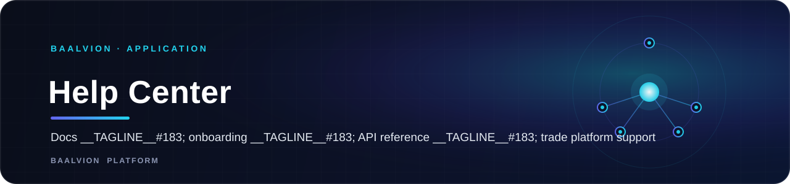

<div align="center">



<br/>
<br/>

**A from-scratch, dependency-light documentation site for the Baalvion trade platform — onboarding guides, role-based walkthroughs, a full API reference, and support, built without a docs framework dependency.**

<p>
  
  
  
  
</p>

<sub><a href="#overview">Overview</a> · <a href="#architecture">Architecture</a> · <a href="#tech-stack">Tech Stack</a> · <a href="#getting-started">Getting started</a> · <a href="#project-structure">Structure</a></sub>

</div>

---

## Overview

**Baalvion Help Center** is the documentation, onboarding, API reference, and support site for the
Baalvion trade platform. Every doc component — sidebar, top bar, table of contents, search dialog,
code blocks with copy buttons, callouts, step lists, and an FAQ accordion — is hand-built in this
repo; there is no MDX/docs-framework dependency in `package.json`.

- **Dev port:** `3046` (`next dev --turbopack -p 3046`)
- **Canonical production host:** `https://help.baalvion.com` — fully built, **not yet deployed**
  (the domain does not currently resolve)
- **Scope today:** the trade platform specifically (buyer/seller/agent onboarding, trade API),
  not the wider Baalvion portfolio

## Architecture

### Route groups

All documentation lives under a single `(docs)` route group, sharing one layout
(`(docs)/layout.tsx`) with a section switcher in the top bar:

| Section | Contents |
|---|---|
| `getting-started` | What is Baalvion, how it works, creating an account, logging in, password reset, system requirements, onboarding |
| `guides` | Role-based walkthroughs: buyer, seller, agent |
| `platform` | Dashboard system, messaging, notifications, permissions, reporting, role-based navigation, search, security model, settings/profile |
| `api` | Overview, authentication, code examples, errors, listings, notifications, orders, rate limits, reports, tasks, users, webhooks |
| `faqs`, `troubleshooting`, `release-notes`, `support` | Standalone top-level pages |

### Canonical cross-property links

`src/lib/site.ts` centralizes every reference to login, dashboards, and marketing sites so this
docs site never hand-writes a cross-property URL:

```ts
EXTERNAL = {
  marketing: 'https://baalvion.com',
  insights: 'https://about.baalvion.com',
  investors: 'https://ir.baalvion.com',
  trade: 'https://trade.baalvion.com',
  login: 'https://trade.baalvion.com/login',
  buyerDashboard / sellerDashboard / agentDashboard: 'https://trade.baalvion.com/{role}/dashboard',
  statusPage: 'https://status.baalvion.com',
}
```

## Tech Stack

Next.js 15 · React 19 · TypeScript · Tailwind CSS (`@tailwindcss/typography`) — no external docs
framework.

## Getting Started

```bash
pnpm install
pnpm run dev        # http://localhost:3046
```

## Project Structure

```
src/
  app/(docs)/
    getting-started/  guides/  platform/  api/
    faqs/  troubleshooting/  release-notes/  support/
    layout.tsx
  components/
    docs/   # breadcrumbs · doc-page · docs-shell · docs-sidebar · docs-topbar · prev-next · search-dialog · toc
    site/   # contact-form · home-hero-search · site-footer · site-header
    ui/     # callout · card-grid · code-block · copy-button · faq-accordion · steps · theme-toggle
  lib/
    highlight.ts   nav.ts (DOCS_SECTIONS)   site.ts (SITE, EXTERNAL)   theme-script.ts
```

## Notes

This app is complete but pre-launch: `help.baalvion.com` has no DNS configured yet. Its content is
scoped to the trade platform today — extending it to cover the rest of the Baalvion portfolio (or
standing up a separate help center per property) is a deliberate, separate decision, not something
this README should imply is already done.

---

<sub>Part of the <a href="https://github.com/baalvionservice/Baalvion-Project-Infra">Baalvion Platform</a> · centralized identity · domain-driven monorepo</sub>
