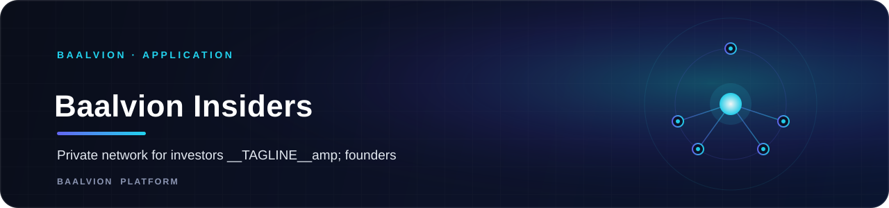
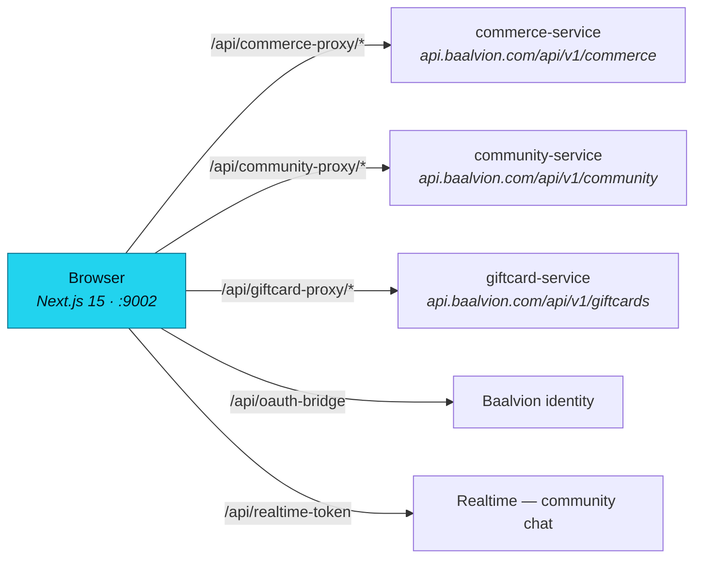

<div align="center">



<br/>
<br/>

**A private, invite-only network for investors and founders, live today — plus a considerably larger multi-vertical marketplace, education platform, and community forums already built in this repository but not yet deployed.**

<p>
  
  
  
  
  
</p>

<sub><a href="#overview">Overview</a> · <a href="#architecture">Architecture</a> · <a href="#tech-stack">Tech Stack</a> · <a href="#getting-started">Getting started</a></sub>

</div>

---

## Overview

**Baalvion Insiders** (repository codename `market-underworld`) is what visitors actually see live
today: an invite-only, verified network for investors and founders — curated deal flow and
high-value discussions.

The repository itself is considerably larger than that: a multi-vertical marketplace (clothing,
commodities, events, food, travel, VIP listings), an education marketplace pairing teachers and
students, community forums, gift cards, and a tiered paid-access gate (`/access` — deposit-gated
tiers unlocking the marketplace). **None of that is live in production yet** — `/access`,
`/marketplace`, `/forum`, `/gift-cards`, and `/education` all return HTTP 404 on
`marketunderworld.com` today; only `/` is live. Treat this README's "Overview" as the deployed
product, and the "Architecture" / "What's in the repo but not live" sections below as the larger
codebase.

- **Dev port:** `9002` (`next dev --turbopack -p 9002`)
- **Canonical production host:** `https://marketunderworld.com` — only the root route is live
- **Auth model:** central Baalvion identity via `@baalvion/auth-sdk`, bridged through an
  `oauth-bridge` API route

## Architecture

### Proxy layer

The app never calls backend services directly from the client — every domain call goes through a
same-origin proxy route to the shared platform gateway:



Additional proxy routes cover admin, orders, wallet, and wishlist, all fronting the same central
API gateway rather than a service local to this app.

### What's in the repo but not live

The working tree contains full route implementations that do not currently resolve on
`marketunderworld.com` (verified 404):

| Route | What it is |
|---|---|
| `/access` | A tiered, deposit-gated unlock flow (e.g. "$100 USD — unlock the marketplace") |
| `/marketplace` (+ `clothing`, `commodities`, `events`, `food`, `travel`, `vip`) | A multi-vertical listings marketplace |
| `/education`, `/classroom/[classId]`, `/live-sessions` | A teacher/student marketplace with live sessions |
| `/forum/[communitySlug]` | Per-community discussion threads |
| `/gift-cards` | Gift-card purchase and redemption |

The live root page (`src/app/page.tsx`) also still imports `LIVE_ACTIVITY_MOCK` from
`src/data/mockData.ts` for its "regions" and "live activity" UI — that page renders locally, but is
not what is actually deployed at `marketunderworld.com/` today (the live root shows the Baalvion
Insiders hero instead). Whichever build is live is ahead of what a fresh checkout of this branch
renders at `/`.

### AI

`@genkit-ai/google-genai` and `genkit` are dependencies and `src/ai/genkit.ts` initializes the
client, but `src/ai/dev.ts` — where flows are registered — is currently empty. No generative-AI
flow ships live yet.

## Tech Stack

Next.js 15 · React 19 · TypeScript · Tailwind CSS · Radix UI · Framer Motion · Embla Carousel ·
date-fns

## Getting Started

```bash
pnpm install
pnpm run dev        # http://localhost:9002
```

## Notes

- Invite-only: new members apply for access and are verified before joining — there is no public
  sign-up.
- The dev port (`9002`) is shared with `Law-Elite-Network-main` in this monorepo; run one at a
  time locally, or override with `-p`.

---

<sub>Part of the <a href="https://github.com/baalvionservice/Baalvion-Project-Infra">Baalvion Platform</a> · centralized identity · domain-driven monorepo</sub>
