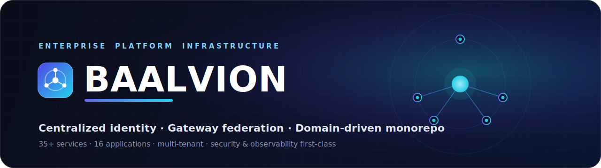
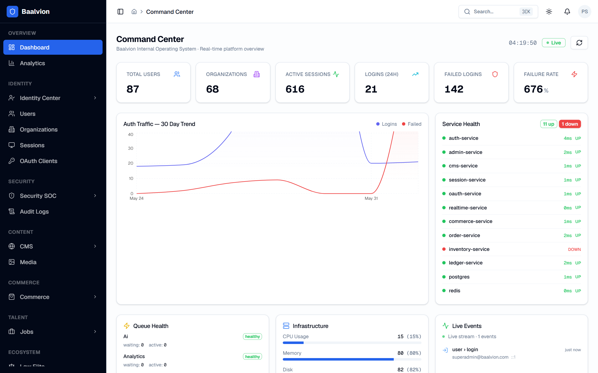
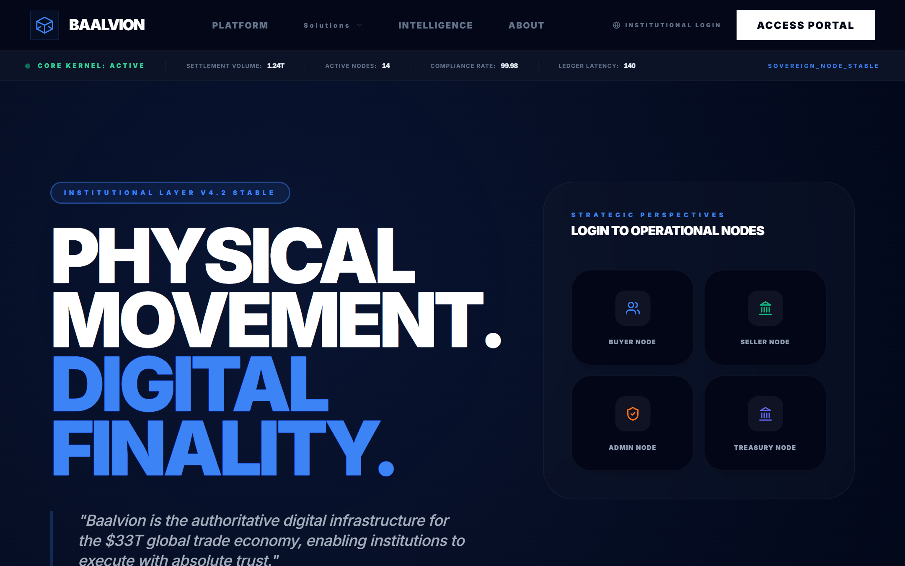
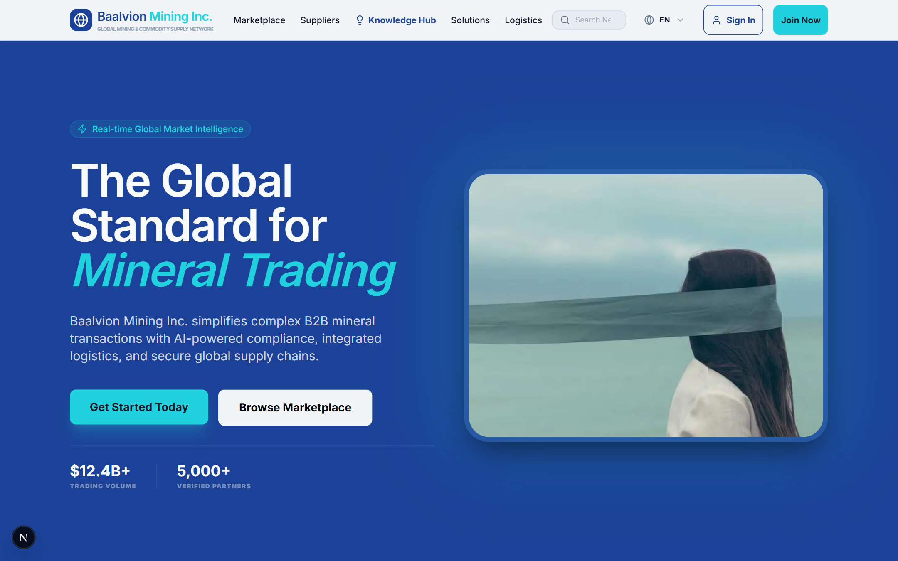
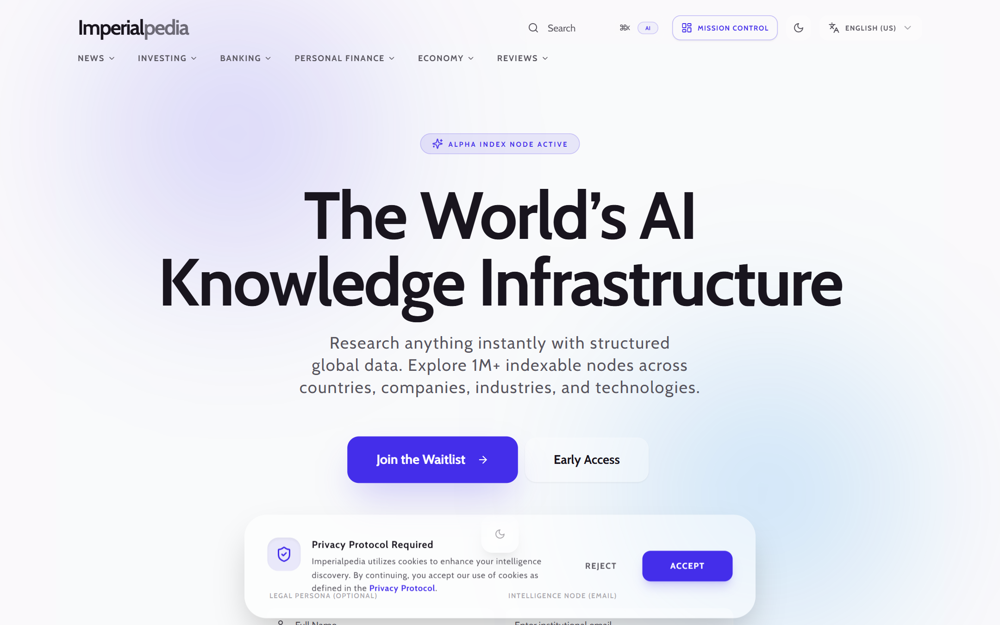
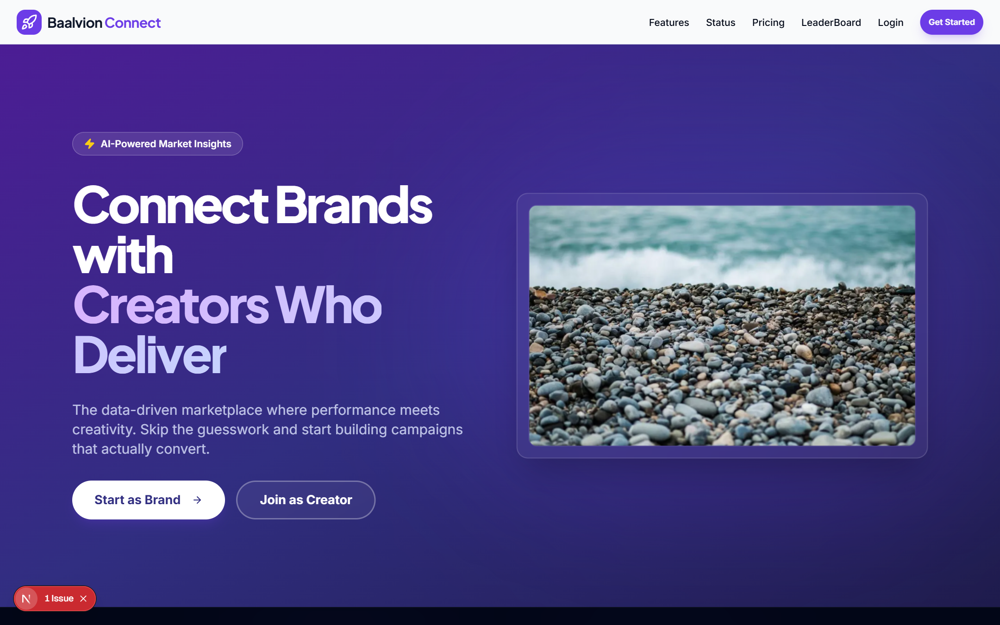
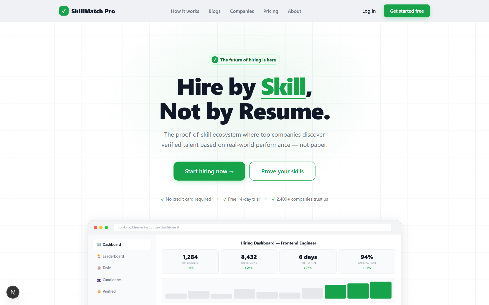
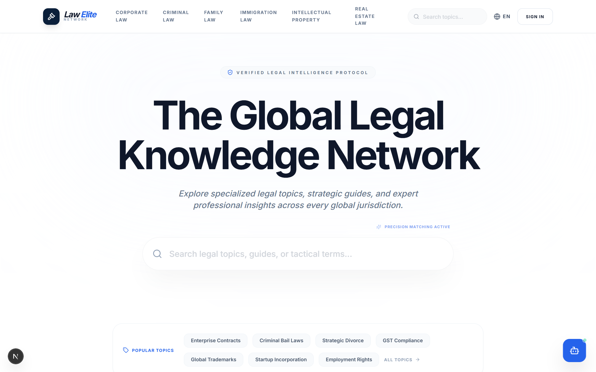
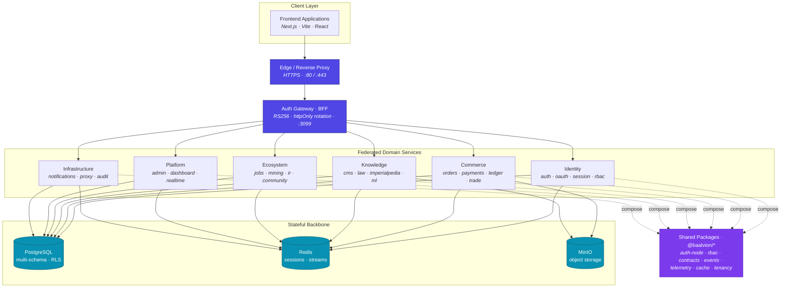

<div align="center">

<picture>
  <source media="(prefers-color-scheme: dark)" srcset="assets/banner-dark.svg">
  <source media="(prefers-color-scheme: light)" srcset="assets/banner-light.svg">
  
</picture>

<br/>
<br/>

**Enterprise multi-platform infrastructure ecosystem — centralized identity, gateway federation, and a federated monorepo of domain services and applications.**

<p>
  <a href="https://github.com/baalvionservice/Baalvion-Project-Infra/actions/workflows/ci.yml"></a>
  <a href="https://github.com/baalvionservice/Baalvion-Project-Infra/actions/workflows/codeql.yml"></a>
  <a href="https://github.com/baalvionservice/Baalvion-Project-Infra/actions/workflows/scorecard.yml"></a>
  <a href="https://www.conventionalcommits.org"></a>
  <a href="LICENSE"></a>
</p>

<p>
  
  
  
  
  
  
  
  
  
  
  
</p>

<sub><a href="#getting-started">Getting started</a> · <a href="#architecture">Architecture</a> · <a href="#platform-applications">Applications</a> · <a href="#technology-stack">Stack</a> · <a href="#security">Security</a> · <a href="CONTRIBUTING.md">Contributing</a></sub>

</div>

---

## Overview

Baalvion is a scalable enterprise platform built around a centralized
authentication foundation, a multi-service backend organized by bounded
context, and a suite of specialized frontend applications spanning finance,
real estate, community, media, and commerce. Security, observability, and
multi-tenant isolation are first-class concerns.

The codebase is a **pnpm + Turborepo monorepo** with an enforced service-catalog
architecture contract that keeps domain boundaries clean as the platform grows.

## Platform Preview

<div align="center">

**Admin Console — Command Center**



<sub>One operations console across every domain — identity metrics, auth-traffic trends, live service health, queue depth, and a real-time event feed.</sub>

</div>

### The Ecosystem

<table>
  <tr>
    <td width="50%" valign="top">
      
      <p align="center"><b>Global Trade Infrastructure</b><br/><sub>Physical movement · digital finality · trade settlement</sub></p>
    </td>
    <td width="50%" valign="top">
      
      <p align="center"><b>Mining</b><br/><sub>B2B mineral trading · compliance · global logistics</sub></p>
    </td>
  </tr>
  <tr>
    <td width="50%" valign="top">
      
      <p align="center"><b>Imperialpedia</b><br/><sub>AI-powered knowledge infrastructure</sub></p>
    </td>
    <td width="50%" valign="top">
      
      <p align="center"><b>Brand Connector</b><br/><sub>Brand ↔ creator marketplace</sub></p>
    </td>
  </tr>
  <tr>
    <td width="50%" valign="top">
      
      <p align="center"><b>ControlTheMarket</b><br/><sub>Skill-based hiring &amp; talent challenges</sub></p>
    </td>
    <td width="50%" valign="top">
      
      <p align="center"><b>Law Elite Network</b><br/><sub>Global legal knowledge network</sub></p>
    </td>
  </tr>
</table>

## Repository Layout

```
Backend/
  services/<domain>/<service>/     # bounded-context services
    identity/        auth-service · auth-gateway · oauth-service · session-service
    platform/        admin-service · dashboard-service · realtime-service
    commerce/        commerce · order · payment · ledger · inventory ·
                     fulfillment · market · trade · financial-services-java
    knowledge/       cms-service · imperialpedia-service · law-service · ml-service
    ecosystem/       about · brand-connector · ctm · elite-circle · insiders ·
                     ir · jobs · law-elite · mining · real-estate
    infrastructure/  notification-service · proxy-service · realtime-service
  packages/                        # shared libraries (@baalvion/*)
                     auth-node · auth-sdk · rbac · contracts · events ·
                     telemetry · logger · errors · security · validation · …
  catalog/                         # service catalog + architecture contract
  gateway/  database/  infra/      # cross-cutting infrastructure
Frontend/<app>/                    # Next.js / Vite applications
docs/                              # architecture, ADRs, runbooks
.github/                           # CI/CD, CodeQL, issue/PR templates, Dependabot
```

## Architecture



**Authentication** is centralized: RS256 asymmetric JWTs issued by the identity
stack, validated at the gateway, with httpOnly refresh-token rotation and
Redis-backed sessions. Authorization is enforced through a shared hierarchical
RBAC package. Each domain owns an isolated PostgreSQL schema.

## Platform Applications

| Application        | Port | Domain        |
|--------------------|------|---------------|
| Admin Platform     | 3030 | platform      |
| Imperialpedia      | 3029 | knowledge     |
| Mining             | 3028 | ecosystem     |
| IR Baalvion        | 3027 | ecosystem     |
| Jobs Portal        | 3026 | ecosystem     |
| Company Dashboard  | 3024 | platform      |
| About Baalvion     | 3020 | ecosystem     |
| ControlTheMarket   | 3034 | ecosystem     |
| Amarise            | 3033 | ecosystem     |
| Brand Connector    | 3035 | ecosystem     |
| Law Elite          | 9002 | knowledge     |
| Global Trade (GTI) | 9003 | commerce      |
| Proxy / Gateway    | 8080 | infrastructure|
| Elite Circle       | 8081 | ecosystem     |

## Technology Stack

**Backend** — Node.js (≥20), TypeScript, Express, PostgreSQL 15 (multi-schema),
Redis 7, RS256 JWT auth, MinIO object storage; Java / Spring Boot for the
financial services suite.

**Frontend** — Next.js (App Router) and Vite, React, TypeScript, server-side
rendering and SEO-first architecture.

**Platform** — pnpm workspaces + Turborepo, Docker / Docker Compose, Kubernetes,
PM2 for local process management, an observability stack, and a service catalog
that enforces the architecture contract in CI.

## Getting Started

### Prerequisites

- [Node.js](https://nodejs.org) `>= 20` (`nvm use` reads [`.nvmrc`](.nvmrc))
- [pnpm](https://pnpm.io) `>= 9` (`corepack enable`)
- [Docker Desktop](https://www.docker.com/products/docker-desktop)

### Install & run

```bash
pnpm install                 # install the entire workspace
cp .env.example .env         # local config (never committed)

pnpm run infra:up            # Postgres + Redis (+ pgAdmin)
pnpm run migrate:auth        # run identity migrations
pnpm run generate:keys       # generate local RS256 keypair

pnpm run dev:identity        # identity stack + admin platform
# or target everything:
pnpm run dev
```

On Windows, `./start.ps1` and `./stop.ps1` manage the local PM2 fleet.

## Development

| Command                          | Purpose                                  |
|----------------------------------|------------------------------------------|
| `pnpm run dev`                   | Run all backends + frontends (Turbo)     |
| `pnpm run dev:backends`          | Backends only                            |
| `pnpm run dev:frontends`         | Frontends only                           |
| `pnpm run build`                 | Build the whole workspace                |
| `pnpm run lint`                  | Lint all workspaces                      |
| `pnpm run type-check`            | Type-check all workspaces                |
| `pnpm test`                      | Unit tests (Jest)                        |
| `pnpm run test:e2e`              | End-to-end tests (Playwright)            |
| `pnpm run architecture:check`    | Validate + enforce the service catalog   |
| `pnpm run ci:auth:guards`        | Static auth-safety guards                |

## Quality Gates

Every pull request runs CI ([`.github/workflows/ci.yml`](.github/workflows/ci.yml)):
architecture-contract validation, package build + type-check, per-service test
and Docker build smoke tests, and a required `ci-success` summary check. CodeQL
([`.github/workflows/codeql.yml`](.github/workflows/codeql.yml)) scans
JavaScript/TypeScript and Java weekly and on every PR.

## Security

This repository contains **no secrets**. `.env` files, private keys,
certificates, and database dumps are `.gitignore`d and injected at deploy time.
To report a vulnerability, see [SECURITY.md](SECURITY.md) — never open a public
issue for security findings.

## Contributing

See [CONTRIBUTING.md](CONTRIBUTING.md) for the branching model, Conventional
Commit conventions, and the PR process. All changes are reviewed by their
code owner per [CODEOWNERS](CODEOWNERS) (per-context team ownership activates on
migration to a GitHub organization). Please also read our
[Code of Conduct](CODE_OF_CONDUCT.md).

## License

Proprietary — © 2026 Baalvion. All Rights Reserved. See [LICENSE](LICENSE).
