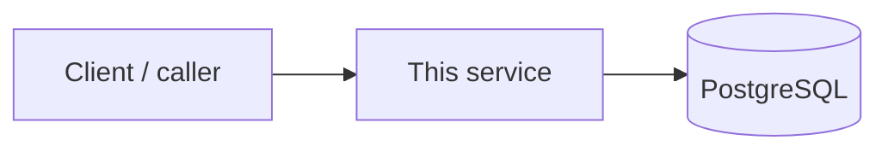

<div align="center">

 — Baalvion Platform" width="100%">

<br/>
<br/>

**<One-sentence bold summary of what this is and the value it delivers.>**

<!-- Badge row: only badges for tech this project ACTUALLY uses -->
<p>
  
  
</p>

<sub><a href="#overview">Overview</a> · <a href="#getting-started">Getting started</a> · <a href="#configuration">Configuration</a> · <a href="#project-structure">Structure</a></sub>

</div>

---

## Overview

<What it is. Who/what depends on it. Where it sits in the Baalvion platform
(domain, gateway relationship, tier). Keep the real facts from the prior README.>

## Architecture

<!-- Include a mermaid diagram ONLY when there is real structure to show. -->


## Getting Started

```bash
# real install/run commands from package.json scripts
pnpm install
pnpm run dev
```

## Configuration

| Variable | Default | Purpose |
|----------|---------|---------|
| `EXAMPLE_VAR` | — | real env var documented from source / .env.example |

## Project Structure

| Path | Purpose |
|------|---------|
| `src/...` | real directory purpose |

## Testing

```bash
pnpm test
```

## Notes

- Real, load-bearing caveats from the existing README (auth centralization,
  graceful degradation, do-not-replace integrations, etc.).

---

<div align="center">
<sub>Part of the <a href="https://github.com/baalvionservice/Baalvion-Project-Infra">Baalvion Platform</a> · centralized identity · domain-driven monorepo</sub>
</div>
