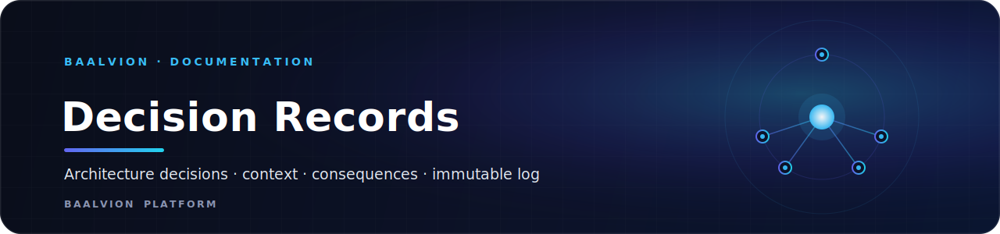

 
 

**The immutable log of significant architectural decisions across the Baalvion Platform — the context behind each choice and the consequences it carries.**

[Index](#index) · [Authoring a new ADR](#authoring-a-new-adr) · [Status values](#status-values)

---

## Overview

This directory records significant architectural decisions, the context behind
them, and their consequences. ADRs are **immutable once accepted** — supersede
them with a new record rather than editing history.

These records are the source of truth referenced by the
[Architecture Blueprint](../architecture/README.md): where the blueprint
describes *what* the platform looks like, the ADRs capture *why* each load-bearing
choice was made.

## Index

| #    | Decision                                                       |
|------|----------------------------------------------------------------|
| 0001 | [Repository strategy](0001-repository-strategy.md)             |
| 0002 | [Event bus: NATS vs Kafka](0002-event-bus-nats-vs-kafka.md)    |
| 0003 | [Database per service](0003-database-per-service.md)           |
| 0004 | [API gateway: Kong](0004-api-gateway-kong.md)                  |
| 0005 | [Service communication](0005-service-communication.md)         |
| 0006 | [Strangler-fig migration](0006-strangler-fig-migration.md)     |

## Authoring a new ADR

1. Copy [`0000-template.md`](0000-template.md) to the next number
   (`NNNN-short-title.md`).
2. Fill in context, decision, and consequences.
3. Open a PR; ADRs are reviewed by `@baalvion/architecture` (see
   [CODEOWNERS](../../CODEOWNERS)).
4. When a decision changes, add a new ADR and mark the old one `Superseded`.

## Status values

`Proposed` · `Accepted` · `Deprecated` · `Superseded by ADR-NNNN`

---

Part of the <a href="https://github.com/baalvionservice/Baalvion-Project-Infra">Baalvion Platform</a> · centralized identity · domain-driven monorepo

