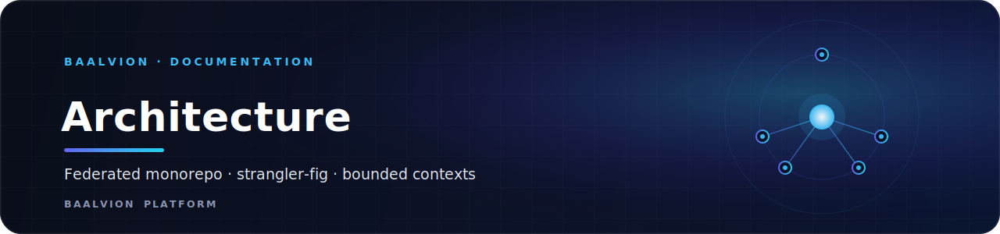
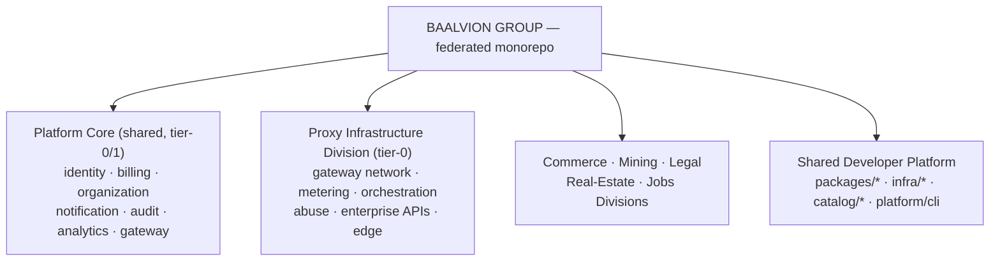

<div align="center">



<br/>
<br/>

**The permanent architecture and operational scaling model for Baalvion Group — a federated monorepo of independently deployable bounded contexts on a shared platform core.**


<sub>[Thesis](#1-the-thesis) · [Platform layer](#2-the-platform-layer-already-real) · [Communication](#3-communication-model) · [Data](#4-data-model) · [Isolation](#5-operational-isolation) · [Lifecycle](#6-how-a-new-service-comes-to-life) · [Index](#document-index)</sub>

</div>

> This document is the map; the code under `packages/`, `catalog/`, `infra/` and
> the ADRs in [`docs/adr/`](../adr/) are the territory.

---

## 1. The thesis

Baalvion is a **multi-business group** (proxy infrastructure, commerce, mining,
legal, real-estate, jobs) that today shares one monorepo. The businesses must
become **operationally isolated, independently deployable, independently scalable
bounded contexts** that sit on a **shared platform core** — without a big-bang
rewrite that would halt the businesses.

The chosen model is **federated monorepo + strangler-fig extraction**:

- **One repo, many independently-deployable units** (ADR-0001). We keep the
  developer-experience wins of a monorepo (atomic cross-cutting changes, one
  toolchain, shared packages) while each service owns its build, DB, deploy,
  observability and scaling.
- **Extract incrementally** behind stable contracts (ADR-0006). The monolith
  keeps running while we peel services off one at a time. Nothing is moved until
  its contract + event integration exists and is green in CI.



The Proxy Infrastructure Division is the furthest-along division — the beachhead
for the extraction pattern.

## 2. The platform layer (already real)

The internal platform — the thing that makes services cheap to build correctly —
lives in `packages/*` and is consumed by every service:

| Concern | Package | Status |
|---------|---------|--------|
| Identity / token verification | `@baalvion/auth-sdk` | existing |
| RBAC | `@baalvion/rbac` | existing |
| Observability (OTel + pino + prom) | `@baalvion/telemetry` | existing |
| Graceful shutdown | `@baalvion/graceful-shutdown` | existing |
| **Domain events + durable bus** | `@baalvion/events` | **extended (P11)** |
| **Inter-service contracts (gRPC + events)** | `@baalvion/contracts` | **new (P11)** |
| **Service bootstrap (golden path)** | `@baalvion/service-kit` | **new (P11)** |
| Service catalog + governance | `catalog/` + `baalctl` | **new (P11)** |

## 3. Communication model

Two transports, one rule: **a service depends only on contracts, never on another
service's internals** (`@baalvion/contracts`).

- **Synchronous** → gRPC over mTLS (ADR-0005). For request/response where the
  caller needs an answer now (token verification, quota check, allocation).
- **Asynchronous** → domain events on NATS JetStream (ADR-0002). For everything
  else: state propagation, read-model building, sagas, fan-out. The default.

The proxy backend **already emits** real domain events today
(`service/domainEvents.js` → `billing.invoice.generated`, `proxy.session.started`,
`abuse.action.triggered`) — the event-driven backbone is adopted, not theoretical.

## 4. Data model

**Database-per-service** (ADR-0003). The shared Postgres is logically partitioned
per context and physically split during extraction. CQRS where read and write
shapes diverge: the **analytics** and **audit** contexts are pure read models
built by consuming the event stream (Timescale/ClickHouse), never by querying
other services' tables.

## 5. Operational isolation

- **Namespaces per division** (`baalvion`, `baalvion-identity`, `baalvion-edge`,
  `baalvion-eventbus`) + **zero-trust NetworkPolicies** (deny-all, allow-listed) in
  the standard Helm chart.
- **Per-service deploy** via the `baalvion-service` Helm chart, generated per
  service by the **ArgoCD ApplicationSet** straight from the catalog.
- **Tiering** drives sync order + on-call: tier-0 = identity, gateway, billing.

## 6. How a new service comes to life

```
baalctl new service payments-platform --division platform-core --owner @baalvion/platform-core
  → writes catalog/services/payments-platform.yaml + Helm values
  → scaffold code with @baalvion/service-kit createService()
  → declare its public surface in @baalvion/contracts
  → PR (CODEOWNERS routes review; buf + catalog gates run)
  → merge → ArgoCD ApplicationSet provisions + deploys it
```

## Document index

| Document | Scope |
|----------|-------|
| [`ddd-map.md`](./ddd-map.md) | Bounded contexts and the domain model |
| [`migration-roadmap.md`](./migration-roadmap.md) | The phased strangler-fig extraction |
| [`PLATFORM-ARCHITECTURE-REFERENCE.md`](./PLATFORM-ARCHITECTURE-REFERENCE.md) | Platform architecture reference |
| [`BAALVION-OS-MIGRATION.md`](./BAALVION-OS-MIGRATION.md) | Platform OS migration |
| [`GROUP-ECOSYSTEM-ARCHITECTURE.md`](./GROUP-ECOSYSTEM-ARCHITECTURE.md) | Group-wide ecosystem architecture |
| [`PLATFORM-CONSOLIDATION-AND-GOVERNANCE-PLAN.md`](./PLATFORM-CONSOLIDATION-AND-GOVERNANCE-PLAN.md) | Consolidation and governance plan |
| [`ARCHITECTURE-RECOMMENDATIONS.md`](./ARCHITECTURE-RECOMMENDATIONS.md) | Architecture recommendations |
| [`CORPORATE-PRODUCT-STRATEGY.md`](./CORPORATE-PRODUCT-STRATEGY.md) | Corporate product strategy |
| [`EXECUTIVE-DECISION-DOCUMENT.md`](./EXECUTIVE-DECISION-DOCUMENT.md) | Executive decision document |
| [`CONFLICT-IMPACT-REPORT.md`](./CONFLICT-IMPACT-REPORT.md) | Conflict and impact report |
| [`../adr/`](../adr/) | Architecture Decision Records (the *why*) |

---

<div align="center">
<sub>Part of the <a href="https://github.com/baalvionservice/Baalvion-Project-Infra">Baalvion Platform</a> · centralized identity · domain-driven monorepo</sub>
</div>
