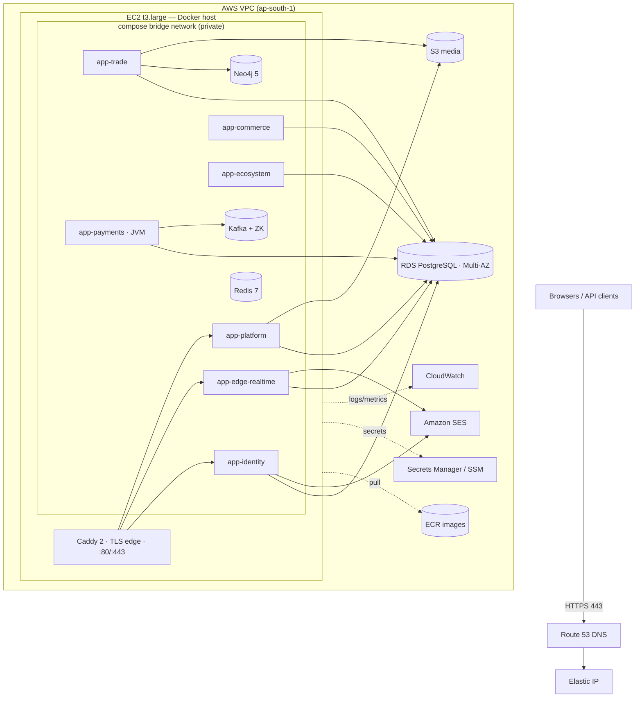

# Baalvion Backend — Production Deployment

The single authoritative guide for deploying the Baalvion consolidated backend to AWS.

**45 repository modules → 6 Node app containers + 1 JVM app (43 deployables)**, packaged for a
single EC2 host + managed RDS, with a documented path to ECS/HA. No business logic changes; module
boundaries stay intact.

> **Status:** design + runnable artifacts complete and **validated end-to-end locally** (2026-06-23 —
> all 43 deployables brought up under Docker, full auth/CMS/payment/email flows exercised). Sizing is
> anchored on the **measured ~4.0 GiB idle footprint**, not estimates.
>
> **Companion artifacts** live in [`deploy/consolidated/`](../../deploy/consolidated/):
> `docker-compose.prod.yml`, `.env.production.example`, the six `pm2/*.config.js`, `caddy/Caddyfile`,
> `Dockerfile.node`, `Dockerfile.java`, `preflight-env.js`, and `sql/payments-bootstrap.sql`.
>
> **Design rationale** — why multi-process over single-process (the boot-pattern finding), the
> per-container process model, and ECS guardrails — lives in [ARCHITECTURE.md](ARCHITECTURE.md). This
> runbook is the *how*; that companion is the *why*.

## Contents

1. [Principles](#1-principles)
2. [Service inventory](#2-service-inventory)
3. [Resource audit](#3-resource-audit)
4. [Consolidation architecture (6 + 1)](#4-consolidation-architecture-6--1)
5. [Production architecture](#5-production-architecture)
6. [Service deployment groups](#6-service-deployment-groups)
7. [AWS resources & image inventory](#7-aws-resources--image-inventory)
8. [Sizing & cost](#8-sizing--cost)
9. [Environment & secrets](#9-environment--secrets)
10. [Cross-container dependency map](#10-cross-container-dependency-map)
11. [Runbooks — deploy · rollback · backup](#11-runbooks--deploy--rollback--backup)
12. [Monitoring & alerting](#12-monitoring--alerting)
13. [Risks discovered in testing](#13-risks-discovered-in-testing)
14. [Final pre-deploy checklist](#14-final-pre-deploy-checklist)
15. [ECS migration path](#15-ecs-migration-path)
16. [Dry-run → production exclusions](#16-dry-run--production-exclusions)

---

## 1. Principles

1. **No business logic changes** — every module still runs its own unmodified `node index.js`.
2. **Module boundaries intact** — nothing under `Backend/services/**` moves; grouping is packaging only.
3. **PostgreSQL on AWS RDS** — external, TLS-on, one database with a schema per domain.
4. **Compose now, ECS later** — the compose file is written to translate 1:1 to ECS task definitions.

**TL;DR** — ~85% of the fleet is light Node/Express+Sequelize. The only real RAM weight sits in two
non-Node services (`financial-services-java` JVM, `ml-service` Python) plus a few worker-heavy Node
BFFs. One shared image runs each app via a different `pm2-runtime` ecosystem file; a container
launches only its bounded context's processes. Footprint ~4.0 GiB idle → one `t3.large` (8 GB) +
RDS → ~$102–130/mo on-demand.

---

## 2. Service inventory

All 45 services under `Backend/services/<domain>/<service>/`. **Runtime split:** 43 Node.js
(Express 4/5 + Sequelize), 1 Java (Spring Boot 4.1), 1 Python (FastAPI). **Real vs shell:** 44 real,
1 shell (`law-elite` — in-memory demo, decommissioned).

| Domain | Service | Runtime | Port | Notable / heavy deps |
|---|---|---|---:|---|
| commerce | commerce-service | Node 20 / Express 5 | 3012 | BullMQ, Sequelize, ioredis, media uploads |
| commerce | financial-services-java | Java 17 / Spring Boot 4.1 | 3015 | spring-kafka, HikariCP, Resilience4j (22 modules) |
| commerce | fulfillment-service | Node 20 / Express 5 | 3016 | Sequelize, ioredis |
| commerce | inventory-service | Node 20 / Express 5 | 3014 | Sequelize, ioredis |
| commerce | market-service | Node 20 / Express 5 | 3007 | Sequelize, prom-client |
| commerce | order-service | Node 20 / Express 5 | 3013 | BullMQ reconciliation worker, @baalvion/events |
| commerce | trade-service | Node 20 / Express 5 | 3025 | BullMQ, ws, @aws-sdk/s3, doc/logistics engines, RLS |
| ecosystem | about-service | Node 20 / Express 5 | 3010 | Sequelize (CMS content) |
| ecosystem | agent-service | Node 20 / Express 5 | 3044 | Sequelize, ioredis (leaderboards) |
| ecosystem | brand-connector-service | Node 20 / Express 5 | 3006 | Sequelize |
| ecosystem | crm-service | Node 20 / Express 5 | 3063 | Sequelize, prom-client |
| ecosystem | ctm-service | Node 20 / Express 5 | 3017 | Razorpay + Stripe SDKs, Swagger UI |
| ecosystem | insiders-service | Node 20 / Express 4 | 3050 | Sequelize, Multer, bcryptjs |
| ecosystem | ir-service | Node 20 / Express 5 | 3008 | Sequelize, prom-client (19 route modules) |
| ecosystem | jobs-service | Node 20 / Express 5 | 3002 | Elasticsearch 9, BullMQ ×4 workers, S3, Bull-Board |
| ecosystem | law-elite | Node 20 / Express 4 | 3001/3002 | **Shell** — two in-memory demo apps, mock arrays |
| ecosystem | mining-service | Node 20 / Express 5 | 3003 | Sequelize, prom-client (9 route modules) |
| ecosystem | real-estate-service | Node 20 / Express 5 | 3005 | Sequelize, prom-client |
| identity | auth-gateway | Node 20 / Express 4 | 3026 | ioredis, http-proxy-middleware (trust-boundary BFF) |
| identity | auth-service | Node 20 / Express 5 | 3001 | bcrypt, jsonwebtoken (RS256), speakeasy, qrcode, geoip-lite, nodemailer |
| identity | oauth-service | Node 20 / Express 5 | 3023 | OIDC/OAuth2 server; bcrypt, jwt, pino |
| identity | rbac-service | Node 20 / Express 5 | 3053 | Sequelize, jwt (RLS tenant isolation) |
| identity | session-service | Node 20 / Express 5 | 3022 | geoip-lite, ua-parser, ioredis |
| infrastructure | audit-service | Node 20 / Express 5 | 3032 | Sequelize, ioredis, pino (event consumer) |
| infrastructure | developer-service | Node 20 / Express 5 | 3042 | Sequelize, ioredis, pino |
| infrastructure | notification-service | Node 20 / Express 5 | 3031 | BullMQ ×5 workers, nodemailer + resend, Twilio/Firebase (optional) |
| infrastructure | proxy-service | Node 20 / Express 5 | 4000 | socket.io, Razorpay/Stripe/PayU/Cashfree, S3, SAML/OpenID (consumer BFF) |
| infrastructure | realtime-service | Node 20 / Express 4 | 3040 | socket.io, Redis pub/sub |
| infrastructure | report-service | Node 20 / Express 5 | 3041 | Sequelize, exceljs + pdfkit (lazy) |
| infrastructure | search-service | Node 20 / Express 5 | 3036 | @baalvion/search (OpenSearch), ioredis |
| knowledge | cms-service | Node 20 / Express 5 | 3018 | BullMQ media pipeline, Sequelize, ioredis |
| knowledge | imperialpedia-service | Node 20 / Express 5 | 3004 | Sequelize, prom-client |
| knowledge | law-service | Node 20 / Express 5 | 3015 | Multer, S3, WebSocket, nodemailer, billing worker |
| knowledge | ml-service | Python 3.11 / FastAPI | 8000 | scikit-learn, statsmodels, numpy, joblib (optional accelerator) |
| marketplace | marketplace-service | Node 20 / Express 5 | 3060 | Sequelize, Zod (cap tables/deals) |
| platform | admin-service | Node 20 / Express 5 | 3021 | Sequelize, Redis, pino (super-admin + feature flags) |
| platform | dashboard-service | Node 20 / Express 5 | 3009 | Sequelize (aggregation layer) |
| platform | realtime-service | Node 20 / hand-rolled WS | 3026→3046 | pg, Redis, jwt (no ws lib) |
| platform | tenant-service | Node 20 / Express 5 | 3043 | Sequelize, Redis (white-label registry) |
| trade | network-graph-service | Node 20 / Express 5 | 3047 | **neo4j-driver** (50-conn pool) |
| trade | order-execution-service | Node 20 / Express 5 | 3052 | outbox/saga/reconciliation/redrive workers |
| trade | product-registry-service | Node 20 / Express 5 | 3048 | Sequelize (SKU/GTIN/HS master) |
| trade | quality-inspection-service | Node 20 / Express 5 | 3050 | Sequelize (AQL sampling) |
| trade | supplier-lifecycle-service | Node 20 / Express 5 | 3051 | Sequelize (calls network-graph + trust-score) |
| trade | trade-documentation-service | Node 20 / Express 5 | 3049 | Sequelize, S3 (no headless browser) |

**Packaging-relevant findings:**

- **`law-elite` is not production code** — two in-memory Express 4 demo apps. Decommission; excluded
  from all deployable apps.
- **Port collisions** in the raw fleet (`3026` auth-gateway vs platform/realtime; `3002` jobs vs
  law-elite; `3015` payment-JVM vs law-service; `3050` insiders vs quality-inspection) are resolved by
  placing collisions in **different containers** (separate network namespaces) or remapping via the
  pm2 `PORT` env (e.g. platform/realtime → `3046`).
- **Homogeneous stack** — 43 of 45 share Node 20 + Express + Sequelize + ioredis + `@baalvion/*`
  workspace packages, which is what makes one shared image viable.

---

## 3. Resource audit

> **Methodology:** MB figures below are **derived idle-RSS estimates** (Node/Express+Sequelize
> baseline ≈ 80–110 MB; +workers/Redis/Neo4j/ES/JVM/numpy add known increments) — for relative
> bucketing and capacity planning, not billing-grade truth. Validate any sizing-driving number with
> `docker stats --no-stream` / `pm2 jlist`. The running fleet's capped limits total ~4.94 GB,
> corroborating the ~5 GB Node figure.

**🟢 Light (<150 MB) — 28 services:** plain Express + Sequelize CRUD, no workers. (dashboard,
about, brand-connector, imperialpedia, inventory, fulfillment, product-registry, quality-inspection,
crm, market, mining, real-estate, rbac, oauth, auth-gateway, supplier-lifecycle, trade-documentation,
agent, insiders, ir, admin, tenant, audit, developer, ctm, both realtime, session, search, report.)

**🟡 Medium (150–300 MB) — 12 services:** background workers / websockets / Neo4j / ES client.
commerce (160) · network-graph (160) · auth (160) · order (170) · cms (170) · law (170) · trade
(190) · order-execution (190) · notification (200) · **proxy (220–280 ⚠)** · **jobs (250–300 ⚠)**.

**🔴 Heavy (>300 MB) — 2 services:** `ml-service` (300–400, numpy/scikit) · `financial-services-java`
(400–700+, JVM, heaviest by far).

**Takeaway:** the entire RAM problem is concentrated in two non-Node services plus a few worker-heavy
Node BFFs. Everything else is cheap.

**Lambda candidates (defer for now):** the win worth taking is the **async/bursty path only** —
report generation, notification dispatch, audit ingestion via SQS/EventBridge. **Do NOT Lambda**
auth/gateway/session/oauth/rbac (login latency), proxy + both realtime (websockets), the JVM (cold
start), ml-service (numpy cold start), or the order/trade transactional chain. HTTP Lambdas behind
API Gateway add cold-start latency and a Postgres connection-exhaustion problem (needs RDS Proxy).

**Merge analysis — keep modules separate, deploy together:**

| Model | Mechanism | RAM | Code change | Boundary risk |
|---|---|---|---|---|
| A. Single process | mount each Express router under a path prefix in one Node process | ~2 GB | **~42 entrypoint edits** | global-state sharing |
| **B. Multi-process per container** *(chosen)* | one image; `pm2-runtime` runs each module's own `node index.js`, grouped by context | ~5 GB Node | **none** | none — own port/pool/lifecycle |

Model B is chosen because service entrypoints self-start on import inconsistently (some call
`start()` at import, binding ports + creating schema + starting workers), so Model A would require
guarding `start()` and exporting `app` in ~42 files — violating the "no changes" guarantee. Model A
remains the documented lever to reach ~2 GB (a `t3.small`) if that constraint is later relaxed.

---

## 4. Consolidation architecture (6 + 1)

**Mechanism:** one shared image (`Dockerfile.node`) carries the full Backend pnpm workspace. Each app
container runs the same image but a different pm2 ecosystem file (selected via compose `command:`).
`pm2-runtime` launches each module's own `node index.js` with its own `cwd` and explicit `PORT` — a
container starts **only the processes in its ecosystem file**.

| App (container) | Bounded context(s) | Modules · port |
|---|---|---|
| **app-identity** (5) | identity | auth `3001` · auth-gateway `3026` · oauth `3023` · rbac `3053` · session `3022` |
| **app-commerce** (7) | commerce + marketplace | commerce `3012` · inventory `3014` · fulfillment `3016` · market `3007` · order `3013` · trade-service `3025` · marketplace `3060` |
| **app-trade** (6) | trade | network-graph `3047` · order-execution `3052` · product-registry `3048` · quality-inspection `3050` · supplier-lifecycle `3051` · trade-documentation `3049` |
| **app-ecosystem** (10) | ecosystem | about `3010` · agent `3044` · brand-connector `3006` · crm `3063` · ctm `3017` · insiders `3050` · ir `3008` · jobs `3002` · mining `3003` · real-estate `3005` |
| **app-platform** (10) | platform + knowledge + infra-utils | admin `3021` · dashboard `3009` · tenant `3043` · cms `3018` · imperialpedia `3004` · law `3015` · audit `3032` · developer `3042` · report `3041` · search `3036` |
| **app-edge-realtime** (4) | infra BFF + realtime + async | proxy/BFF `4000` · realtime-infra `3040` · realtime-platform `3046` · notification `3031` |
| **app-payments** (1, JVM) | commerce/finance | financial payment-service `3015` (`--profile payments`) |
| **Total** | | **43** (42 Node processes + 1 JVM) |

**Excluded by design:** `law-elite` (in-memory demo shell — decommission) · `ml-service` (Python;
optional accelerator, OFF by default, Node has an in-process fallback — ships as an 8th container only
when needed).

**Grouping rationale:** (1) by bounded context first (matches CODEOWNERS seams); (2) runtime
separation (JVM/Python can't share the Node image); (3) connection-style isolation
(`app-edge-realtime` collects the public BFF + two websocket servers + notification workers);
(4) back-office consolidation (low-traffic admin/knowledge/infra share `app-platform`).

**Boundaries stay intact:** no file under `Backend/services/**` moves or is edited; each module is its
own OS process (own event loop, crash domain) with its own Sequelize pool to its own schema, its own
workers and `@baalvion/graceful-shutdown`, and `pm2 restart <module>` cycles one module without
touching siblings. The grouping is **packaging, not coupling** — reversible by moving one entry to a
new ecosystem file.

---

## 5. Production architecture

A single EC2 host runs Caddy (edge TLS) + 6 Node app containers + the JVM payment app + on-box
Redis/Neo4j/Kafka. PostgreSQL is managed RDS. Browsers reach only Caddy (80/443); everything else is
private on the Docker bridge network.



**Edge routing (Caddyfile):** `auth.baalvion.com → app-identity:3026` ·
`api.baalvion.com → app-edge-realtime:4000` · `ws.baalvion.com → app-edge-realtime:3040` ·
`admin.baalvion.com → app-platform:3021` (+ `/auth-bff/*` shim → app-identity:3001,
`/api/v1/public/*` → app-platform:3018). Internal service-to-service calls use Docker DNS and bypass
Caddy.

**Hard dependencies (boot-blocking):**

- **All app containers → Redis** (compose `depends_on: redis healthy`).
- **app-trade → Neo4j** — `network-graph-service` calls `verifyConnectivity()` and `process.exit(1)`
  on failure. Neo4j is mandatory in prod.
- **app-payments → DB** (Flyway-migrated `payments` schema) + **Kafka** (@EnableKafka; tolerates
  absence but logs continuous reconnect noise).

**Soft/lazy dependencies (degrade, don't crash):** `search-service` → OpenSearch (absent ⇒ HTTP 503
by design); `jobs-service` → Elasticsearch (absent ⇒ Postgres full-text fallback); S3/SES/payment
gateways are first-use, not boot.

**Trust boundaries:** cross-service calls are gateway-signed (`GATEWAY_SIGNING_SECRET`) or carry
`x-internal-secret` (`INTERNAL_SERVICE_SECRET`); all token verification is RS256 via
`@baalvion/auth-node` (single issuer).

---

## 6. Service deployment groups

You deploy/skip at **container** granularity — a service's group tells you whether its container is
essential, but you can't run half a container.

**Group 1 — CORE PRODUCTION (must run):** auth-service, auth-gateway, rbac (identity); cms,
admin (platform); commerce, order (commerce); proxy (edge-realtime); + PostgreSQL (RDS), Redis,
Caddy. Disabling any breaks the system — the fleet verifies auth's tokens, order's checkout fails
closed without rbac, cms holds the payment-provider-key vault, proxy is the frontends' API entrypoint.

**Group 2 — SUPPORT (recommended; degrades if off):** notification (order/alert emails, fail-open),
inventory (oversell guard — order fails *open* without it), session/oauth (auth works degraded),
payment-service JVM (needed for the finance/ledger path, **not** for consumer checkout which uses Node
gateway adapters), tenant/dashboard/search/fulfillment, the product verticals (ctm, ir, about,
imperialpedia, law, mining, real-estate, crm, insiders, agent, brand-connector, market, marketplace,
trade-service), and the GTI trade tier (network-graph + 5 trade services — disable whole app-trade if
GTI not live). Infra: SES, S3, Neo4j (only if app-trade), Kafka/MSK (only if JVM), OpenSearch.

**Group 3 — BACKGROUND / ASYNC:** report-service (bursty, Lambda candidate), audit-service
(compliance), realtime-platform, and in-process workers (notification ×5, jobs ×4, order
reconciliation). The **Java finance reactor** (ledger, settlement, escrow, account, invoice, fx,
credit, aml, risk, dispute, wallet, trade-finance, payment-rails, smart-contract — ~21 modules) is
**not in the consolidated stack** (full GTI trade-finance only).

**Group 4 — DEV ONLY (must NOT reach prod):** Mailpit/MailHog, `docker-compose.dryrun.yml` +
throwaway Postgres, `dryrun-keys/`, `NODE_TLS_REJECT_UNAUTHORIZED=0` / `DEPLOY_PROFILE=dryrun` /
`PSP_MOCK=true`, law-elite, pgAdmin/`tools` profile. The `preflight-env.js` hard-fails on these in a
non-dryrun profile.

**Minimum Viable Production Set:** `app-identity` + `app-commerce` + `app-platform` +
`app-edge-realtime` (4 of 6) + RDS, Redis, Caddy, SES, S3. **Not needed:** app-trade, app-ecosystem,
app-payments JVM, Kafka, Neo4j, OpenSearch — consumer checkout uses Node gateway adapters. Footprint
~2.3–2.8 GiB idle → `t3.medium`/`t3.large`.

**Recommended Production Set:** all 6 Node containers + `app-payments` JVM (`--profile payments`) +
RDS Multi-AZ, Redis (→ ElastiCache at scale), Neo4j, Kafka/MSK, OpenSearch, SES, S3, Caddy. Enable
only the product verticals you run; the rest stay dark inside `app-ecosystem` without harm. Footprint
~4.6 GiB idle → `t3.large` (8 GB).

*(Frontends — Amarisé, admin-platform, CTM, GTI — are a separate deploy track on Vercel/ECR+CDN, not
part of these backend groups.)*

---

## 7. AWS resources & image inventory

### Core (single-host MVP — matches `docker-compose.prod.yml`)

| Resource | Spec | Purpose / notes |
|---|---|---|
| **EC2** | 1 × `t3.large` (x86_64, 2 vCPU / 8 GB) | Docker host; x86_64 matches CI (`ubuntu-latest`), image built `linux/amd64` |
| **EBS** | 50 GB gp3 root | OS + 6.6 GB Node image + neo4j/kafka volumes |
| **Elastic IP** | 1 | stable ingress for Route 53 |
| **RDS PostgreSQL** | `db.t3.small`, 20 GB gp3, **Multi-AZ for prod** | the one database (schema-per-domain); app user needs `CREATE`; automated backups + PITR |
| **ECR** | 2 repos: `baalvion-backend`, `baalvion-payments` | lifecycle policy to expire old tags |
| **Route 53** | hosted zone + A/ALIAS for `*.baalvion.com` | must resolve before Caddy issues certs |
| **TLS** | Caddy ACME (Let's Encrypt) | ACM only if fronted by an ALB |
| **S3** | `baalvion-prod-media` (versioned) | trade/law/cms media; access via EC2 **instance role**, not keys |
| **SES** | verified domain + SMTP creds | out of sandbox; SPF/DKIM/DMARC |
| **Secrets Manager / SSM** | SecureString per `[SECRET]` | injected at deploy; rotation schedule |
| **CloudWatch** | log group `/baalvion/consolidated` + alarms | see §12 |
| **IAM** | instance role (ECR pull, SSM read, S3, SES, CW) + CI deploy role (OIDC) | no long-lived keys on the box |
| **Security Groups** | EC2: 443/80 from internet, 22 from SSM/admin only; RDS: 5432 from EC2 SG only | prefer SSM Session Manager over open 22 |
| **VPC** | public subnet (EC2+EIP) + private subnets (RDS Multi-AZ, 2 AZs) | — |
| **Kafka** (payments profile) | on-box `cp-kafka` + `cp-zookeeper` → **MSK** at scale | payment-service event bus (@EnableKafka) |

**Optional / scale-out:** ElastiCache (Redis HA at 10x+) · OpenSearch (non-degraded search) ·
ALB + ACM (HA edge, mirrors Caddyfile rules) · ECS Fargate / EKS (100x) · RDS Proxy (if any service
moves to Lambda) · EFS (multi-instance shared media if not fully on S3).

### Docker image inventory

| Image | Source | Size | Runs |
|---|---|---:|---|
| **`baalvion-backend`** | `Dockerfile.node` (full Backend workspace) | **~6.6 GB** | all 6 Node containers (pm2 personality per container) |
| **`baalvion-payments`** | `Dockerfile.java` (`mvn -pl payment-service -am`) | **~585 MB** | the JVM payment container |
| `redis:7-alpine` | Docker Hub | ~41 MB | on-box cache/queues |
| `neo4j:5` | Docker Hub | ~600 MB | graph for network-graph-service (**required**) |
| `caddy:2-alpine` | Docker Hub | ~50 MB | TLS edge |
| `confluentinc/cp-kafka:7.6.1` + `cp-zookeeper:7.6.1` | Docker Hub | ~800 MB ea | payments event bus (`payments` profile) |

> **⚠ 6.6 GB Node-image risk (R7):** bundles the entire Backend workspace; slow ECR pulls/rollbacks,
> inflates EBS/ECR. Mitigations (no code change): `.dockerignore` already trims Frontend/git;
> consider a multi-stage build with `pnpm install --prod`, store dedupe, and cache pruning. Tag images
> by **git sha** (`prod-<sha>`), not only `prod-latest`, so rollback is a tag change.

---

## 8. Sizing & cost

All memory figures are **measured** from the local dry-run (`docker stats --no-stream`, idle).

### Per-container CPU & memory

| Container | Measured idle | `mem_reservation` | `mem_limit` | Rationale |
|---|---:|---:|---:|---|
| app-identity | **723 MiB** | 512m | **1024m** | was 723/768 = 94% in dry-run → raised cap (R4) |
| app-commerce | 460 MiB | 640m | 1280m | BullMQ + media + order/trade workers |
| app-trade | 422 MiB | 512m | 1024m | Neo4j pool + saga/outbox workers |
| app-ecosystem | 634 MiB | 768m | 1536m | 10 modules incl. jobs (ES client) |
| app-platform | 613 MiB | 768m | 1536m | 10 modules incl. cms/law media |
| app-edge-realtime | 251 MiB | 448m | 896m | proxy/jobs can cross 300 MB under load |
| app-payments (JVM) | 402 MiB | 512m | 768m | `-Xmx512m`, MaxRAMPercentage 70 |
| redis | 8 MiB | 96m | 320m | `maxmemory 256mb noeviction` |
| neo4j | 525 MiB | 384m | 768m | heap 384m + pagecache 128m |
| kafka + zookeeper | ~600 MiB (est) | — | 768m + 384m | `payments` profile only |
| caddy | ~40 MiB | 32m | 96m | TLS edge |

Each Node process additionally carries `--max-old-space-size` + a pm2 `max_memory_restart` ceiling,
so one leaking module restarts without taking down siblings. **CPU policy:** on 2-vCPU `t3.large` do
**not** hard-pin CPU — the fleet is near-idle and relies on burst credits.

### EC2 sizing (from the measured ~4 GiB idle)

| Footprint | Value |
|---|---|
| Idle, Node-only (6 apps + redis + neo4j + caddy) | **~3.5 GiB** |
| Idle, full stack (+ payments JVM) | **~4.0 GiB** |
| + Kafka/Zookeeper (payments profile, est.) | **~4.6 GiB** |
| Realistic prod **peak** under load (proxy/jobs/JVM + data) | **~5.5–6.5 GiB** |

**Recommendation: `t3.large` (x86_64, 2 vCPU / 8 GB).** 4.0 GiB idle leaves ~2 GiB headroom; peak
~6 GiB still fits 8 GB with margin. **x86_64 is the determined target** — it matches CI, every current
ECR image, and the live `ec2-single-host` deployment. ARM/Graviton (`t4g.large`, ~15–20% cheaper) is a
documented future optimization that requires adding a `docker buildx` multi-arch pipeline (out of
scope). Step up to `t3.xlarge` (4/16) if the 42-process + JVM baseline exhausts CPU credits.

### Cost (ap-south-1, USD/mo)

**Current (1×):**

| Item | Spec | On-demand | 1-yr Savings/RI |
|---|---|---:|---:|
| EC2 | t3.large 2/8 (x86_64) | ~$61 | ~$38 |
| EBS | 50 GB gp3 | ~$4 | ~$4 |
| RDS | db.t3.small Single-AZ + 20 GB | ~$28 | ~$22 |
| Redis / Neo4j / Kafka | on-box | $0 | $0 |
| ECR + S3 + egress | low | ~$8 | ~$8 |
| SES | <50k emails | ~$1 | ~$1 |
| **Total (single-AZ DB)** | | **~$102** | **~$73** |
| ▸ upgrade RDS to Multi-AZ (recommended) | db.t3.small Multi-AZ | +~$28 | +~$22 |
| **Total (Multi-AZ DB)** | | **~$130** | **~$95** |

**10× traffic** (vertical + start offloading): t3.xlarge + db.m6i.large Multi-AZ + ElastiCache +
(MSK or on-box Kafka) + more SES/CloudWatch → **~$550–700/mo**.

**100× traffic** (horizontal/HA on ECS or multi-EC2): per-service Fargate tasks + db.r6i.xlarge
Multi-AZ + read replicas + ElastiCache HA + MSK 3-broker + OpenSearch + ALB/WAF → **~$2,900–4,500/mo**.

> Scaling is **not linear**: 1×→10× is mostly a bigger box + managed Redis/DB (~6×); 10×→100× forces
> horizontal compute, RDS read replicas, MSK and OpenSearch. The cheapest 100× lever is per-service
> horizontal scaling on ECS (one image, N task defs) so only the hot containers scale out.
>
> The single-process merge (Model A, ~2 GB → `t3.small`, ~$30/mo all-in) remains the documented RAM
> lever but requires ~42 entrypoint edits — out of scope (see §3).

---

## 9. Environment & secrets

Template: [`deploy/consolidated/.env.production.example`](../../deploy/consolidated/.env.production.example).
At deploy, `.env` is **generated from SSM/Secrets Manager** — never committed. Every Node process
inherits these via the container env; pm2 adds the per-process `PORT`. The container `preflight-env.js`
blocks missing/placeholder vars (31 required + an email provider) before the apps start.

### Environment variable inventory

| Variable | Consumers | Required | Default / example |
|---|---|---|---|
| `NODE_ENV` | all | yes | `production` |
| `DB_HOST` `DB_PORT` `DB_NAME` `DB_USER` | all (Sequelize) | yes | RDS endpoint / `5432` / `baalvion` / `baalvion_app` |
| `DB_SSL` | all | yes (prod) | `true` |
| `DB_JDBC_PARAMS` | payments JVM | yes | `?sslmode=require` |
| `REDIS_HOST` `REDIS_PORT` | all | yes | `redis` / `6379` |
| `NEO4J_URI` `NEO4J_USER` `NEO4J_PASSWORD` `NEO4J_DATABASE` | network-graph (app-trade) | **yes — boot-blocking** | `bolt://neo4j:7687` / `neo4j` |
| `JWT_ISSUER` `JWT_AUDIENCE` | auth + consumers | yes | `baalvion-auth` / `baalvion-platform` |
| `ISLAND_AUTH_MODE` | auth, BFFs | yes (prod) | `strict` |
| `APP_SECURITY_ENABLED` | payments JVM | yes | `false` *(edge-locked — see note)* |
| `PSP_MOCK` | order/commerce/ctm | yes | `false` (prod) |
| `CORS_ORIGINS` | all HTTP | yes | `https://app.baalvion.com,…` |
| `SMTP_HOST` `SMTP_PORT` | notification, auth email | yes | `email-smtp.ap-south-1.amazonaws.com` / `587` |
| `EMAIL_FROM` | notification, auth | yes | `noreply@baalvion.com` (SES-verified) |
| `AWS_REGION` `S3_BUCKET` | trade, law, cms | yes (media) | `ap-south-1` / `baalvion-prod-media` |
| `KAFKA_BOOTSTRAP` / `SPRING_KAFKA_BOOTSTRAP_SERVERS` | payments JVM | yes (payments) | `kafka:9092` |
| `OPENSEARCH_URL` | search-service | no (degrades) | unset ⇒ 503 degraded |
| `ES_URL` / `ELASTICSEARCH_URL` | jobs-service | no (DB fallback) | unset ⇒ DB search |
| `ECR_REGISTRY` `IMAGE_TAG` | compose/deploy | yes | `<acct>.dkr.ecr…` / `prod-<sha>` |
| Inter-service discovery | see §10 | yes | `app-<container>:<port>` URLs |
| External URLs | frontends/OAuth | yes | `FRONTEND_URL`, `API_BASE_URL`, `OAUTH_PUBLIC_BASE_URL`, `AUTH_UI_URL`, `STOREFRONT_URL`, `PAYU_RETURN_URL` |
| `FINANCE_ENABLED` | trade-service | yes | `false` (full Java reactor not in this stack) |

> **`APP_SECURITY_ENABLED=false` note:** proven core-stack pattern — the JVM's own security is off and
> the **Caddy edge denies** its sensitive paths (`/refund`, `/capture`, `/actuator/*`, internal).
> Flipping to `true` requires configuring the JVM's auth or webhooks 401. Decide explicitly. This is
> **not** a dry-run artifact.

### Secrets inventory

All `[SECRET]` — store in **Secrets Manager / SSM SecureString**, inject at deploy, rotate, keep out
of git (push-protection + `.gitignore` enforce this).

| Secret | Consumer(s) | Rotation |
|---|---|---|
| `DB_PASSWORD` | all | 90d |
| `NEO4J_PASSWORD` | network-graph, neo4j | 90d |
| `JWT_PRIVATE_KEY_B64` | auth-service (signs) | incident / 180d (KMS-backed) |
| **`JWT_PUBLIC_KEY`** | **all fleet consumers (verify)** | with the keypair — ⚠ see risk **R1** |
| `JWT_ACCESS_SECRET` `JWT_REFRESH_SECRET` | auth | 180d (≥32 chars) |
| `GATEWAY_SIGNING_SECRET` | gateways/BFFs | 90d |
| `INTERNAL_SERVICE_SECRET` | all (`x-internal-secret`) | 90d |
| `INVENTORY_INTERNAL_KEY` | order → inventory | 90d |
| `METRICS_SECRET` · `CART_SESSION_SECRET` · `BILLING_SIGNING_SECRET` · `RBAC_INTERNAL_API_KEY` · `AUDIT_INTERNAL_KEY` | various | 90d |
| `CMS_SECRETS_KEY` · `PROVIDER_SECRET_KEY` | cms/proxy vaults | on incident |
| `FINANCE_WEBHOOK_SECRET` | payments | on incident |
| `SMTP_USER` `SMTP_PASS` | notification/auth | 90d (**SES SMTP creds, not IAM keys**) |
| `RAZORPAY_*` `PAYU_*` `CASHFREE_*` | order/ctm/payment | per provider (usually synced from the CMS vault) |
| `SUPERADMIN_PASSWORD` | bootstrap | rotate **immediately after first use** |

**Handling rules:** no secret in an image layer, compose file, or git; inject only via `.env`
(deploy-time) or Docker secrets; restrict SSM/Secrets Manager read to the EC2 instance role; audit via
CloudTrail.

---

## 10. Cross-container dependency map

**Same-container** calls work over `localhost`; **cross-container** calls must target
`http://app-<container>:<pm2 port>`. The pm2 PORT **overrides the service's standalone default** (e.g.
rbac runs on `3053` here). The committed code only had `localhost:<standalone-port>` defaults, so each
cross-container edge below was broken until these env vars were set.

| Caller (container) | Target (container:port) | Env var | Notes |
|---|---|---|---|
| auth-gateway (identity) | auth-service (identity:3001) | `AUTH_SERVICE_URL`, `JWKS_URI` | same-container |
| auth-gateway BFF | mining 3003 · imperialpedia 3004 · ir 3008 · dashboard 3009 · ctm 3017 · proxy 4000 · insiders 3050 · trade-service 3025 · order-execution 3052 | `SVC_*` | cross |
| order / commerce / inventory / fulfillment | rbac (identity:3053) | `RBAC_BASE_URL` (+`/v1`) | cross · **`failMode=closed`** → checkout breaks if wrong |
| order-service | inventory (commerce:3014) | `INVENTORY_BASE_URL` + `INVENTORY_INTERNAL_KEY` | same-container; key-gated oversell guard |
| order-service | notification (edge-realtime:3031) | `NOTIFICATION_BASE_URL` | order emails via `INTERNAL_SERVICE_SECRET` |
| order / auth / trade / network-graph / product-registry / trade-documentation | cms (platform:3018) | `CMS_BASE_URL`, `CMS_INTERNAL_URL` | **prod guard rejects a localhost CMS URL** |
| trade-service / insiders | auth JWKS (identity:3001) | `JWKS_URI` | dualTokenVerifier |
| trade-service | payment JVM (payments:3015) | `SVC_PAYMENT` | **finance facade OFF (`FINANCE_ENABLED=false`) in MVP** |
| insiders / proxy | payment JVM (payments:3015) | `PAYMENT_SERVICE_URL` | cross |
| proxy-service | auth-service (identity:3001) | `AUTH_SERVICE_URL` | cross |

**Not deployed in the consolidated MVP:** `financial-services-java` is a ~22-module reactor; the stack
runs **only `payment-service`**. So `order-service → ledger` and `trade-service → ledger/account/
escrow/settlement/risk` are **not wired** — order-service ledger posting stays disabled (no
`LEDGER_INTERNAL_KEY`), trade-service keeps `FINANCE_ENABLED=false` (simulated finance refs), and
auth-gateway's finance BFF routes 502 if hit (only `payments` → `SVC_PAYMENT` is live). Cross-container
DNS works because each Node service listens on `0.0.0.0` and the JVM on all interfaces.

---

## 11. Runbooks — deploy · rollback · backup

`COMPOSE` shorthand:

```bash
COMPOSE="docker compose --env-file deploy/consolidated/.env -f deploy/consolidated/docker-compose.prod.yml --profile payments"
```

### Deploy

**Pre-flight:** AWS resources exist (EC2, RDS Multi-AZ, ECR, Route 53, SES out of sandbox, S3, SSM);
DNS A/ALIAS records resolve (required before Caddy issues TLS); CI built & pushed
`baalvion-backend:prod-<sha>` + `baalvion-payments:prod-<sha>` (`linux/amd64`) to ECR; secrets present
(**`JWT_PUBLIC_KEY` is the inlined PEM** — see R1); a **manual RDS snapshot** taken before any schema
change.

```bash
# 1. Materialise .env from SSM/Secrets Manager; pin IMAGE_TAG=prod-<sha>
# 2. Backing services first, wait healthy
$COMPOSE up -d redis neo4j zookeeper kafka
$COMPOSE ps                       # redis/neo4j/kafka = healthy
# 3. Apps
$COMPOSE up -d app-identity app-commerce app-trade app-ecosystem app-platform app-edge-realtime app-payments
$COMPOSE ps                       # 6 node apps healthy; app-payments running
```

**One-shot migrations & seed** (idempotent; once per fresh DB):

```bash
# auth: superadmin (only if none exists)
docker exec consolidated-app-identity-1 \
  sh -c 'cd /app/Backend/services/identity/auth-service && node scripts/bootstrapSuperAdmin.js'
# cms: schema tables (tracked/idempotent)
docker exec consolidated-app-platform-1 \
  sh -c 'cd /app/Backend/services/knowledge/cms-service && ./node_modules/.bin/sequelize-cli db:migrate'
# cms: register the REAL websites only (NOT demo/editorial seeders)
docker exec -e CMS_ORG_ID=<superadmin-org> -e CMS_CREATED_BY=<superadmin-id> consolidated-app-platform-1 \
  sh -c 'cd /app/Backend/services/knowledge/cms-service && node scripts/registerProductionWebsites.cjs'
# payments PREREQUISITE (R12): Flyway needs a `postgres` schema-owner role + a `baalvion_app` runtime
# role. Run the idempotent bootstrap ONCE as the RDS MASTER, BEFORE app-payments migrates:
psql "host=$DB_HOST port=$DB_PORT dbname=$DB_NAME user=$DB_MASTER_USER" \
  -f deploy/consolidated/sql/payments-bootstrap.sql
# then set baalvion_app's password from Secrets Manager:
psql ... -c "ALTER ROLE baalvion_app PASSWORD '<secret>';"
```

> Auth's 13 SQL migrations are **not** required (boot-time sync provisions `auth.*`). Do **not** run
> demo-content seeders (`seedAboutBaalvion.cjs`). **Order matters for payments:** create the
> `postgres` role *before* the JVM starts, or it restart-loops on Flyway V001.

**Post-deploy smoke (acceptance):** 6/6 Node containers healthy + JVM actuator `UP`; auth login 200
(RS256); CMS public 200; payment `GET /api/v1/payments` 200 (and `POST /initiate` 201); 1 SES email
delivered; Caddy issued certs for every host (`docker logs consolidated-caddy-1 | grep certificate`).

### Rollback

- **App-only regression** (bug/crash/perf) → roll the image tag back (fast, no data loss):

  ```bash
  sed -i 's/^IMAGE_TAG=.*/IMAGE_TAG=prod-<previous-sha>/' deploy/consolidated/.env
  $COMPOSE up -d            # re-pulls the prior image, recreates containers; re-run smoke
  ```

- **Bad/incompatible migration** → restore the DB (migrations are forward-only; prefer restore over
  `db:migrate:undo`). Restore the pre-deploy manual snapshot or PITR to a timestamp just before
  deploy, repoint `DB_HOST`, `up -d`. Communicate the RPO; prefer roll-forward fixes.

After any rollback: re-run smoke, record the incident, open a fix-forward ticket.

### Backup & recovery

| Asset | Backup | RPO | RTO | Recovery |
|---|---|---|---|---|
| **RDS PostgreSQL** | automated backups + PITR (14–35d) + manual snapshot pre-deploy | ≤5 min | 10–30 min | restore snapshot/PITR → repoint `DB_HOST` |
| **Neo4j** (on-box) | nightly `neo4j-admin database dump` → S3 + EBS snapshot | 24h | 15–30 min | restore dump into fresh volume |
| **Redis** (on-box) | AOF; treated as **ephemeral** (queues/sessions/cache) | n/a | minutes | accept loss; sessions re-auth, jobs re-enqueue |
| **Kafka** (on-box) | **ephemeral**; topics auto-create | n/a | minutes | payment outbox in RDS is the source of truth |
| **S3 media** | bucket versioning (+ optional CRR) | ~0 | immediate | restore prior version |
| **Secrets** | durable in Secrets Manager (versioned) | 0 | immediate | — |
| **Config/IaC** | compose, `.env.example`, pm2 configs, Caddyfile in **git** | 0 | minutes | re-clone |
| **Whole host** | golden AMI + the above | n/a | 20–40 min | launch from AMI, materialise `.env`, `up -d`, smoke |

**Targets:** RTO ≤ 30 min, RPO ≤ 5 min (RDS PITR). Test a restore quarterly. The only durable state is
**RDS** (+ S3 media + Neo4j graph) — everything else is rebuildable, which makes the single-host model
recoverable.

---

## 12. Monitoring & alerting

**Signal sources:** host CPU/mem/disk/net (CloudWatch agent) · container health/restarts/mem-vs-limit
(Docker healthchecks + `docker events`) · per-process status/heap (`pm2 jlist`, 42 procs) · structured
JSON app logs with `traceId`/`requestId` (pino → `awslogs` → CloudWatch `/baalvion/consolidated`) ·
edge rps/4xx/5xx/latency/TLS (Caddy access logs) · DB connections/CPU/storage/replica-lag/slow-queries
(RDS Enhanced Monitoring + Performance Insights) · queues (BullMQ stats + Redis) · payments (JVM
heap/GC, Kafka lag, `payments.outbox_events` depth, actuator) · email (SES send/bounce/complaint).

**Health probes (synthetic, every 1 min):** `auth.baalvion.com`, `api.baalvion.com/health`,
`admin.baalvion.com`. Internal: each container's representative `/health`; cms `/api/v1/health`;
`search-service` returns **503 by design** without OpenSearch (alert only if OpenSearch is
provisioned).

**Alarms (CloudWatch → SNS → PagerDuty/Slack):**

| Alarm | Threshold | Severity |
|---|---|---|
| EC2 CPU / memory / disk | >80% 10 min / >85% / >80% | warn / high / high |
| Container unhealthy / restart loop | healthcheck fail ×3 / restart_time climbing | high |
| RDS connections / CPU / free storage / replica lag | >80% of max / >80% / <10 GB / >30 s | high / high / high / warn |
| Edge 5xx rate / p95 latency (auth, api) | >2% / >1 s | high / warn |
| BullMQ failed jobs / JVM heap / Kafka lag | >0 sustained / >85% `-Xmx` / >1000 climbing | warn |
| TLS cert expiry | <14 days | high (Caddy auto-renews; alert if it can't) |
| Auth login-failure spike / Secrets-IAM access anomaly | abnormal 401 rate / CloudTrail anomaly | security |
| SES bounce / complaint rate | >5% / >0.1% | high |

**Dashboards:** Host · Fleet (per-container mem-vs-limit, restarts, 42-process status) · RDS · Edge ·
Queues · Payments. **Logging hygiene:** structured JSON already emitted — set retention (30–90d),
metric filters for `level:50` → alarms, never log secrets/PII (services already redact email/tokens).
Link every high/critical alarm to the relevant §11 runbook.

---

## 13. Risks discovered in testing

Severity: 🔴 critical · 🟠 high · 🟡 medium · ⚪ low. All found while bringing the full stack up locally
and driving auth/CMS/payment/email end-to-end.

- **🔴 R1 — `JWT_PUBLIC_KEY` as a file path breaks ALL authenticated cross-service calls.** Consumers
  pass the env **value as the key**; a path → `secretOrPublicKey must be an asymmetric key` → 401 on
  every token-verifying request (latent until the first cross-service authed call). **Mitigation:** set
  `JWT_PUBLIC_KEY` to the **inlined PEM** as a single-line `\n`-escaped string (verified locally).
  Follow-up (separate PR): make the auth-node loader accept a path/B64 and fix `.env.example`.
- **🟠 R2 — Mailer mandates STARTTLS.** `emailService` hardcodes `requireTLS` for non-465 ports →
  MailHog fails. **Prod:** Amazon SES (587 STARTTLS, trusted cert) works unchanged. **Forbidden:** the
  dry-run Mailpit + self-signed cert + `NODE_TLS_REJECT_UNAUTHORIZED=0` (disables ALL TLS fleet-wide).
- **🟠 R3 — `network-graph-service` hard-exits without Neo4j** (`process.exit(1)`). Neo4j is included
  in `docker-compose.prod.yml` as a boot dependency.
- **🟠 R4 — `app-identity` ran at 94% of its memory cap** (723/768 MiB idle). `mem_limit` raised to
  **1024m**; monitor under load.
- **🟡 R5 — Payment JVM needs Kafka** (else continuous reconnect noise + no event fan-out). Kafka+ZK
  added under the `payments` profile → MSK at scale.
- **🟡 R6 — Search degrades without OpenSearch/Elasticsearch** (search 503, jobs → Postgres). Provision
  OpenSearch if search must be first-class, or accept degraded and silence the false alarm.
- **🟡 R7 — 6.6 GB Node image** (slow pulls/rollbacks). Multi-stage `--prod` install + cache pruning
  (no code change); tag by git sha.
- **🟡 R8 — Single-host SPOF** (only RDS is HA). Host loss = full outage until AMI restore (~20–40 min).
  Acceptable for MVP; migrate hot services to ECS for HA (§15).
- **🟡 R9 — `APP_SECURITY_ENABLED=false` relies on the Caddy edge.** Verify the edge-deny rules for the
  JVM's sensitive paths before exposing it; consider enabling JVM security.
- **⚪ R10 — Fresh DB needs explicit migration/seed one-shots** (cms migrations + superadmin seed) —
  codified in §11 step 5.
- **⚪ R11 — Payment API integration quirks (for integrators):** `initiate` requires `idempotencyKey`
  in the **body**; `paymentScheme ∈ {NIP, VISA, MASTERCARD, INTERSWITCH, WALLET, INTERNAL, ESCROW}`;
  tenant via `X-Tenant-ID`.
- **🟠 R12 — Payment JVM Flyway hard-codes the `postgres` role (cold-start blocker).** `V001` runs
  `ALTER SCHEMA payments OWNER TO postgres`; on a DB whose app user isn't `postgres` the role doesn't
  exist → Flyway fails → JVM crash-loops with 0 `payments` tables. **Mitigation:** run
  `sql/payments-bootstrap.sql` (creates the role; idempotent, RDS-compatible) **before** the JVM
  migrates (§11). Follow-up (separate PR): make V001 use `CURRENT_USER`/a configurable owner.

---

## 14. Final pre-deploy checklist

The authoritative gate — every box checked before a production push.

**A. Build & architecture (x86_64)**
- [ ] Images built **`linux/amd64`** (not ARM); `baalvion-backend:prod-<sha>` + `baalvion-payments:prod-<sha>` pushed to ECR, **tagged by git sha**.
- [ ] Host is x86 (`t3.large` 2/8 default); EBS ≥50 GB for the 6.6 GB image.

**B. Secrets & env (preflight-enforced)**
- [ ] `.env` materialised from Secrets Manager; container **preflight passes** (31 required + email provider).
- [ ] All `[SECRET]`s ≥32 chars, none in git/images/compose (gitleaks + `.gitignore`).
- [ ] **R1:** `JWT_PUBLIC_KEY` set correctly — verify a cross-service authed call returns 200, not 401.
- [ ] `SUPERADMIN_PASSWORD` strong + rotated after bootstrap (not the dev value).
- [ ] All trust-boundary secrets set (`INVENTORY_INTERNAL_KEY`, `GATEWAY_SIGNING_SECRET`, `INTERNAL_SERVICE_SECRET`, `BILLING_SIGNING_SECRET`, `RBAC_INTERNAL_API_KEY`, `AUDIT_INTERNAL_KEY`, `CART_SESSION_SECRET`, `METRICS_SECRET`, `CMS_SECRETS_KEY`, `PROVIDER_SECRET_KEY`, `FINANCE_WEBHOOK_SECRET`).

**C. Inter-service discovery**
- [ ] All `app-<container>:<port>` URLs set (§10); **`CMS_BASE_URL` is a DNS name, not localhost**.
- [ ] External URLs set (`FRONTEND_URL`, `API_BASE_URL`, `OAUTH_PUBLIC_BASE_URL`, `AUTH_UI_URL`, `STOREFRONT_URL`, `PAYU_RETURN_URL`, `CORS_ORIGINS`).
- [ ] `FINANCE_ENABLED=false` unless deploying the full Java finance reactor.

**D. Data layer**
- [ ] RDS Multi-AZ; `DB_SSL=true`; app user has `CREATE`. Pre-deploy manual snapshot taken.
- [ ] **Run `sql/payments-bootstrap.sql` as the RDS master BEFORE app-payments** (R12); set `baalvion_app` password.
- [ ] Neo4j provisioned + reachable (`NEO4J_PASSWORD`) — app-trade hard-exits without it.
- [ ] One-shot seed: superadmin bootstrapped; cms `db:migrate`; **only real** websites registered (no demo seeders).

**E. Dry-run-only config absent**
- [ ] `DEPLOY_PROFILE` ≠ `dryrun`; `NODE_TLS_REJECT_UNAUTHORIZED=0` **absent**; `PSP_MOCK=false`.
- [ ] SMTP = **Amazon SES** (587 STARTTLS), no self-signed cert; `docker-compose.dryrun.yml`/`dryrun-keys/`/dev `.env` not deployed.

**F. Edge, security, monitoring**
- [ ] Caddy issued TLS for every host; DNS resolves. **R9:** edge-deny rules cover the JVM's sensitive paths.
- [ ] Security groups least-privilege (RDS 5432 from EC2 SG only; SSH via SSM).
- [ ] CloudWatch logs + retention; alarms wired (host, RDS, edge 5xx, queues, JVM heap, Kafka lag, cert expiry, SES bounces); synthetic checks on auth/api/admin.

**G. Payments**
- [ ] Real provider keys loaded (`PSP_MOCK=false`); Kafka/MSK reachable for the JVM.
- [ ] Razorpay webhook idempotency durable (order-service unique index + ctm status-check — in place).

**H. Post-deploy smoke (must pass)**
- [ ] 6/6 Node containers healthy + app-payments `UP`; 42/42 processes `online` (`pm2 jlist`); cross-container matrix green.
- [ ] Auth login 200 (RS256) · CMS public 200 · payment `POST /initiate` 201 · 1 SES email delivered.

**Accepted-risk sign-offs:** Single-host SPOF (R8) accepted for MVP, ECS HA path documented · Search
degraded without OpenSearch (R6) accepted or provisioned · 6.6 GB image (R7) accepted, slim-down
ticketed · ARM/Graviton optimization deferred (x86 is the determined target).

> **Verdict:** the stack is functionally validated end-to-end locally. **R1 and R2 are deploy-blocking
> config traps** — both have config-only mitigations captured here. With this checklist satisfied, the
> package is ready for a staged production rollout.

---

## 15. ECS migration path

The Compose file translates cleanly to ECS — each `app-*` service becomes one ECS service/task, and
because all six Node apps share one image and differ only by `command:`, you get **one image + N task
definitions**.

| Compose construct | ECS equivalent |
|---|---|
| `image: baalvion-backend` | one ECR image, referenced by every task def |
| `command: pm2-runtime start <app>.config.js` | task def `command` (the only per-app difference) |
| `mem_limit` / `mem_reservation` | container `memory` / `memoryReservation` (1:1) |
| `healthcheck` (`node -e` probe) | container `healthCheck` (unchanged) |
| `environment` / `env_file` | task def `environment` + secrets from SSM/Secrets Manager |
| `depends_on: redis` | service dependency / startup ordering |
| RDS (external) | no change — already managed |
| `redis` container | **ElastiCache** (swap `REDIS_HOST`) |
| `caddy` (TLS + routing) | **ALB + ACM**; Caddyfile rules → ALB listener rules |
| compose network | awsvpc task networking in private subnets |

**Launch type:** Fargate (simplest, right default) or EC2 capacity provider (cheaper at steady state,
bin-pack the 6–7 tasks). **Later → scale to 45+ independent services:** split the busiest apps first
(promote `proxy`, `order`, `auth` to their own autoscaled ECS services), then per-context services,
managed data tier (RDS Multi-AZ + read replicas, ElastiCache, OpenSearch, Neo4j Aura), and offload
async to Lambda (report/notification/audit via SQS/EventBridge + RDS Proxy). Enforce module boundaries
in CI with `pnpm run architecture:check`.

| Phase | Compute | DB | Cache | Search/Graph | Edge | Deploy units |
|---|---|---|---|---|---|---|
| **Now** | 1× EC2 (Compose) | RDS Single-AZ | Redis container | client → external | Caddy | 6 (+1 JVM) |
| **ECS lift** | Fargate, 6–7 tasks | RDS Single-AZ | ElastiCache | managed | ALB + ACM | 6 (+1 JVM) |
| **Scale-out** | Fargate, autoscaled | RDS Multi-AZ + replicas | ElastiCache | OpenSearch + Neo4j Aura | API GW + ALB | up to 45+ |

---

## 16. Dry-run → production exclusions

The local validation used throwaway scaffolding. **None of the following may reach production** — the
`preflight-env.js` hard-fails on most of them in a non-dryrun profile.

| Dry-run artifact | Production replacement |
|---|---|
| `docker-compose.dryrun.yml` (throwaway Postgres) | **RDS PostgreSQL** (`DB_HOST`, `DB_SSL=true`) |
| **Mailpit** SMTP container | **Amazon SES** (`email-smtp.<region>.amazonaws.com:587`) |
| **Self-signed SMTP cert** (`dryrun-keys/smtp_*.pem`) | SES's publicly-trusted cert — delete the self-signed files |
| **`NODE_TLS_REJECT_UNAUTHORIZED=0`** | **REMOVE entirely** — it disables all TLS verification (critical) |
| **Dev JWT keypair** (`dryrun-keys/jwt_*.pem`, `JWT_*_B64`) | fresh RS256 keypair from KMS/Secrets Manager; rotate |
| **Test superadmin** (`superadmin@baalvion.com` / dev password) | bootstrap a real admin with a strong password, then rotate |
| **`PSP_MOCK=true`** | `PSP_MOCK=false` + real provider keys |
| **Seeded demo content** (demo websites / about-baalvion fixtures) | seed only the **real** websites; no demo/editorial fixtures |
| **Dev secrets in `.env`** | unique values from Secrets Manager, all ≥32 chars, rotated |
| `MP_SMTP_AUTH_ACCEPT_ANY` / `MP_SMTP_AUTH_ALLOW_INSECURE` | n/a — SES enforces real SMTP auth |

Production uses [`.env.production.example`](../../deploy/consolidated/.env.production.example) (which
omits all of the above) and `docker-compose.prod.yml` (no Mailpit/throwaway-Postgres; adds Neo4j +
Kafka).

### Quick start (once AWS resources exist)

```bash
# 1. Pull secrets → .env (SSM/Secrets Manager), then from the repo root:
docker compose --env-file deploy/consolidated/.env \
  -f deploy/consolidated/docker-compose.prod.yml --profile payments up -d
# 2. One-shot migrations/seed — see §11 Deploy
# 3. Smoke — see §11 Post-deploy smoke
```
