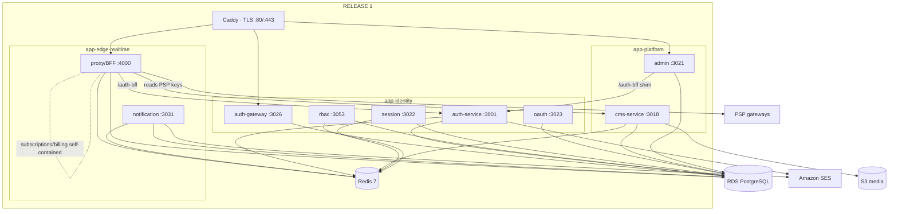

# Release 1 — Staged Production Deployment Plan

A staged rollout plan derived from [DEPLOYMENT.md](DEPLOYMENT.md) (the authoritative runbook),
[ARCHITECTURE.md](ARCHITECTURE.md) (design rationale), and [AWS-PROVISIONING.md](AWS-PROVISIONING.md)
(provisioning order). **This document does not change the architecture** — it selects the smallest
subset of the validated 6+1 stack that satisfies the launch goals, and sequences the rest.

> **Launch goal (drives everything below):** a content-publishing + subscriptions launch — user
> signup, login, OTP verification, email delivery, admin login, article publishing, media uploads, and
> subscription purchases. **Not** a physical-goods storefront and **not** the GTI trade / finance-ledger
> platform. That distinction is what makes Release 1 smaller than DEPLOYMENT.md's storefront MVP.

> **Headline result:** Release 1 = **3 app containers** (`app-identity` + `app-platform` +
> `app-edge-realtime`) + RDS + Redis + Caddy + SES + S3. ~1.6 GiB idle → **`t3.medium` (4 GB)** →
> **~$67/mo on-demand** (~$50 reserved). No `app-commerce`, no `app-payments` JVM, no Neo4j, no Kafka,
> no OpenSearch.

> ## ⛔ CORRECTION (2026-06-24) — read [RELEASE-1-VALIDATION.md](RELEASE-1-VALIDATION.md) first
> A code-level dependency trace **disproved the "no `app-payments` JVM" claim above** for the
> **subscription-purchase charge step**. The live consumer checkout (`proxy-service` →
> `POST /v1/billing/checkout`, the *only* path the SPA uses) hard-forwards to the Java payment-service at
> `PAYMENT_SERVICE_URL` and returns `502 PAYMENT_UPSTREAM` with **no fallback** when the JVM is absent
> ([billingRoutes.js:111,182](../../Backend/services/infrastructure/proxy-service/routes/billingRoutes.js#L111)).
> **`app-commerce` can still be excluded; the `app-payments` JVM (+ Kafka + the R12 bootstrap) cannot —
> if paid subscriptions must work on launch day.** The corrected, correctness-first Release 1 set, the
> full flow traces, the hidden-coupling findings, and the FINAL diagram live in
> **[RELEASE-1-VALIDATION.md](RELEASE-1-VALIDATION.md)**, which supersedes the headline and §13 below.
> The 3-container set here remains valid as the **"defer paid subscriptions"** option (covers 7 of 8
> goals; subscription *purchase* 502s until the JVM is added).

---

## 1. Full service inventory (45 modules → 7 containers)

43 deployables (42 Node + 1 JVM) packaged into 7 app containers; `law-elite` (shell demo) and
`ml-service` (optional Python accelerator) are excluded by design. Memory = §3 derived idle-RSS
buckets; CPU = qualitative (the fleet is near-idle and runs on burst credits — DEPLOYMENT.md §8 says do
**not** CPU-pin on a 2-vCPU host). "Disable for R1?" is relative to the **content+subscriptions launch
goal**, not the storefront.

### app-identity — 5 modules · 723 MiB idle · cap 1024m · **Release 1 ✅**

| Service | Port | Purpose | Key deps | Mem | CPU | Criticality (R1) | Disable R1? |
|---|---:|---|---|---:|---|---|---|
| auth-service | 3001 | RS256 token issuer; signup/login; **email + phone OTP**; MFA; account email | bcrypt, jsonwebtoken, speakeasy, nodemailer, geoip; RDS, Redis, SES | 160 | Med | **CRITICAL** | No |
| auth-gateway | 3026 | Identity BFF / trust boundary | ioredis, http-proxy | 100 | Low | **CRITICAL** | No |
| rbac-service | 3053 | Authz (RLS tenant isolation); **fail-closed** | Sequelize, jwt; RDS | 100 | Low | High | No¹ |
| session-service | 3022 | Session registry / device tracking | geoip, ua-parser, ioredis | 100 | Low | Medium | No¹ |
| oauth-service | 3023 | OIDC / social login server | bcrypt, jwt, pino; RDS | 100 | Low | Medium | No¹ |

¹ Rides along in the container at near-zero cost; can't be split out without re-imaging.

### app-platform — 10 modules · 613 MiB idle · cap 1536m · **Release 1 ✅**

| Service | Port | Purpose | Key deps | Mem | CPU | Criticality (R1) | Disable R1? |
|---|---:|---|---|---:|---|---|---|
| cms-service | 3018 | **Article authoring + publishing + public read API + media pipeline + PSP-key vault** | BullMQ, Sequelize, ioredis, S3; RDS, Redis | 170 | Med | **CRITICAL** | No |
| admin-service | 3021 | Super-admin console backend + feature flags | Sequelize, Redis, pino | 100 | Low | **CRITICAL** | No |
| imperialpedia-service | 3004 | Personal-finance content site API | Sequelize | 100 | Low | Medium | Ride-along |
| law-service | 3015 | Legal content/docs (Multer/S3/WS + billing worker) | Multer, S3, ws | 170 | Med | Low | Ride-along |
| audit-service | 3032 | Compliance event consumer | Sequelize, ioredis | 100 | Low | Medium | Ride-along |
| dashboard-service | 3009 | Admin aggregation layer | Sequelize | 100 | Low | Low | Ride-along |
| tenant-service | 3043 | White-label registry | Sequelize, Redis | 100 | Low | Low | Ride-along |
| developer-service | 3042 | Developer/API-key portal | Sequelize, ioredis | 100 | Low | Low | Ride-along |
| report-service | 3041 | XLSX/PDF generation (bursty) | exceljs, pdfkit (lazy) | 100 | Low | Low | Ride-along |
| search-service | 3036 | Search (OpenSearch client) — **503 by design without OpenSearch** | @baalvion/search, ioredis | 100 | Low | Low (degraded) | Ride-along |

### app-edge-realtime — 4 modules · 251 MiB idle · cap 896m · **Release 1 ✅**

| Service | Port | Purpose | Key deps | Mem | CPU | Criticality (R1) | Disable R1? |
|---|---:|---|---|---:|---|---|---|
| proxy-service | 4000 | **Consumer/admin BFF (frontend API entrypoint) + subscriptions/billing engine + PSP adapters (Razorpay/Stripe/PayU/Cashfree) + webhooks** | socket.io, PSP SDKs, S3, SAML/OIDC; RDS, Redis | 220–280 | Med | **CRITICAL** | No |
| notification-service | 3031 | Transactional email/alerts (5 BullMQ workers) | BullMQ, nodemailer+resend; Redis, SES | 200 | Med | **CRITICAL** | No |
| realtime-infra | 3040 | socket.io fan-out (live updates) | socket.io, Redis | 100 | Med | Medium | Ride-along |
| realtime-platform | 3046 | Hand-rolled WS telemetry (PORT remapped off 3026) | pg, Redis, jwt | 100 | Low | Low | Ride-along |

### app-commerce — 7 modules · 460 MiB idle · cap 1280m · **Phase 1.5 ⏸**

| Service | Port | Purpose | Mem | CPU | Criticality (R1) | Disable R1? |
|---|---:|---|---:|---|---|---|
| order-service | 3013 | Cart/order/checkout + reconciliation worker (storefront, **not** subscriptions) | 170 | Med | Not for R1 | **Yes** |
| commerce-service | 3012 | Catalog read + media (BullMQ) | 160 | Med | Not for R1 | **Yes** |
| inventory-service | 3014 | Oversell guard (order fails *open* without it) | 100 | Low | Not for R1 | **Yes** |
| fulfillment-service | 3016 | Shipment/fulfillment | 100 | Low | Not for R1 | **Yes** |
| market-service | 3007 | Market data | 100 | Low | Not for R1 | **Yes** |
| trade-service | 3025 | Trade ops (doc/logistics engines, `FINANCE_ENABLED=false`) | 190 | Med | Not for R1 | **Yes** |
| marketplace-service | 3060 | Cap tables / deals | 100 | Low | Not for R1 | **Yes** |

### app-ecosystem — 10 modules · 634 MiB idle · cap 1536m · **Phase 1.5 ⏸**

| Service | Port | Purpose | Mem | CPU | Disable R1? |
|---|---:|---|---:|---|---|
| about-service | 3010 | about.baalvion.com content API | 100 | Low | **Yes** |
| ctm-service | 3017 | CTM site + inline payments (Razorpay/Stripe) | 150 | Med | **Yes** |
| ir-service | 3008 | Investor-relations site (19 route modules) | 100 | Low | **Yes** |
| brand-connector-service | 3006 | B2B billing/subscriptions (`/plans`, `/subscribe`) | 100 | Low | **Yes** |
| crm-service | 3063 | CRM / VIP clients | 100 | Low | **Yes** |
| insiders-service | 3050 | Insiders membership (Multer/bcrypt) | 100 | Low | **Yes** |
| agent-service | 3044 | Agent leaderboards/commissions | 100 | Low | **Yes** |
| mining-service | 3003 | Mining vertical (9 route modules) | 100 | Low | **Yes** |
| real-estate-service | 3005 | Real-estate vertical | 100 | Low | **Yes** |
| jobs-service | 3002 | Jobs (Elasticsearch + 4 BullMQ workers) | 250–300 | High | **Yes** |

### app-trade — 6 modules · 422 MiB idle · cap 1024m · **Phase 3 ⏸** (requires Neo4j)

| Service | Port | Purpose | Mem | CPU | Disable R1? |
|---|---:|---|---:|---|---|
| network-graph-service | 3047 | Trade graph — **`process.exit(1)` without Neo4j** | 160 | Med | **Yes** |
| order-execution-service | 3052 | Outbox/saga/reconciliation workers | 190 | Med | **Yes** |
| product-registry-service | 3048 | SKU/GTIN/HS master | 100 | Low | **Yes** |
| quality-inspection-service | 3050 | AQL sampling | 100 | Low | **Yes** |
| supplier-lifecycle-service | 3051 | Supplier trust-score | 100 | Low | **Yes** |
| trade-documentation-service | 3049 | Trade docs (S3) | 100 | Low | **Yes** |

### app-payments (JVM) — 1 module · 402 MiB idle · cap 768m · **Phase 2 ⏸** (requires Kafka + R12)

| Service | Port | Purpose | Mem | CPU | Disable R1? |
|---|---:|---|---:|---|---|
| financial-services-java | 3015 | Finance/ledger/settlement reactor (Spring Boot 4.1, @EnableKafka, Flyway) | 400–700 | High | **Yes** |

### Excluded by design (not Release 1, not later)

| Service | Reason |
|---|---|
| law-elite | In-memory demo shell — decommission |
| ml-service (Python/FastAPI) | Optional accelerator, OFF by default; Node has in-process fallback; ships as 8th container only when ML is needed |

---

## 2. Capability → service map (requirement 4)

| Capability | Service(s) | Container | External dep |
|---|---|---|---|
| **Authentication** | auth-service (RS256 issuer), auth-gateway (BFF), rbac-service (authz, fail-closed), session-service, oauth-service; `@baalvion/auth-node` verifier in every service | app-identity | RDS, Redis |
| **OTP** | auth-service — `emailOtps` model + mailer (email OTP); `phoneOtps` + `phoneVerificationService` + `utils/sms` (phone OTP, Twilio) | app-identity | SES (email OTP); Twilio (phone OTP, **optional**) |
| **Email** | auth-service `utils/mailer` (account/OTP mail); notification-service (5 BullMQ workers, transactional/alert mail) | app-identity + app-edge-realtime | **SES (587 STARTTLS)** |
| **CMS** | cms-service (authoring + media + PSP-key vault); admin-service (console backend) | app-platform | RDS, Redis |
| **Content publishing** | cms-service (publish + public read `/api/v1/public/*`); optional fronts: imperialpedia-service (in app-platform), about-service (app-ecosystem, Phase 1.5) | app-platform | RDS |
| **Media uploads** | cms-service media pipeline (BullMQ) | app-platform | Redis, **S3** |
| **Payments** | proxy-service (consumer PSP adapters + webhooks); cms-service vault holds keys. Finance/ledger = financial-services-java (Phase 2); inline = order/ctm (Phase 1.5) | app-edge-realtime (+ cms vault) | RDS, Redis, PSP gateways |
| **Subscriptions** | **proxy-service** — `subscriptions` model + `billingEngine`/`billingService` (self-contained: no order/rbac calls). B2B = brand-connector-service (Phase 1.5) | app-edge-realtime | RDS, PSP gateways |

**Why the storefront MVP is overkill here:** DEPLOYMENT.md §6's MVP adds `app-commerce` because it
assumes physical-goods checkout through `order-service`. Verified in code: the proxy-service
subscription/billing path references **zero** `*_BASE_URL` to order/rbac/inventory — it drives the PSPs
directly off its own `subscriptions`/`invoices` models. **Subscriptions therefore need only
`app-edge-realtime`.** Add `app-commerce` only when you sell shippable goods.

---

## 3. Smallest production deployment for the 8 launch goals (requirements 5 & 6)

| Launch goal | Path | Containers exercised |
|---|---|---|
| User signup | frontend → proxy BFF `/auth-bff/*` → auth-service | edge-realtime → identity |
| User login | same → RS256 session | edge-realtime → identity |
| OTP verification | auth-service email OTP → SES | identity + SES |
| Email delivery | auth-service mailer + notification workers → SES | identity + edge-realtime + SES |
| Admin login | admin frontend → Caddy `/auth-bff` shim → auth-service; admin-service backs the console | identity + platform |
| Article publishing | admin → cms-service authoring; public read `/api/v1/public/*` | platform |
| Media uploads | cms-service media pipeline (BullMQ) → S3 | platform + Redis + S3 |
| Subscription purchases | proxy-service billing engine → PSP; keys from cms vault | edge-realtime (+ cms vault) |

### ✅ Recommended Release 1 set — exactly these

**App containers (3):** `app-identity`, `app-platform`, `app-edge-realtime`
**Data/edge:** RDS PostgreSQL · Redis (on-box) · Caddy (TLS edge) · SES · S3

### ⏸ Postponed (requirement 7)

| Deferred | Tier | Add when |
|---|---|---|
| `app-commerce` (order/inventory/commerce/fulfillment/market/trade/marketplace) | Phase 1.5 | Physical-goods storefront (Amarisé) checkout goes live |
| `app-ecosystem` (about/ctm/ir/crm/insiders/agent/mining/real-estate/jobs/brand-connector) | Phase 1.5 | A vertical site needs its own backend API |
| Twilio (phone OTP) | Phase 1.5 | SMS OTP required (email OTP covers launch) |
| `app-payments` JVM + Kafka/ZK + `payments-bootstrap.sql` (R12) | Phase 2 | Finance/ledger/settlement path needed |
| RDS Multi-AZ · OpenSearch | Phase 2 | DB HA / first-class search |
| `app-trade` (6 svc) + Neo4j | Phase 3 | GTI global-trade vertical |
| `ml-service` (Python) · ECS/Fargate · ElastiCache · MSK · read replicas · ALB/WAF | Phase 3 | Scale-out / HA |

---

## 4. Staged tiers (requirement 2)

| Tier | Containers / infra | Idle RAM | Host | ~Cost/mo (on-demand) |
|---|---|---:|---|---:|
| **Launch Critical (Release 1)** | identity + platform + edge-realtime · RDS · Redis · Caddy · SES · S3 | ~1.6 GiB | `t3.medium` (4 GB) | **~$67** |
| **Phase 1.5** | + app-commerce + app-ecosystem (+ Twilio) | ~2.7 GiB | `t3.large` (8 GB) | ~$100 |
| **Phase 2** | + app-payments JVM + Kafka/ZK · RDS Multi-AZ · OpenSearch | ~4.6 GiB | `t3.large` | ~$160 |
| **Phase 3** | + app-trade + Neo4j (+ ml-service) · → ECS/ElastiCache/MSK | ~6 GiB → HA | `t3.xlarge` → ECS | ~$300 → $550+ |

---

## 5. Dependency graph (requirement 8)



**Boot-blocking (Release 1):** every app container → **Redis healthy**. **Not** boot-blocking and not
in R1: Neo4j (app-trade only), Kafka (JVM only), OpenSearch (search degrades to 503 by design).

---

## 6. Startup order & Docker deployment order (requirement 8)

**Prerequisite (one-time, before any container):** RDS reachable (`DB_SSL=true`), DNS A/ALIAS records
resolve to the EIP (Caddy needs this to issue TLS).

```bash
COMPOSE="docker compose --env-file deploy/consolidated/.env \
  -f deploy/consolidated/docker-compose.prod.yml"   # NOTE: no --profile payments in R1

# 1. Backing service first — wait healthy
$COMPOSE up -d redis
$COMPOSE ps                       # redis healthy

# 2. Apps, in dependency order (identity first — everyone verifies its tokens)
$COMPOSE up -d app-identity       # auth issuer + gateway up
$COMPOSE up -d app-platform       # cms + admin
$COMPOSE up -d app-edge-realtime  # proxy BFF (calls auth) + notification

# 3. Edge (issues TLS once DNS resolves)
$COMPOSE up -d caddy

# 4. One-shot migrations & seed (idempotent, once per fresh DB)
docker exec consolidated-app-identity-1 \
  sh -c 'cd /app/Backend/services/identity/auth-service && node scripts/bootstrapSuperAdmin.js'
docker exec consolidated-app-platform-1 \
  sh -c 'cd /app/Backend/services/knowledge/cms-service && ./node_modules/.bin/sequelize-cli db:migrate'
docker exec -e CMS_ORG_ID=<superadmin-org> -e CMS_CREATED_BY=<superadmin-id> consolidated-app-platform-1 \
  sh -c 'cd /app/Backend/services/knowledge/cms-service && node scripts/registerProductionWebsites.cjs'
# (R12 payments-bootstrap.sql NOT run in R1 — no JVM. Auth's 13 SQL migrations NOT required.)
```

**Why this order:** `proxy-service` and `admin` verify auth's RS256 tokens, so `app-identity` must be
healthy first; `proxy-service` reads PSP keys from the cms vault, so `app-platform` precedes
`app-edge-realtime`. Redis is the only hard backing dependency.

---

## 7. Deployment blocker validation (requirement 9)

| ID | Blocker | Applies to R1? | Action |
|---|---|---|---|
| **R1** | `JWT_PUBLIC_KEY` as a **file path** → `secretOrPublicKey must be an asymmetric key` → **401 on every authed cross-service call** | 🔴 **YES** (proxy→auth, admin→auth, rbac all authed) | Set `JWT_PUBLIC_KEY` to the **inlined PEM** (single-line `\n`-escaped). **Verify a cross-service authed call returns 200, not 401** before sign-off |
| **R12** | Payment JVM Flyway `V001` hard-codes `postgres` role → crash-loop | 🟢 **NO** — `app-payments` not deployed in R1 | Becomes blocking in **Phase 2**; run `sql/payments-bootstrap.sql` as RDS master before the JVM then |
| **R2** | Mailer mandates STARTTLS; self-signed/`NODE_TLS_REJECT_UNAUTHORIZED=0` forbidden | 🔴 **YES** (email + OTP are launch goals) | Use **Amazon SES 587 STARTTLS**; never ship the dry-run Mailpit/self-signed cert |
| **B-SES** | SES in sandbox can't email unverified recipients | 🔴 **YES** | **Move SES out of sandbox**; SPF/DKIM/DMARC verified |
| **B-VAULT** | Subscriptions need PSP keys from the cms vault | 🔴 **YES** | Set `CMS_SECRETS_KEY` + `PROVIDER_SECRET_KEY`; load real provider keys into the vault; `PSP_MOCK=false` |
| **B-CMSURL** | Prod guard rejects a `localhost` CMS URL | 🔴 **YES** | `CMS_BASE_URL`/`CMS_INTERNAL_URL` must be DNS names |
| **R10** | Fresh DB needs migrate/seed one-shots | 🔴 **YES** | cms `db:migrate` + superadmin bootstrap + register **real** websites (no demo seeders) |
| **R4** | `app-identity` ran 94% of cap (723/768) | 🟠 Watch | `mem_limit` already 1024m; t3.medium gives headroom — monitor under load |
| **B-PRE** | `preflight-env.js` hard-fails on missing/placeholder vars or any dry-run config | 🔴 **YES** | 31 required vars + an email provider must pass; `DEPLOY_PROFILE ≠ dryrun` |
| **B-DNS** | Caddy can't issue TLS before DNS resolves | 🔴 **YES** | Create Route 53 A/ALIAS → EIP first |
| **R6** | search-service 503 without OpenSearch | 🟢 Accepted | Degraded by design; don't alarm on it |
| **R7** | 6.6 GB Node image | 🟢 Accepted | Size EBS ≥ 40 GB; tag images by git sha |

---

## 8. AWS resource checklist — Release 1 (requirement 10)

- [ ] **IAM** CI deploy role (OIDC) + EC2 instance role (ECR pull, SSM read, S3 media scope, `ses:SendRawEmail`, CloudWatch). No long-lived keys on the box.
- [ ] **VPC** — public subnet (EC2+EIP) + 2 private subnets (RDS). **SGs:** EC2 443/80 from internet, 22 via SSM only; RDS 5432 from EC2 SG only.
- [ ] **Elastic IP** allocated.
- [ ] **RDS PostgreSQL** `db.t3.small`, 20 GB gp3, **Single-AZ for R1** (Multi-AZ = Phase 2), `DB_SSL=true`, automated backups + PITR. App user has `CREATE`. **No `payments-bootstrap.sql` needed in R1.**
- [ ] **ECR** repo `baalvion-backend` (the `baalvion-payments` repo is Phase 2). Lifecycle policy. Image built `linux/amd64`, tagged `prod-<sha>`.
- [ ] **EC2 `t3.medium`** (2/4, x86_64), **40 GB gp3** root, instance role attached, EIP associated, Docker + Compose.
- [ ] **S3** `baalvion-prod-media` (versioned) via instance role.
- [ ] **SES** verified domain, **out of sandbox**, SPF/DKIM/DMARC, SMTP creds (587 STARTTLS).
- [ ] **Route 53** hosted zone + A/ALIAS for `auth.` `api.` `admin.` (+ content hosts) → EIP. Resolves before Caddy.
- [ ] **Secrets (SSM SecureString)** — all ≥32 chars: `DB_PASSWORD`, **`JWT_PUBLIC_KEY` (inlined PEM — R1)**, `JWT_PRIVATE_KEY_B64`, `JWT_ACCESS_SECRET`, `JWT_REFRESH_SECRET`, `GATEWAY_SIGNING_SECRET`, `INTERNAL_SERVICE_SECRET`, `RBAC_INTERNAL_API_KEY`, `AUDIT_INTERNAL_KEY`, `CART_SESSION_SECRET`, `METRICS_SECRET`, `CMS_SECRETS_KEY`, `PROVIDER_SECRET_KEY`, `SMTP_USER`/`SMTP_PASS` (SES), PSP keys, `SUPERADMIN_PASSWORD` (rotate after first use). *(Neo4j/Kafka/finance/inventory secrets deferred.)*
- [ ] **CloudWatch** log group `/baalvion/consolidated` + retention; alarms (host CPU/mem/disk, RDS conn/CPU/storage, edge 5xx/p95, BullMQ failures, TLS expiry, SES bounce/complaint); synthetic checks on auth/api/admin.

**Not provisioned for R1:** Neo4j, Kafka/MSK, OpenSearch, `baalvion-payments` ECR repo, app-payments — all deferred to their phase above.

---

## 9. Deployment readiness report (requirement 10)

| Area | Status | Note |
|---|---|---|
| Architecture validated | ✅ | Full 6+1 stack brought up locally end-to-end (DEPLOYMENT.md, 2026-06-23) |
| R1 set selection | ✅ | 3 containers cover all 8 goals; subscription self-containment verified in code |
| R1 (`JWT_PUBLIC_KEY`) | ⚠️ Config gate | Inline PEM + verify 200 before sign-off |
| R2 / SES | ⚠️ Config gate | SES out of sandbox + 587 STARTTLS |
| PSP vault / subscriptions | ⚠️ Config gate | Seed provider keys, `PSP_MOCK=false` |
| Fresh-DB one-shots (R10) | ⚠️ Runbook step | migrate + superadmin + real-website registration |
| AWS infra | ❌ Not provisioned | Follow §8 (AWS-PROVISIONING.md order, minus Neo4j/Kafka/payments) |
| R12 / Neo4j / Kafka | 🟢 N/A for R1 | Deferred with their containers |

**Verdict:** the stack is functionally validated; Release 1 is a **config + provisioning** exercise, not
a code exercise. All R1 blockers have config-only mitigations.

---

## 10. Launch readiness report — verification checklist (requirements 8 & 10)

**Pre-flight:** R1 set images pushed (`baalvion-backend:prod-<sha>`, amd64); `.env` from SSM, preflight
passes; DNS resolves; manual RDS snapshot taken.

**Smoke gate (must pass):**
- [ ] 3/3 app containers healthy; ~19/19 pm2 processes `online` (`pm2 jlist`).
- [ ] **R1 proof:** a cross-service authed call returns **200** (not 401).
- [ ] Caddy issued TLS for every host (`docker logs … | grep certificate`).
- [ ] **Signup** → 201; **Login** → 200 (RS256).
- [ ] **OTP** request → email arrives via SES; verify → 200.
- [ ] **Admin login** → 200; admin console loads.
- [ ] **Publish an article** in cms → public `/api/v1/public/<slug>/content` returns it 200.
- [ ] **Media upload** → cms pipeline → object lands in S3, URL resolves.
- [ ] **Subscribe** → proxy billing → PSP `initiate` succeeds; webhook marks subscription active.
- [ ] 1 SES email delivered end-to-end; SES bounce/complaint dashboards clean.

---

## 11. Rollback plan (requirement 10)

| Scenario | Action | Data loss |
|---|---|---|
| **App regression** (bug/crash/perf) | `sed -i 's/^IMAGE_TAG=.*/IMAGE_TAG=prod-<previous-sha>/' .env && $COMPOSE up -d` → re-pulls prior image, recreate, re-smoke | None |
| **Bad CMS migration** | Restore pre-deploy RDS snapshot or PITR to just-before-deploy; repoint `DB_HOST`; `up -d`; re-smoke (migrations are forward-only — prefer restore over undo) | Up to RPO (≤5 min) |
| **Host loss (R8 SPOF)** | Launch from golden AMI, materialize `.env` from SSM, `up -d`, smoke | None (RDS is durable) |
| **SES blocked / bounces spike** | Email is fail-open in notification; auth OTP degrades — pause new-user OTP flows, fix SES reputation, no rollback | None |
| **PSP/subscription failure** | Subscriptions isolated in proxy; flip `PSP_MOCK`? **No** — fix keys/webhook; billing webhook idempotency protects against double-charge | None |

**Targets:** RTO ≤ 30 min, RPO ≤ 5 min (RDS PITR). Only durable state is **RDS + S3** — everything else
(Redis, containers) is rebuildable. After any rollback: re-run smoke, record incident, open fix-forward
ticket.

---

## 12. Resource & cost estimate — Release 1 (requirement 11)

### RAM (3 containers + on-box)

| Container | Idle | Cap (`mem_limit`) |
|---|---:|---:|
| app-identity | 723 MiB | 1024m |
| app-platform | 613 MiB | 1536m |
| app-edge-realtime | 251 MiB | 896m |
| redis | 8 MiB | 320m |
| caddy | 40 MiB | 96m |
| **Idle total** | **~1.64 GiB** | — |
| **Realistic peak** (proxy/cms/notification workers under load) | **~2.5–3.0 GiB** | fits 4 GB with margin |

### CPU
2 vCPU (`t3.medium`), burst-credit model — do **not** CPU-pin. Idle < 5%; bursts during media-pipeline
encodes, BullMQ drains, and login spikes. Step to `t3.large` only if baseline exhausts credits.

### Storage
| Asset | Size |
|---|---|
| EBS root (OS + 6.6 GB image + Docker + Redis AOF + logs) | **40 GB gp3** |
| RDS gp3 (schema-per-domain; grows with users/content) | **20 GB** (start) |
| ECR (6.6 GB image × few tags) | ~15–20 GB |
| S3 media | starts ~0, grows with uploads |

### AWS monthly cost (ap-south-1)

| Item | Spec | On-demand | 1-yr Savings/RI |
|---|---|---:|---:|
| EC2 | `t3.medium` 2/4 (x86_64) | ~$33 | ~$21 |
| EBS | 40 GB gp3 | ~$3 | ~$3 |
| RDS | `db.t3.small` **Single-AZ** + 20 GB | ~$28 | ~$22 |
| Redis / Caddy | on-box | $0 | $0 |
| ECR + S3 + egress | low | ~$5 | ~$5 |
| SES | < 50k emails | ~$1 | ~$1 |
| **Release 1 total** | | **~$70/mo** | **~$52/mo** |

**Knobs:** ultra-budget `t3.small` (2 GB) + `db.t3.micro` ≈ **~$40/mo** — *not recommended* (2 GB < ~2.5–3 GiB
peak risks OOM under load). RDS **Multi-AZ** upgrade (recommended once revenue justifies) **+~$28/mo**.
For comparison the full Recommended Production Set (6+1 + Neo4j/Kafka, `t3.large` Multi-AZ) is
**~$130/mo** — Release 1 is **~45% cheaper**.

---

## 13. Recommended Release 1 Deployment

> **Exactly this — nothing more.**

**App containers (3):**
- `app-identity` — auth-service · auth-gateway · rbac · session · oauth *(signup, login, OTP, admin auth)*
- `app-platform` — cms-service · admin-service (+ 8 back-office riding along) *(publishing, media, admin console)*
- `app-edge-realtime` — proxy-service (BFF + subscriptions/billing + PSP) · notification (email) · 2× realtime

**Infrastructure:**
- **EC2** `t3.medium` (2 vCPU / 4 GB, x86_64) · 40 GB gp3 · Elastic IP · instance role
- **RDS PostgreSQL** `db.t3.small` Single-AZ · 20 GB gp3 · `DB_SSL=true` · backups + PITR
- **Redis 7** (on-box) · **Caddy 2** (TLS edge, on-box)
- **S3** `baalvion-prod-media` (versioned) · **SES** (out of sandbox, 587 STARTTLS)
- **ECR** `baalvion-backend` · **Route 53** zone + A/ALIAS · **CloudWatch** logs + alarms · **SSM** secrets

**Excluded from Release 1:** app-commerce, app-ecosystem, app-trade, app-payments (JVM), Neo4j, Kafka/MSK,
OpenSearch, ml-service, Multi-AZ DB, ElastiCache, ALB. *(All sequenced into Phases 1.5 / 2 / 3 above.)*

**Release-1 deploy-blockers to clear first:** R1 (inline `JWT_PUBLIC_KEY` + verify 200) · R2/SES (out of
sandbox + STARTTLS) · cms PSP vault seeded (`PSP_MOCK=false`) · `CMS_BASE_URL` as DNS · fresh-DB one-shots
(migrate + superadmin + real websites) · DNS before Caddy. **R12 / Neo4j / Kafka do not apply to
Release 1.**

**Expected cost: ~$70/mo on-demand (~$52/mo reserved).** Scales to the full validated 6+1 stack by adding
one container at a time — no re-architecture.

---

*Derived from [DEPLOYMENT.md](DEPLOYMENT.md), [ARCHITECTURE.md](ARCHITECTURE.md), and
[AWS-PROVISIONING.md](AWS-PROVISIONING.md). Service membership, ports, and the subscription
self-containment finding were verified against the live `deploy/consolidated/pm2/*.config.js` and
`Backend/services/**` source on 2026-06-24.*
</content>
</invoke>
