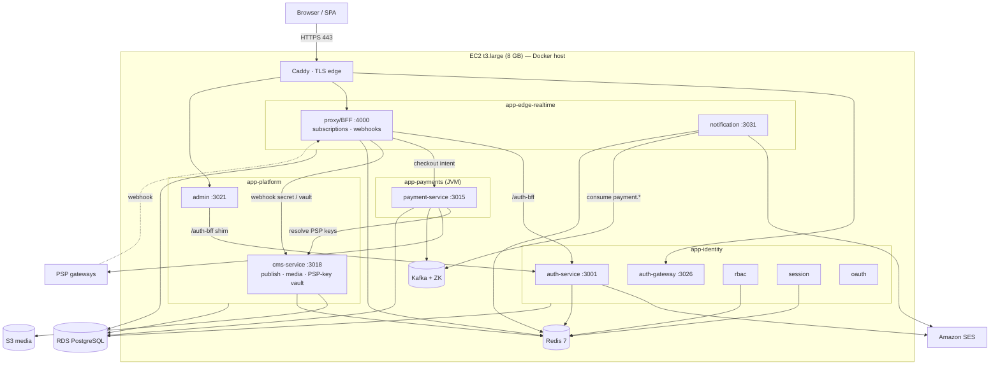

# Release 1 — Runtime Dependency Validation (correctness-first)

A code-level validation of every runtime dependency behind the Release-1 flows, performed before
committing to the architecture in [RELEASE-1-PLAN.md](RELEASE-1-PLAN.md). **This document supersedes**
the "no `app-payments` JVM" headline in that plan. Every claim here is backed by `file:line` evidence
traced against `Backend/services/**`, `Backend/packages/**`, and `deploy/consolidated/**` on 2026-06-24.

> **Bottom line:** `app-commerce` **can** be safely excluded. The **`app-payments` JVM cannot** — the
> live subscription-purchase *charge* hard-depends on it. The corrected minimal Release 1 is **4 app
> containers + Kafka** (Option A), or the 3-container set **only if paid subscriptions are deferred**
> (Option B).

---

## 1. Flow-by-flow runtime dependency trace

For each flow: full service-to-service request path · DB dependencies · external API dependencies.
Containers: **IDP**=app-identity, **PLT**=app-platform, **EDGE**=app-edge-realtime, **PAY**=app-payments(JVM).

### 1.1 Subscription flow

There are **two distinct sub-flows** — purchase (charge) and activation (record). They have different
dependencies.

**(a) Purchase / checkout — `POST /v1/billing/checkout`** *(the only path the SPA uses)*
```
Browser → Caddy → EDGE:proxy-service
  authMiddleware (local RS256, on-disk pubkey)                     [proxy/middleware/authMiddleware.js:33]
  → billingService.getPlan()/getSubscription()  (server-side price) [proxy/service/billingService.js:10,19]
  → fetch PAYMENT_SERVICE_URL /v1/gateway/payments?site=<slug>      [proxy/routes/billingRoutes.js:111]
        → PAY:financial-services-java  (resolves PSP keys from CMS vault, creates provider intent)
  → returns PUBLIC clientParams to browser (Razorpay key/orderId, Stripe pk, PayU form+hash)
```
- **Service-to-service:** EDGE → **PAY (JVM)** *(hard; `502 PAYMENT_UPSTREAM` on failure,
  [billingRoutes.js:182-184](../../Backend/services/infrastructure/proxy-service/routes/billingRoutes.js#L182))*; PAY → CMS vault (PLT) for per-tenant keys.
- **DB:** proxy `plans`, `subscriptions`, `organizations` (own schema, read); JVM `payments` schema (write intent).
- **External API:** PSP (Razorpay/Stripe/PayU/Cashfree) — called **by the JVM**, not proxy.

**(b) Activation — `POST /v1/billing/activate`** *(server-side, after webhook confirms payment)*
```
EDGE:proxy-service → platformController.activatePlan         [proxy/controller/platformController.js:189]
  → billingService.activateSubscription                     [proxy/service/billingService.js:87]
  → store.update('subscriptions') + update('organizations') + createInvoiceRecord  (ALL local DB)
```
- **Service-to-service:** none. **DB:** proxy `subscriptions`, `organizations`, `invoices` (own schema, write). **External:** none.

**(c) Recurring renewal — in-process scheduler (no JVM)**
```
proxy workers/index.js setInterval → billingEngine.runMonthlyBilling → chargeInvoice
  → Razorpay SDK directly (env keys)                        [proxy/service/billingEngine.js:201-214]
```
- **Service-to-service:** none. **DB:** proxy `invoices`, `usage_charges`, `billing_runs`. **External:** Razorpay (in-process SDK, env keys).

> **Asymmetry that matters:** the *first* purchase routes through the JVM; *renewals* and *activation*
> are JVM-free. So excluding the JVM breaks **new subscription sign-ups**, not the back-office.

### 1.2 Payment flow

| Path | Route | Engine | S2S deps | External | JVM? |
|---|---|---|---|---|---|
| **Live (SPA)** | `POST /v1/billing/checkout` | forwards to JVM | EDGE→**PAY**, PAY→CMS vault | PSP via JVM | **YES** |
| **Legacy (retiring)** | `POST /v1/payment/*` | in-process | none | Razorpay/PayU env-key SDK | No |
| **Renewal** | scheduler | `billingEngine.chargeInvoice` | none | Razorpay env-key SDK | No |

- DB (all proxy own-schema): `transactions`, `payment_methods`, `invoices`, `chargebacks`, `payment_webhook_events`.
- Source comments mark `/v1/payment/*` as *"slated for retirement"* ([billingRoutes.js:8-9](../../Backend/services/infrastructure/proxy-service/routes/billingRoutes.js#L8)); the SPA is wired to the JVM path.

### 1.3 Webhook handling — `POST /v1/billing/webhook/{razorpay,stripe,payu,cashfree}`

```
PSP → Caddy → EDGE:proxy index.js (raw body mount)          [proxy/index.js:29-58]
  → {provider}WebhookController  → signature verify (local crypto, secret from CMS vault w/ env fallback)
  → cmsVault.getSecret() → CMS_BASE_URL /internal/integrations/<slug>   [proxy/service/cmsVault.js:28]  → PLT:cms-service
  → webhookDedup.claimEvent (local table payment_webhook_events)
  → billingService.activateSubscription | purchaseCredit  (local DB)
```
- **Service-to-service:** EDGE → **PLT (cms vault)** for the signing secret *(soft — 60 s cache + env fallback to `RAZORPAY_WEBHOOK_SECRET` etc.)*. **No JVM, no order-service.**
- **DB:** proxy `payment_webhook_events`, `subscriptions`, `credit_ledger`, `invoices`. **External:** the PSP (inbound only).
- **Consequence:** subscription **activation is webhook-driven and JVM-independent** — once a payment is captured, the PSP calls proxy directly and proxy flips the subscription active locally.

### 1.4 Invoice creation

| Generator | Trigger | Path | S2S | DB | External |
|---|---|---|---|---|---|
| Subscription invoice | activation | `billingService.createInvoiceRecord` [billingService.js:37] | none | proxy `invoices` (write) | none |
| Usage invoice | monthly scheduler | `billingEngine.computeInvoice` [billingEngine.js:99] | none | Timescale `org_usage_daily` (read) + `invoices` (write) | none |
| Invoice document | download | `billingService.getInvoiceDocument` [billingService.js:200] | none | proxy `invoices` (read) | none |

- **Fully in-process. No JVM, no order-service, no report-service.** Invoice PDF is a local string build, not a report-service call.

### 1.5 RBAC / auth flow

```
signup/login/email-OTP → IDP:auth-service (route→controller→service→model)   [auth-service/routes/authRoutes.js:42-48]
  issueTokenPair → jwtRsa.signAccessToken (RS256, local keys)                 [auth-service/service/jwtRsa.js:14]
token verification (every R1 consumer):
  proxy   → local RS256 via on-disk pubkey config/keys/<kid>.pub             [proxy/utils/jwtserver.js:10; authMiddleware.js:33]
  cms/admin → @baalvion/auth-node createAuthMiddleware (JWKS cached 300s from
              auth-service + static JWT_PUBLIC_KEY fallback, RS256-only)      [auth-node/index.js:392-421]
```
- **Service-to-service:** consumers → IDP **only** (JWKS public-key fetch, lazy + cached; proxy doesn't even need that — on-disk key). **No per-request introspection.** No non-R1 container on any verify path.
- **DB:** `auth.users`, `auth.organizations`, `auth.organization_members`, `auth.sessions`, `auth.refresh_tokens`, `auth.email_otps`, `auth.phone_otps`, `auth.audit_logs` (all IDP-owned `auth.*` schema).
- **External API:** **SES** (email OTP / account mail — `utils/mailer.js`, **fails loud 503 in prod if SMTP unset**, [emailLoginService.js:101]); **Twilio** (phone OTP — `utils/sms.js`, best-effort, non-blocking, **optional**).
- **RBAC:** **in-process in every R1 service** — proxy uses its own `service/rbac.js` + `service/rbacService.js` (own `custom_roles` tables, Redis-cached); cms uses `requireRole` on token claims + own `cms.website_members`; admin uses `requireRole/requireSuperAdmin` on claims. **No R1 flow calls the rbac-service container.** The §10 `failMode=closed` rbac edge belongs only to order/commerce/inventory/fulfillment — all excluded.

---

## 2. Explicit answers (requirement 3)

### Can `app-commerce` and the `app-payments` JVM be safely excluded in production without breaking any edge case?

| Container | Safe to exclude? | Why |
|---|---|---|
| **app-commerce** (order-service et al.) | ✅ **YES** | No R1 flow makes any network call to order-service (verified: zero `ORDER_*_URL`/axios/fetch to it across proxy/cms/auth/notification/admin). Proxy billing is its own schema + own PSP SDKs. The only commerce touch is admin-service analytics doing a **defensive cross-schema read** of `commerce.orders` via `to_regclass` ([admin/analyticsService.js:84-96]) which returns NULL→0 when absent — degrades, never errors. |
| **app-payments (JVM)** | ❌ **NO** (if paid subscriptions launch day-1) | The live `POST /v1/billing/checkout` — *"the ONLY payment path the SPA uses"* — hard-`fetch`es `PAYMENT_SERVICE_URL` (the JVM) to create every payment intent, with **no in-process fallback**; JVM down ⇒ `502 PAYMENT_UPSTREAM`. New subscription purchases fail. |

### What features break if they are removed?

**Remove the JVM (`app-payments`):**
- 🔴 **New subscription purchase / PAYG credit top-up via the SPA → `502`** (hard break of launch goal #8).
- 🟠 **Payment-lifecycle notifications never fire** — notification-service handles `payment.captured/failed/refunded/payment.ledger.recorded` ([notification/workers/eventConsumer.js:160-166]); the **JVM is their producer**. Absent ⇒ those emails/alerts silently never send (no crash).
- 🟢 Still works without the JVM: subscription **activation** (webhook-driven), **invoice** creation, **recurring renewal** charges (in-process Razorpay), plan management, webhooks.

**Remove `app-commerce` (order-service):**
- 🟠 Admin console **revenue/order KPIs render `0`** (commerce schema absent) — cosmetic/operational, not a break.
- 🟢 Storefront product checkout (order-service) is unavailable — **not an R1 goal**.

### Is proxy-service truly self-sufficient for billing?

**Mostly — with two exceptions:**
- ✅ Self-sufficient for: plans, subscription **record-keeping**, **activation**, **invoice** creation, **webhook** processing, **recurring renewal** charges (in-process Razorpay), dunning. Own DB schema, own PSP SDKs, no order-service.
- ❌ **NOT** self-sufficient for the **initial purchase charge** — delegates intent creation to the **JVM** (`PAYMENT_SERVICE_URL`).
- ⚠️ **Soft cross-service edge:** webhook signature secrets + the "which gateways are live" list are read from the **CMS vault** (`CMS_BASE_URL` → cms-service, in app-platform) with a 60 s cache and an env-var fallback ([cmsVault.js:28]). Intra-R1, but a real edge that must be wired (DNS, not localhost).

---

## 3. Hidden coupling risks (requirement 4)

| Category | Finding | Risk | Evidence |
|---|---|---|---|
| **DB tables** | `schema-per-domain` holds. Proxy owns all billing tables in its own DB/`public` schema; **no cross-schema FK** to a shared `payments`/`commerce` schema. JVM writes its own `payments` schema. | 🟢 Low | proxy `sql/schema.sql:171,433,501,625`; JVM Flyway `payments.*` |
| **DB cross-read** | admin-service analytics `to_regclass('commerce.orders')` — reads a table owned by the excluded order-service; NULL→0 fallback. | 🟠 Degrades (KPIs show 0) | [admin/analyticsService.js:84-96] |
| **Shared libs** | R1 services import `@baalvion/{auth-node, events, sdk, telemetry, graceful-shutdown, upload}`. **None** hard-require Kafka/Neo4j/OpenSearch; `auth-node` JWKS target is auth-service (R1); `@baalvion/search` (OpenSearch) is imported **only** by search-service (degrades to 503). | 🟢 Low | package.json + [auth-node/index.js:311-350] |
| **Event bus** | `@baalvion/events` = **Redis Streams** (`baalvion:events`). Universal consumers **notification + audit are both in R1**. No R1 producer needs a non-R1 consumer. | 🟢 Low | [packages/events/src/broker.ts:230-394] |
| **Event bus — degraded** | notification-service has `payment.*` handlers whose **producer is the JVM/commerce**; absent ⇒ payment notifications silently skipped. | 🟠 Degrades | [notification/workers/eventConsumer.js:160-166] |
| **Event bus — latent bug** | proxy emits to stream **`baalvion:event_stream`** while notification/audit read **`baalvion:events`** → proxy's `billing.*` domain events currently reach **neither** consumer (pre-existing defect, independent of the R1 cut). | 🟠 Billing audit/notify fan-out is a no-op until fixed | [proxy/service/domainEvents.js:24] vs [notification/config/appConfig.js:119] |
| **Event bus — durability** | R1 emits are fire-and-forget (no outbox wired); a Redis outage drops events silently. | 🟡 Observability gap | [packages/events/src/outbox.ts] (unused) |
| **BullMQ queues** | Every **active** queue's Worker is co-located with its producer in R1 (proxy `notifications/emails`; cms `cms-scheduler/cms-notifications`; notification `email/webhook/sms/push/notification`; proxy `usage:events` metering). Some declared-but-dead queues (`billing-renewals`, `provider-health`…) are inert. | 🟢 Low (no orphan consumed only off-R1) | [proxy/service/queueService.js:25-30]; [notification/queue/queues.js:18-58] |
| **JWT validation** | Local RS256 everywhere; no remote introspection. proxy uses on-disk pubkey; cms/admin use cached JWKS (from IDP) + `JWT_PUBLIC_KEY` static fallback. **No non-R1 container verifies tokens.** R1 blocker **R1** (inline PEM) still applies to the cms/admin fallback path; **proxy additionally needs its `config/keys/<kid>.pub` file provisioned.** | 🟢 Low (with R1 done) | [auth-node/index.js:392-421]; [proxy/utils/jwtserver.js:10] |

---

## 4. Corrected minimal Release 1 architecture (requirement 5)

The dependency trace forces a choice. Both are fully specified; **Option A is the correctness-first
answer for the stated goal set (subscription purchases is goal #8).**

### ✅ Option A — Subscriptions live on launch day (RECOMMENDED, correctness-first)

**4 app containers + Kafka:** `app-identity` · `app-platform` · `app-edge-realtime` · **`app-payments` (JVM)**
+ **Kafka + ZooKeeper** (compose gates `app-payments depends_on kafka: healthy`, [docker-compose.prod.yml:230])
+ RDS · Redis · Caddy · SES · S3.

- Run with `--profile payments`. **R12 `payments-bootstrap.sql` becomes a hard blocker** (run as RDS master before the JVM migrates).
- New required wiring (all present in `.env.production.example`): `PAYMENT_SERVICE_URL=http://app-payments:3015` (**not** the in-code `:13015` default), `CMS_BASE_URL=http://app-platform:3018`, `INTERNAL_SERVICE_SECRET` (non-default — proxy **throws** on the dev value in prod, [billingRoutes.js:31]), `FINANCE_WEBHOOK_SECRET`, `APP_SECURITY_ENABLED=false` (+ Caddy edge-deny for the JVM's `/refund`,`/capture`,`/actuator/*` — R9), `FINANCE_ENABLED=false`, PSP keys seeded into the **CMS vault** for the site slug.
- **Sizing:** ~2.64 GiB idle (incl. JVM + Kafka/ZK), ~4–4.5 GiB peak → **`t3.large` (8 GB)**.
- **Cost:** ~**$102/mo** on-demand (single-AZ DB; ~$73 reserved) · ~$130 Multi-AZ.

### 🟡 Option B — Defer paid subscriptions to Phase 1.5 (cheapest)

**3 app containers:** `app-identity` · `app-platform` · `app-edge-realtime` + RDS · Redis · Caddy · SES · S3.
No JVM, no Kafka, **R12 N/A**.

- Covers **7 of 8** goals. Subscription **purchase returns `502`** until the JVM is added; everything
  else (signup/login/OTP/email/admin/publishing/media) works, and subscription **plans/records/webhooks/
  renewals** exist (you just can't take a *first* card payment through the SPA).
- Requires a **product decision** ("payments switch on next week") — or a small code change to repoint the
  SPA to the retiring in-process `/v1/payment/*` path (not recommended).
- **Sizing:** ~1.6 GiB idle → **`t3.medium` (4 GB)**. **Cost:** ~**$67/mo** on-demand (~$50 reserved).

---

## 5. FINAL safe Release 1 deployment diagram (Option A) (requirement 6)



**Boot order:** RDS reachable + **R12 bootstrap done** → Redis → Kafka/ZK (healthy) → app-identity →
app-platform → app-edge-realtime → app-payments (JVM, after R12) → Caddy → one-shot seeds → smoke.

---

## 6. Minimal AWS setup — Option A (requirement 6)

| Resource | Spec | R1 note |
|---|---|---|
| EC2 | **`t3.large`** 2/8 x86_64, 50 GB gp3, EIP, instance role | JVM + Kafka push idle to ~2.6 GiB |
| RDS PostgreSQL | `db.t3.small`, 20 GB gp3, **Single-AZ** (Multi-AZ = +$28), `DB_SSL=true`, PITR | **Run `payments-bootstrap.sql` as master before the JVM (R12)** |
| ECR | **2 repos:** `baalvion-backend` + `baalvion-payments` | JVM image ~585 MB |
| Redis · Kafka · ZK · Caddy | on-box (compose) | → ElastiCache / MSK at scale |
| S3 | `baalvion-prod-media` (versioned), instance-role access | media uploads |
| SES | verified domain, **out of sandbox**, 587 STARTTLS | email + OTP (fail-loud) |
| Route 53 | zone + A/ALIAS → EIP | before Caddy TLS |
| Secrets (SSM) | all DEPLOYMENT.md §9 secrets **+** `FINANCE_WEBHOOK_SECRET`, JVM `DB_JDBC_PARAMS`; `JWT_PUBLIC_KEY` inline PEM **+** proxy on-disk pubkey file | R1 + R12 |
| CloudWatch | logs + alarms incl. **JVM heap, Kafka lag, `payments.outbox` depth** | — |

*Not provisioned for R1:* Neo4j, OpenSearch, `app-commerce/trade/ecosystem`, Multi-AZ, ElastiCache, MSK, ALB.

---

## 7. Risk list — including everything deferred (requirement 6)

**Deploy-blocking (must clear before go-live, Option A):**
- 🔴 **R1** — `JWT_PUBLIC_KEY` inline PEM (cms/admin fallback) **+ proxy `config/keys/<kid>.pub` provisioned**; prove a cross-service authed call returns 200.
- 🔴 **R12** — `payments-bootstrap.sql` as RDS master **before** the JVM migrates (now in-scope because the JVM is in R1).
- 🔴 **R2 / SES** — SES out of sandbox + 587 STARTTLS (email + OTP fail loud).
- 🔴 **Payment wiring** — `PAYMENT_SERVICE_URL=http://app-payments:3015` (not the `:13015` default), `CMS_BASE_URL` DNS, `INTERNAL_SERVICE_SECRET` non-default, PSP keys seeded in the CMS vault, `PSP_MOCK=false`.
- 🔴 **R10** — fresh-DB one-shots: cms `db:migrate`, superadmin bootstrap, register **real** websites.
- 🔴 **R9** — `APP_SECURITY_ENABLED=false` requires Caddy edge-deny on the JVM's sensitive paths.
- 🔴 **DNS before Caddy** TLS.

**Accepted / degraded at launch:**
- 🟠 **Event-stream key mismatch** (proxy `baalvion:event_stream` vs consumers `baalvion:events`) — billing audit + payment-failure notifications are a **no-op** until fixed. Subscription activation is unaffected (webhook-driven). *Recommend a fix-forward ticket before turning on dunning emails.*
- 🟠 **Payment notifications** depend on the JVM publishing `payment.*` to Kafka **and** the stream-key fix.
- 🟠 **Admin commerce KPIs show 0** (app-commerce excluded).
- 🟡 **R5 Kafka** — required by the compose `depends_on` gate when the JVM runs; on-box now → MSK at scale.
- 🟡 **R6 search** — search-service 503 without OpenSearch (degraded by design).
- 🟡 **R7** — 6.6 GB Node image; size EBS ≥50 GB.
- 🟡 **R8** — single-host SPOF; ECS HA path documented.
- 🟡 **Event durability** — no outbox wired; Redis outage drops events.

**Deferred to later phases (with their dependencies):**
- **Phase 1.5:** `app-commerce` (storefront checkout, restores admin KPIs) · `app-ecosystem` (vertical site APIs) · Twilio (phone OTP).
- **Phase 2:** full Java finance reactor (`FINANCE_ENABLED=true`, ledger/settlement/escrow) · RDS Multi-AZ · OpenSearch · MSK.
- **Phase 3:** `app-trade` + Neo4j (GTI) · `ml-service` · ECS/Fargate · ElastiCache · read replicas · ALB/WAF.

---

## 8. Summary verdict

| Question | Answer |
|---|---|
| Exclude `app-commerce`? | ✅ Yes — no hard dependency; admin KPIs degrade to 0 only. |
| Exclude `app-payments` JVM? | ❌ No (Option A) — live subscription purchase 502s without it. Yes only if paid subscriptions are deferred (Option B). |
| Is proxy self-sufficient for billing? | Yes for records/activation/webhooks/renewals; **no** for the initial purchase charge (JVM) and webhook-secret resolution (CMS vault, intra-R1). |
| Hidden coupling that breaks a flow? | None hard-breaks except the JVM checkout edge. Notable degradations: payment notifications, admin KPIs, and a **pre-existing event-stream-key bug** that silences billing audit/notify fan-out. |
| Corrected minimal R1 | **Option A: identity + platform + edge-realtime + payments-JVM + Kafka**, `t3.large`, ~$102/mo. |

*Companion to [RELEASE-1-PLAN.md](RELEASE-1-PLAN.md) (staged tiers/inventory) and the source-of-truth
[DEPLOYMENT.md](DEPLOYMENT.md). Traced 2026-06-24 against live code.*
</content>
