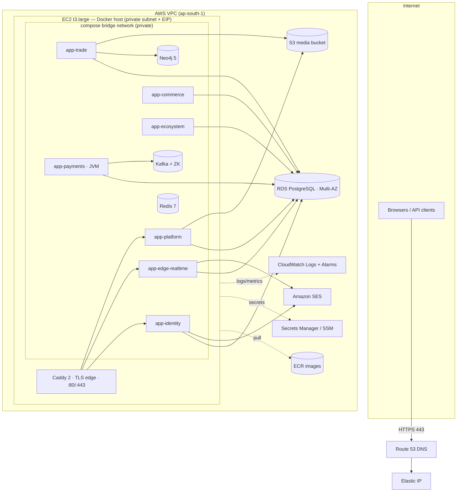
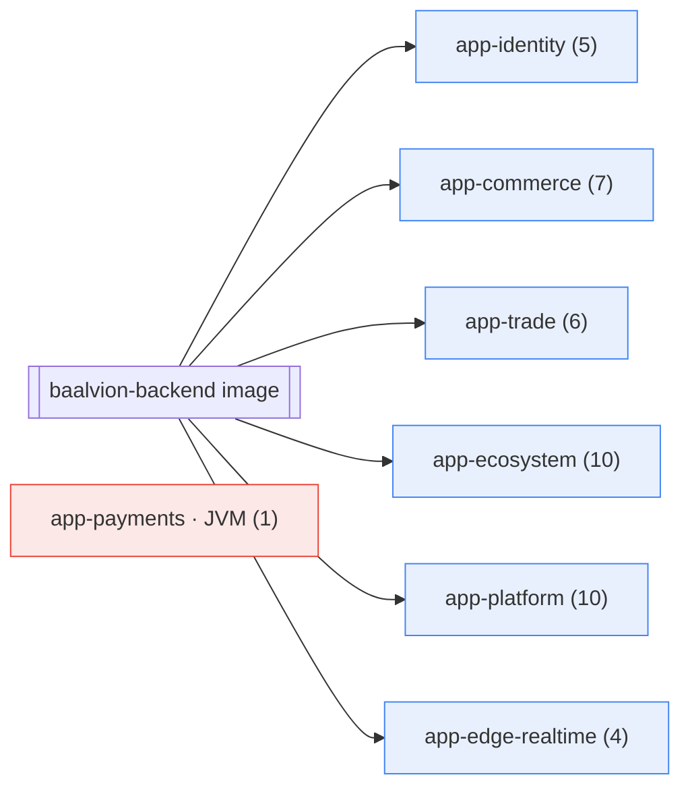
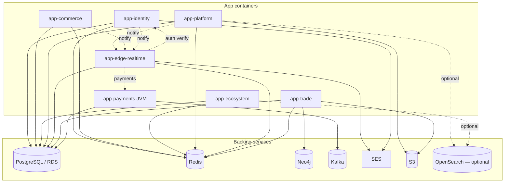

# 01 · Architecture, Grouping & Dependencies

## 1. Production architecture

Single EC2 host runs Caddy (edge TLS) + 6 Node app containers + the JVM payment app +
on-box Redis/Neo4j/Kafka. PostgreSQL is managed RDS. Browsers reach only Caddy (80/443);
everything else is private on the Docker bridge network.

**Edge routing (Caddyfile):** `auth.baalvion.com → app-identity:3026`,
`api.baalvion.com → app-edge-realtime:4000`, `ws.baalvion.com → app-edge-realtime:3040`,
`admin.baalvion.com → app-platform:3021` (+ `/auth-bff/*` shim → app-identity:3001,
`/api/v1/public/*` → app-platform:3018). Internal service-to-service calls use Docker DNS
and bypass Caddy.

## 2. Service grouping — all 43 deployables

One image (`baalvion-backend`) runs six "personalities"; pm2 starts only each container's
modules. The JVM is the seventh deployable.

| Container | Ct | Modules · port |
|---|---:|---|
| **app-identity** | 5 | auth `3001` · auth-gateway `3026` · oauth `3023` · rbac `3053` · session `3022` |
| **app-commerce** | 7 | commerce `3012` · inventory `3014` · fulfillment `3016` · market `3007` · order `3013` · trade-service `3025` · marketplace `3060` |
| **app-trade** | 6 | network-graph `3047` · order-execution `3052` · product-registry `3048` · quality-inspection `3050` · supplier-lifecycle `3051` · trade-documentation `3049` |
| **app-ecosystem** | 10 | about `3010` · agent `3044` · brand-connector `3006` · crm `3063` · ctm `3017` · insiders `3050` · ir `3008` · jobs `3002` · mining `3003` · real-estate `3005` |
| **app-platform** | 10 | admin `3021` · dashboard `3009` · tenant `3043` · cms `3018` · imperialpedia `3004` · law `3015` · audit `3032` · developer `3042` · report `3041` · search `3036` |
| **app-edge-realtime** | 4 | proxy/BFF `4000` · realtime-infra `3040` · realtime-platform `3046` · notification `3031` |
| **app-payments (JVM)** | 1 | financial payment-service `3015` |
| **Total** | **43** | 42 Node processes + 1 JVM |

**Excluded by design:** `law-elite` (in-memory demo shell — decommission) · `ml-service`
(Python; optional accelerator, OFF by default, Node has an in-process fallback).

## 3. Container-to-container & backing-service dependency map

**Hard dependencies (boot-blocking):**
- **All app containers → Redis** (compose `depends_on: redis healthy`).
- **app-trade → Neo4j** — `network-graph-service` calls `verifyConnectivity()` and
  **`process.exit(1)`** on failure. Neo4j is therefore mandatory in prod.
- **app-payments → DB** (Flyway-migrated `payments` schema) + **Kafka** (@EnableKafka;
  tolerates absence but logs continuous reconnect noise — provide Kafka/MSK).

**Soft/lazy dependencies (degrade, don't crash):**
- `search-service` → OpenSearch (absent ⇒ HTTP 503 degraded mode by design).
- `jobs-service` → Elasticsearch (absent ⇒ Postgres full-text fallback).
- S3/SES/payment-gateways → first-use, not boot.

**Trust boundaries:** cross-service calls are gateway-signed (`GATEWAY_SIGNING_SECRET`) or
carry `x-internal-secret` (`INTERNAL_SERVICE_SECRET`); all token verification is RS256 via
`@baalvion/auth-node` (single issuer).

➡ Next: [02 · AWS resources & images](02-aws-resources-and-images.md)
