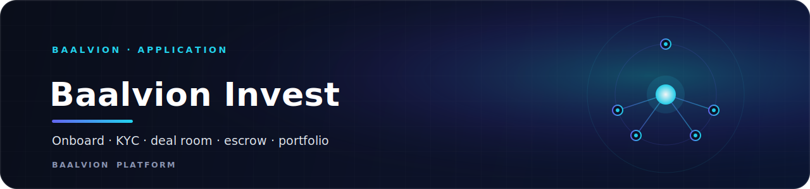
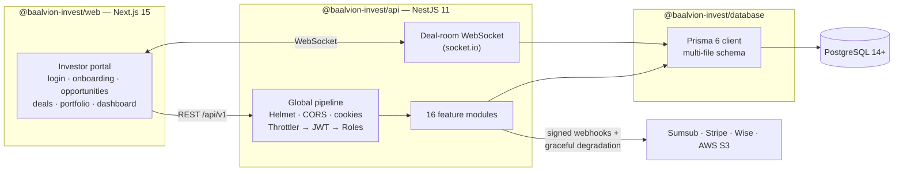

<div align="center">



<br/>
<br/>

**A global investment platform where investors from any country onboard, complete KYC/AML, review deal documents, run due diligence, negotiate privately, sign and fund via escrow, then track portfolio performance — end to end.**


<sub>[Overview](#overview) · [Architecture](#architecture) · [Tech stack](#tech-stack) · [Quick start](#quick-start) · [Configuration](#configuration) · [Feature map](#feature-map) · [Happy path](#end-to-end-happy-path) · [Project structure](#project-structure) · [Testing](#testing) · [Security](#security)</sub>

</div>

---

## Overview

Baalvion Invest is a standalone, self-contained application within the Baalvion
Platform. It delivers the full private-markets journey — investor onboarding,
identity verification, deal sourcing, a secure deal room, document exchange,
term-sheet negotiation, escrowed funding, and portfolio reporting.

- **Tier:** application (investor-facing portal + REST/WebSocket API)
- **Package:** `baalvion-investment-platform` · version `0.1.0`
- **API:** `http://localhost:4000/api/v1` (global prefix `api/v1`)
- **Web:** `http://localhost:3000`
- **Workspaces:** `@baalvion-invest/api`, `@baalvion-invest/web`, `@baalvion-invest/database`
- **Toolchain:** pnpm `9.12.0` + Turborepo `2.3` · Node `>=20.11.0`

> This platform is isolated from the rest of `Backend/` — it ships its own NestJS
> API, Prisma schema, and Next.js portal as one Turborepo.

## Architecture



### Request pipeline

Set in `apps/api/src/main.ts` and `app.module.ts`, in order:

1. **Helmet** security headers + **cookie-parser**.
2. **CORS** restricted to `WEB_ORIGIN` with credentials.
3. **Global prefix** `api/v1`.
4. **ValidationPipe** — `whitelist`, `forbidNonWhitelisted`, `transform` (DTOs
   reject unknown fields).
5. **Global guards** (order matters): `ThrottlerGuard` → `JwtAuthGuard` →
   `RolesGuard` — rate-limit, then authenticate, then authorize.
6. **AllExceptionsFilter** produces a uniform error envelope.
7. `rawBody: true` is enabled so provider webhook signatures (Stripe, Sumsub) can
   be verified over the raw request body.

Rate limit is configured at **120 requests / 60s** (`ThrottlerModule.forRoot`).

### Graceful degradation

Integration providers (Sumsub, Stripe, Wise, S3) **degrade gracefully**: with no
credentials they return deterministic simulated results, so the entire investor
journey is exercisable locally without external accounts.

## Tech stack

### Backend — `@baalvion-invest/api`

| Concern | Library | Version |
|---------|---------|---------|
| Framework | `@nestjs/common` / `core` | `^11.0.0` |
| Config | `@nestjs/config` | `^4.0.0` |
| Auth tokens | `@nestjs/jwt` + `@nestjs/passport` + `passport-jwt` | `^11` / `^4.0.1` |
| WebSockets | `@nestjs/websockets` + `@nestjs/platform-socket.io` + `socket.io` | `^11` / `^4.8.1` |
| Rate limiting | `@nestjs/throttler` | `^6.4.0` |
| Password hashing | `argon2` | `^0.41.1` |
| MFA (TOTP) | `otplib` + `qrcode` | `^12.0.1` / `^1.5.4` |
| Validation | `class-validator` + `class-transformer` + `zod` | `^0.14.1` / `^0.5.1` / `^3.24.1` |
| Storage | `@aws-sdk/client-s3` + `s3-request-presigner` | `^3.700.0` |
| Payments | `stripe` | `^17.5.0` |
| Security headers | `helmet` | `^8.0.0` |

### Frontend — `@baalvion-invest/web`

| Concern | Library | Version |
|---------|---------|---------|
| Framework | `next` (App Router) | `^15.1.0` |
| UI runtime | `react` / `react-dom` | `^19.0.0` |
| Charts | `recharts` | `^2.15.0` |
| Styling | `tailwindcss` + `@tailwindcss/postcss` | `^4.0.0` |

### Data — `@baalvion-invest/database`

| Concern | Library | Version |
|---------|---------|---------|
| ORM client | `@prisma/client` | `^6.7.0` |
| Migrations / CLI | `prisma` | `^6.7.0` |
| Seed runtime | `tsx` | `^4.19.2` |

The Prisma schema is **multi-file** (`prisma/schema/`): `identity`, `investor`,
`company`, `deal`, `document`, `investment`, `payment`, `portfolio`,
`compliance`, `notification`, plus `enums` and the root `schema`.

## Quick start

```bash
# 0. Prereqs: Node 20.11+, pnpm 9, a PostgreSQL 14+ database
cp .env.example .env        # fill DATABASE_URL + secrets (see Configuration)
pnpm install

# 1. Generate keys/secrets for .env
openssl genrsa -out access_private.pem 2048
openssl rsa -in access_private.pem -pubout -out access_public.pem
#  → paste PEMs into JWT_ACCESS_PRIVATE_KEY / JWT_ACCESS_PUBLIC_KEY (\n-escaped)
openssl rand -base64 32     # → ENCRYPTION_KEY

# 2. Database
pnpm --filter @baalvion-invest/database build      # prisma generate + tsc
pnpm db:migrate                                     # create tables

# 3. Run (two terminals)
pnpm --filter @baalvion-invest/api dev    # API → http://localhost:4000/api/v1
pnpm --filter @baalvion-invest/web dev    # Web → http://localhost:3000
```

Set `NEXT_PUBLIC_API_URL=http://localhost:4000/api/v1` for the web app.

### Workspace scripts (repo root)

| Script | Action |
|--------|--------|
| `pnpm dev` | `turbo run dev` across all apps |
| `pnpm build` | `turbo run build` |
| `pnpm lint` | `turbo run lint` |
| `pnpm db:generate` | Prisma client generate |
| `pnpm db:migrate` | `prisma migrate dev` |
| `pnpm db:migrate:deploy` | `prisma migrate deploy` (production) |
| `pnpm db:studio` | Prisma Studio |
| `pnpm db:validate` | Validate the schema |
| `pnpm db:format` | Format the schema |

## Configuration

All variables live in `.env` (see [`.env.example`](.env.example)). The API
validates env at boot (`config/env.validation.ts`) and uses `getOrThrow` for
required values.

| Variable | Purpose |
|----------|---------|
| `DATABASE_URL` | PostgreSQL connection string |
| `DIRECT_DATABASE_URL` | Non-pooled URL for migrations (PgBouncer/RDS Proxy) |
| `JWT_ACCESS_PRIVATE_KEY` / `JWT_ACCESS_PUBLIC_KEY` | RS256 keypair for access tokens |
| `JWT_ACCESS_TTL` | Access-token lifetime in seconds (default `900` = 15m) |
| `JWT_REFRESH_TTL` | Refresh-token lifetime in seconds (default `604800` = 7d) |
| `MFA_ISSUER` | TOTP issuer label (default `Baalvion Invest`) |
| `ENCRYPTION_KEY` | 32-byte base64 — encrypts MFA secrets and document keys |
| `SUMSUB_APP_TOKEN` / `SUMSUB_SECRET_KEY` / `SUMSUB_BASE_URL` / `SUMSUB_WEBHOOK_SECRET` | KYC/AML provider |
| `STRIPE_SECRET_KEY` / `STRIPE_WEBHOOK_SECRET` | Escrow funding (cash in) |
| `WISE_API_TOKEN` / `WISE_PROFILE_ID` / `WISE_WEBHOOK_PUBLIC_KEY` | Payouts (cash out) |
| `AWS_REGION` / `AWS_ACCESS_KEY_ID` / `AWS_SECRET_ACCESS_KEY` / `S3_DOCUMENT_BUCKET` / `S3_KMS_KEY_ID` | Document vault storage |
| `NODE_ENV` | `development` / `production` |
| `API_PORT` | API listen port (default `4000`) |
| `WEB_ORIGIN` | Allowed CORS origin (default `http://localhost:3000`) |

## Feature map

| Phase | Capability | Backend module | Frontend |
|-------|-----------|----------------|----------|
| 1 | Auth: register/login, RS256 JWT, rotating refresh, TOTP MFA | `auth` | `/login`, `/register` |
| 2 | Investor onboarding (profile, preferences, accreditation) | `investors` | `/onboarding` |
| 2 | KYC/AML via Sumsub + webhook | `compliance` | `/onboarding` |
| 2 | Company onboarding, profile, founders, cap table | `companies` | — |
| 2 | Opportunity discovery + AI matching | `opportunities` | `/opportunities` |
| 2 | Deal room: secure messaging (WS), members, NDA | `deals` | `/deals/[id]` |
| 2 | Document vault: S3 presigned up/download, access logs, DD | `documents` | deal room |
| 3 | Term sheets, counters, e-signatures, investments, positions | `investments` | deal room |
| 3 | Escrow + payments (Stripe in, Wise out), double-entry ledger | `payments` | deal room |
| 3 | Portfolio, returns (MOIC), distributions, tax docs | `portfolio` | `/portfolio`, `/dashboard` |
| 3 | Admin: KYC/accreditation/company review queues | `admin` | — |
| — | In-app notifications | `notifications` | — |

The 16 NestJS feature modules (`auth`, `users`, `orgs`, `investors`,
`compliance`, `companies`, `opportunities`, `deals`, `documents`, `investments`,
`payments`, `portfolio`, `admin`, `notifications`, plus `common/prisma` and
`common/crypto`) are wired in `apps/api/src/app.module.ts`.

## End-to-end happy path

1. Register → personal investor org is provisioned (OWNER).
2. `/onboarding` → set investor profile, start Sumsub KYC.
3. `/opportunities` → browse live rounds / AI-recommended → open one.
4. **Express interest** → a private `Deal` + deal room is created.
5. Negotiate in chat, run due-diligence checklist, propose/accept a term sheet.
6. Accepting a term sheet creates a committed `Investment` + `EscrowAccount`.
7. **Fund** escrow (Stripe PaymentIntent) → webhook marks funded → ledger posts
   `investor:cash → escrow:hold`.
8. Release escrow → `escrow:hold → company:cash`, investment goes ACTIVE, a
   `Position` opens, deal closes.
9. `/portfolio` & `/dashboard` → holdings, MOIC, distributions, tax docs.

## Project structure

```
investment-platform/
├── apps/
│   ├── api/                      → NestJS backend (REST /api/v1 + WS deal-room)
│   │   └── src/
│   │       ├── main.ts           → bootstrap: Helmet, CORS, prefix, guards
│   │       ├── app.module.ts     → module + global guard wiring
│   │       ├── config/           → env validation + configuration
│   │       ├── common/           → prisma, crypto, filters, guards
│   │       ├── auth/  users/  orgs/  investors/  compliance/
│   │       ├── companies/  opportunities/  deals/  documents/
│   │       └── investments/  payments/  portfolio/  admin/  notifications/
│   └── web/                      → Next.js 15 investor portal
├── packages/
│   └── database/                 → Prisma schema (multi-file) + client
│       └── prisma/schema/        → identity, investor, company, deal, document,
│                                    investment, payment, portfolio, compliance,
│                                    notification, enums
└── docs/
    └── api-design.md             → API design reference
```

## Testing

The API workspace uses **Jest** (`pnpm --filter @baalvion-invest/api test`).
Lint runs per workspace via `pnpm lint` (Turborepo) or per app
(`eslint` for the API, `next lint` for the web).

## Security

- **Argon2id** password hashing; user-enumeration-resistant login.
- **RS256** access tokens (15m) + opaque rotating refresh tokens with reuse
  detection (family revocation).
- **TOTP MFA** with AES-256-GCM-encrypted seeds + single-use backup codes.
- Global **rate limiting** (120 req / 60s), **Helmet**, strict DTO validation,
  uniform error envelope.
- **Multi-tenant isolation** on `orgId`; per-org RBAC guard.
- **Webhook signature verification** (Stripe, Sumsub) over raw request bodies
  (`rawBody: true`).
- **Double-entry ledger** enforces balanced postings on every money movement.
- BigInt columns (e.g. `Document.sizeBytes`) are serialized as strings
  platform-wide to keep JSON responses lossless.

## Notes

- See [`docs/api-design.md`](docs/api-design.md) for the API design reference.
- Migrations behind PgBouncer/RDS Proxy must use `DIRECT_DATABASE_URL`.
- The platform is phase-gated (Phase 1 auth → Phase 2 onboarding/deals → Phase 3
  investments/payments/portfolio), reflected in `app.module.ts` import grouping.

---

<div align="center">
<sub>Part of the <a href="https://github.com/baalvionservice/Baalvion-Project-Infra">Baalvion Platform</a> · centralized identity · domain-driven monorepo</sub>
</div>
